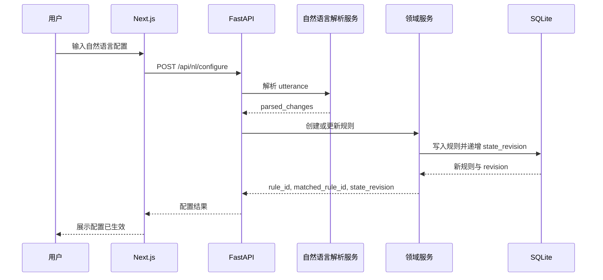

# API 时序图

```mermaid
sequenceDiagram
    participant U as 用户
    participant FE as Next.js
    participant API as FastAPI
    participant NL as 自然语言解析服务
    participant Domain as 领域服务
    participant DB as SQLite

    U->>FE: 输入自然语言配置
    FE->>API: POST /api/nl/configure
    API->>NL: 解析 utterance
    NL-->>API: parsed_changes
    API->>Domain: 创建或更新规则
    Domain->>DB: 写入规则并递增 state_revision
    DB-->>Domain: 新规则与 revision
    Domain-->>API: rule_id, matched_rule_id, state_revision
    API-->>FE: 配置结果
    FE-->>U: 展示配置已生效
```
