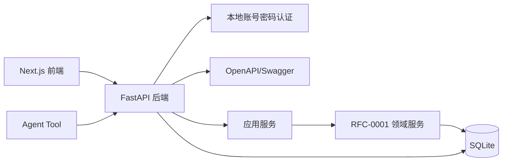

# 后端架构图

```mermaid
flowchart LR
    NextJS[Next.js 前端] --> FastAPI[FastAPI 后端]
    AgentTool[Agent Tool] --> FastAPI
    FastAPI --> Auth[本地账号密码认证]
    FastAPI --> OpenAPI[OpenAPI/Swagger]
    FastAPI --> AppServices[应用服务]
    AppServices --> Domain[RFC-0001 领域服务]
    Domain --> SQLite[(SQLite)]
    FastAPI --> SQLite
```
