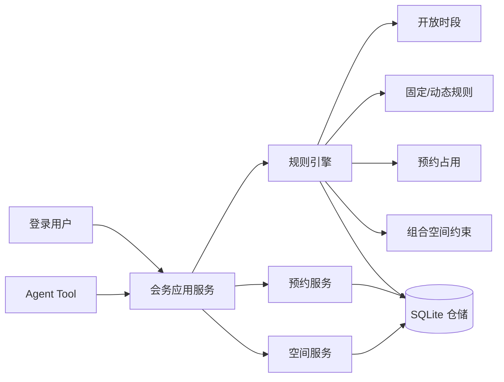

# 领域架构图

```mermaid
flowchart LR
    User[登录用户] --> AppService[会务应用服务]
    AgentTool[Agent Tool] --> AppService
    AppService --> RuleEngine[规则引擎]
    AppService --> BookingService[预约服务]
    AppService --> RoomService[空间服务]
    RuleEngine --> OpeningSchedule[开放时段]
    RuleEngine --> RoomRule[固定/动态规则]
    RuleEngine --> Booking[预约占用]
    RuleEngine --> CompositeRule[组合空间约束]
    BookingService --> Repository[(SQLite 仓储)]
    RoomService --> Repository
    RuleEngine --> Repository
```
