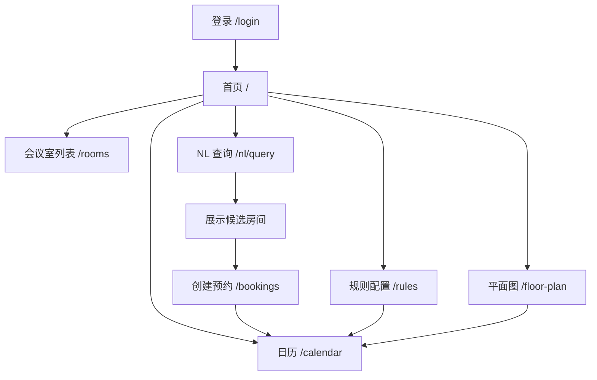

# 前端主流程图

```mermaid
flowchart TD
    Login[登录 /login] --> Home[首页 /]
    Home --> Rooms[会议室列表 /rooms]
    Home --> Calendar[日历 /calendar]
    Home --> NL[NL 查询 /nl/query]
    Home --> Rules[规则配置 /rules]
    Home --> FloorPlan[平面图 /floor-plan]
    NL --> Candidates[展示候选房间]
    Candidates --> Booking[创建预约 /bookings]
    Booking --> Calendar
    Rules --> Calendar
    FloorPlan --> Calendar
```
