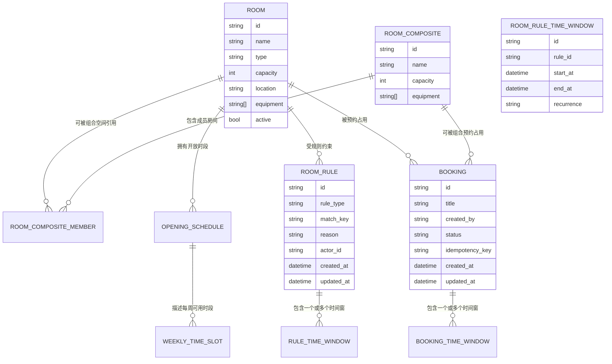
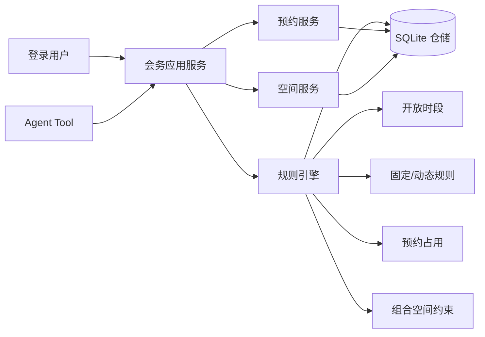

# RFC-0001: 会务系统领域模型与规则引擎

## 摘要

团队需要一个本地可运行的会议室查询与预订系统，并且自然语言配置必须真正改变系统状态，而不是只返回一段解释。这个 RFC 定义会务系统的领域模型、空间关系、规则模型、预约模型和冲突校验原则。核心方案是把“会议室”“组合空间”“规则”“预约”“时段占用”建模为可持久化的领域对象，由规则引擎统一决定某个时间段是否可预约。

本 RFC 不设计前端页面，也不定义完整 API；它只保证后续 FastAPI 和 Next.js 可以基于同一套领域语义工作。最重要的限制是：本期使用本地 SQLite 和单机状态版本，不做分布式并发控制，也不做真实地图服务。

## 动机

当前需求来自一个实际团队会务场景：成员需要查询和预订会议室，登录用户可以配置会议室、开放时段和不可预约规则。系统必须基于真实空间关系工作，尤其要正确处理以下固定约束：

- 活动室中午作为餐厅，午餐时段不能预约会议；
- 会议室一、会议室二既可以分别使用，也可以合并成一间大会议室；
- 503、505、506 是三间小会议室；
- 505 每周二全天不可用。

如果这些规则只写在 Agent prompt 或前端展示逻辑中，就无法保证后续查询、预约和冲突校验一致。因此需要一个明确的领域模型和规则引擎，让配置结果进入系统状态，并成为所有业务判断的唯一来源。

## 设计

### 用户看到的完整流程

1. 用户登录后进入系统，系统从 SQLite 初始化或读取会议室、规则、开放时段和已有预约。
2. 用户输入自然语言配置，例如“这周三 504 临时维修，全天不能预约。刚才说错了，只停用下午”。
3. 后端把自然语言解析为结构化规则变更，并直接写入规则表；如果匹配到已有规则，则更新同一条规则。
4. 用户查询某段时间可用会议室时，规则引擎读取房间、组合空间、开放时段、动态规则和已有预约，返回可用房间与不可用原因。
5. 用户选择候选房间并确认创建预约。
6. 创建预约时，系统再次调用冲突校验；如果时段重叠或命中不可预约规则，则拒绝并返回清晰原因。
7. 用户取消预约后，系统释放对应时段，日历、平面图和可用查询立即反映新状态。

### 概述

会务系统的核心不是“存一张预约表”，而是维护一个可由规则解释的会务状态模型。系统需要同时理解普通会议室、组合会议室、固定规则、动态规则和预约占用。任何查询、预约、取消、修改操作都必须经过同一个规则引擎，避免前端、API、Agent 各自实现一套判断逻辑。

### 概念模型

核心概念关系如下：



#### 房间 `Room`

`Room` 表示真实物理空间，例如活动室、会议室一、会议室二、503、505、506。

字段包括：

| 字段 | 类型 | 说明 |
|---|---|---|
| `id` | string | 稳定 ID，例如 `activity-room`、`meeting-room-1`、`503` |
| `name` | string | 展示名，例如“活动室”“会议室一” |
| `type` | string | `activity`、`small`、`medium`、`large` 等业务类型 |
| `capacity` | int | 可容纳人数 |
| `location` | string | 楼层或区域，例如 `5F` |
| `equipment` | string[] | 设备，例如 `projector`、`whiteboard` |
| `active` | bool | 是否启用；用于软删除或临时下线 |

#### 组合空间 `CompositeRoom`

`CompositeRoom` 表示由多个真实房间组合而成的逻辑空间，例如“会议室一+会议室二”。

字段包括：

| 字段 | 类型 | 说明 |
|---|---|---|
| `id` | string | 稳定 ID，例如 `meeting-room-1-2` |
| `name` | string | 展示名，例如“会议室一+会议室二” |
| `member_room_ids` | string[] | 成员房间 ID 列表 |
| `capacity` | int | 组合后容量 |
| `equipment` | string[] | 组合后可用设备 |
| `active` | bool | 是否启用该组合关系 |

组合空间不是物理房间，而是“同一时间占用多个成员房间”的预约目标。创建组合预约时，系统必须同时锁定成员房间在该时段的使用权。

#### 开放时段 `OpeningSchedule`

`OpeningSchedule` 描述房间可被预约的常规时间范围，可以按周几定义。

示例：

| 字段 | 类型 | 说明 |
|---|---|---|
| `room_id` | string | 房间 ID |
| `weekday` | int | `0` 表示周一，`6` 表示周日；也可扩展为 `*` |
| `start_time` | string | 每天开始时间，例如 `09:00` |
| `end_time` | string | 每天结束时间，例如 `18:00` |

#### 规则 `RoomRule`

`RoomRule` 表示某个房间或组合空间在特定时间窗内不可预约、午餐占用、维护、活动占用等状态。

字段包括：

| 字段 | 类型 | 说明 |
|---|---|---|
| `id` | string | 规则唯一 ID |
| `target_type` | string | `room` 或 `composite` |
| `target_id` | string | 目标房间或组合空间 ID |
| `rule_type` | string | `lunch_block`、`weekly_unavailable`、`temporary_unavailable`、`maintenance`、`activity_block` 等 |
| `match_key` | string | 用于连续修改时匹配同一条规则 |
| `reason` | string | 展示原因，例如“临时维修” |
| `created_by` | string | 创建人 |
| `created_at` | datetime | 创建时间 |
| `updated_at` | datetime | 更新时间 |

规则可以有一个或多个 `RuleTimeWindow`。自然语言配置如果连续修改同一个业务意图，应通过 `match_key` 或时间/目标相似度匹配到同一条规则并更新它。

#### 预约 `Booking`

`Booking` 表示一次会议预约。

字段包括：

| 字段 | 类型 | 说明 |
|---|---|---|
| `id` | string | 预约唯一 ID |
| `target_type` | string | `room` 或 `composite` |
| `target_id` | string | 目标房间或组合空间 ID |
| `title` | string | 会议标题 |
| `organizer_id` | string | 发起人 |
| `attendees` | string[] | 参与人 |
| `description` | string | 描述 |
| `status` | string | `confirmed`、`cancelled`、`moved`、`cancelled_by_user` |
| `idempotency_key` | string | 幂等键 |
| `created_at` | datetime | 创建时间 |
| `updated_at` | datetime | 更新时间 |

预约时间窗存储在 `BookingTimeWindow`，本期只要求单段预约，但模型保留多时间窗能力。

### 固定空间初始化

系统启动时必须自动初始化以下空间与固定规则。初始化逻辑应幂等：已有数据时更新或跳过，不重复创建。

#### 房间

| ID | 名称 | 类型 | 容量建议 | 设备建议 | 位置 |
|---|---|---|---:|---|---|
| `activity-room` | 活动室 | `activity` | 20 | `projector`, `whiteboard` | 5F |
| `meeting-room-1` | 会议室一 | `medium` | 12 | `projector`, `whiteboard` | 5F |
| `meeting-room-2` | 会议室二 | `medium` | 12 | `projector`, `whiteboard` | 5F |
| `503` | 503 | `small` | 4 | `whiteboard` | 5F |
| `505` | 505 | `small` | 4 | `whiteboard` | 5F |
| `506` | 506 | `small` | 4 | `whiteboard` | 5F |

容量和设备是建议默认值，允许用户后续修改。

#### 组合空间

| ID | 名称 | 成员房间 | 容量建议 |
|---|---|---|---:|
| `meeting-room-1-2` | 会议室一+会议室二 | `meeting-room-1`, `meeting-room-2` | 24 |

#### 固定规则

| 规则 | 目标 | 类型 | 时间 | 说明 |
|---|---|---|---|---|
| 活动室午餐不可预约 | `activity-room` | `lunch_block` | 每个工作日 12:00-13:00 | 中午作为餐厅，不能预约会议 |
| 505 周二全天不可用 | `505` | `weekly_unavailable` | 每周二 00:00-24:00 | 固定不可用 |

#### 小会议室关系

503、505、506 的 `type` 必须为 `small`。该关系参与“小会议室”查询，不能被前端硬编码替代。

### 规则引擎

规则引擎是领域模型的核心。它接收一个候选目标、开始时间、结束时间和当前系统状态，返回是否可预约以及原因。

#### 规则引擎输入

```json
{
  "target_type": "room|composite",
  "target_id": "503",
  "start_at": "2026-08-04T10:00:00+08:00",
  "end_at": "2026-08-04T11:00:00+08:00"
}
```

#### 规则引擎输出

```json
{
  "available": true,
  "checks": [
    {
      "check_type": "opening_hours",
      "passed": true
    },
    {
      "check_type": "room_rule",
      "passed": true
    },
    {
      "check_type": "booking_overlap",
      "passed": true
    }
  ],
  "conflicts": [],
  "unavailable_reasons": []
}
```

#### 校验顺序

规则引擎按以下顺序判断：

1. 目标是否存在且启用。
2. 目标是否在开放时间内。
3. 目标是否命中固定规则或动态规则。
4. 如果目标是组合空间，检查所有成员房间是否可用。
5. 检查目标是否已有重叠预约。
6. 如果目标是组合空间，检查成员房间是否被其他预约或组合预约占用。

该顺序保证错误提示从“目标不存在”到“时间非法”，再到“规则阻断”和“预约冲突”，便于前端和 Agent 展示。

### 时间窗与冲突定义

两个时间窗 `[start_a, end_a)` 与 `[start_b, end_b)` 重叠，当且仅当：

```text
start_a < end_b and start_b < end_a
```

本期采用半开区间，避免相邻预约被误判为冲突。例如 10:00-11:00 与 11:00-12:00 不冲突。

### 组合会议室冲突模型

组合会议室的关键约束是：成员房间在同一时段不能被重复使用。

#### 预约普通房间时

如果用户预约 `meeting-room-1`，系统必须检查：

- `meeting-room-1` 是否有普通预约重叠；
- `meeting-room-1-2` 是否有组合预约重叠。

如果存在组合预约重叠，返回 `overlapping_composite_booking`。

#### 预约组合空间时

如果用户预约 `meeting-room-1-2`，系统必须检查：

- `meeting-room-1` 是否有普通预约重叠；
- `meeting-room-2` 是否有普通预约重叠；
- `meeting-room-1` 或 `meeting-room-2` 是否被其他组合预约占用。

只要任一成员房间不可用，组合预约不可创建。

### 动态规则连续修改模型

需求中的例子要求：

> 这周三 504 临时维修，全天不能预约。刚才说错了，只停用下午。

系统应把这两次自然语言配置理解为同一条 504 维修规则的更新，而不是创建两条规则。

#### 匹配策略

系统使用三层匹配：

1. **显式 rule_id**：如果请求携带 `rule_id`，直接定位该规则。
2. **match_key**：如果请求携带 `match_key`，例如 `504:temporary_maintenance:2026-08-05`，匹配同一天同一目标的临时维护规则。
3. **相似度匹配**：如果前两者缺失，则按目标、规则类型、日期、原因关键词寻找最接近的一条未过期规则；只有在唯一匹配时才自动更新。

#### 更新语义

更新规则时：

- 保留原 `rule_id`；
- 更新 `time_window`；
- 更新 `reason`；
- 更新 `updated_at`；
- 记录审计事件；
- 返回 `old_rule` 与 `new_rule`。

这样可以保证日历、平面图、可用查询都读取同一条规则的新状态。

### 状态版本

本 RFC 定义领域层需要维护一个轻量状态版本 `state_revision`。每次成功写入规则、预约、取消或修改预约时递增。

状态版本用于：

- API 返回当前状态版本；
- 前端刷新时判断是否重新拉取数据；
- 后续 RFC-0002 支持并发保护；
- Agent Tool 重试时识别是否已执行过同一操作。

本期 SQLite 单进程场景下，状态版本不要求强分布式一致性，但必须保证写入成功后单调递增。

### 接口契约

本 RFC 只定义领域服务边界，不定义 HTTP API。领域层至少应提供以下能力：

| 能力 | 输入 | 输出 |
|---|---|---|
| 初始化固定空间 | 当前日期/默认配置 | 已初始化的房间、组合空间、固定规则 |
| 查询房间详情 | `room_id` | 房间、开放时段、固定规则摘要 |
| 查询组合空间详情 | `composite_id` | 组合空间、成员房间、容量、设备 |
| 查询可用目标 | 时间窗、容量、设备、类型、是否允许组合 | 可用目标、不可用原因、冲突详情 |
| 查询日历时段 | 目标、日期或时间范围 | 时段列表、预约、规则、午餐占用 |
| 创建预约 | 目标、时间窗、会议信息、幂等键 | 预约结果或冲突原因 |
| 取消预约 | `booking_id`、原因 | 取消结果、释放时段 |
| 修改预约 | `booking_id`、新时间窗、是否强制 | 更新结果、被影响预约 |
| 创建或更新规则 | 目标、规则类型、时间窗、匹配键 | 规则结果、影响时段 |
| 查询平面图状态 | 楼层、时间 | 房间坐标、状态、原因 |

### 架构图



图读法：用户或 Agent Tool 不直接判断会议室是否可用，而是调用应用服务；应用服务统一委托规则引擎读取空间、规则、开放时段和预约状态，并返回可解释结果。

## 权衡取舍

### 考虑过的替代方案

#### 替代方案一：只把规则写在 Agent prompt 中

未采用。原因是 prompt 中的规则无法保证被后续查询、预约和冲突校验一致读取，也无法保证配置结果真正进入系统状态。

#### 替代方案二：只用一张预约表，不建模规则

未采用。原因是午餐、周二不可用、临时维修、组合会议室占用等场景都需要独立解释原因。如果只靠预约表，无法表达“为什么不可预约”，也无法支持连续修改同一条规则。

#### 替代方案三：组合会议室只做前端展示

未采用。原因是组合会议室的冲突约束必须进入后端领域模型，否则用户仍可能分别预约会议室一和会议室二。

### 缺点

- 领域模型比简单预约表复杂，初期实现成本更高。
- 规则匹配需要谨慎设计，否则连续自然语言修改可能误创建新规则。
- 本期使用 SQLite 和单机状态版本，不适合多实例并发部署。
- 组合空间规则需要额外检查成员房间，查询性能会随着组合关系增加而下降。

## 实现计划

### 阶段划分

- [ ] Phase 1: 建立领域模型、仓储边界和初始化数据。
- [ ] Phase 2: 实现规则引擎、冲突检测和组合空间约束。
- [ ] Phase 3: 实现预约、取消、规则更新和状态版本写入路径。
- [ ] Phase 4: 添加领域级单元测试和基础场景集成测试。

### 子任务分解

#### 依赖关系图


#### 子任务列表

| ID | 标题 | 依赖 | Ref |
|----|------|------|-----|
| T1 | 建立领域模型与 SQLite 仓储 | - | - |
| T2 | 初始化固定空间和规则 | T1 | - |
| T3 | 实现规则引擎与时间冲突校验 | T2 | - |
| T4 | 实现组合会议室约束 | T3 | - |
| T5 | 实现预约创建与取消 | T3, T4 | - |
| T6 | 实现规则连续修改与状态版本 | T5 | - |

#### 子任务定义

**T1: 建立领域模型与 SQLite 仓储**
- **范围**: 定义 Room、CompositeRoom、OpeningSchedule、RoomRule、RuleTimeWindow、Booking、BookingTimeWindow 等核心模型和 SQLite 仓储边界。
- **验收标准**: 模型能表达固定空间、组合空间、规则时间窗和预约时间窗；仓储接口支持新增、查询、更新和软删除。

**T2: 初始化固定空间和规则**
- **范围**: 系统启动时幂等写入活动室、会议室一、会议室二、503、505、506、组合空间、活动室午餐规则和 505 周二不可用规则。
- **验收标准**: 多次启动不会重复创建；默认空间与规则符合需求中的固定约束。

**T3: 实现规则引擎与时间冲突校验**
- **范围**: 实现开放时间校验、规则阻断校验、预约重叠校验和半开区间冲突算法。
- **验收标准**: 相邻预约不冲突，重叠预约冲突；午餐和周二不可用规则能阻断预约并返回原因。

**T4: 实现组合会议室约束**
- **范围**: 实现组合空间查询、组合预约校验、成员房间被组合预约占用时的互斥规则。
- **验收标准**: 会议室一和会议室二合并预约后，二者不能再被分别预约；分别预约冲突时返回组合预约冲突。

**T5: 实现预约创建与取消**
- **范围**: 实现创建预约、取消预约、释放时段、预约状态变更和审计事件记录。
- **验收标准**: 创建预约后日历可见；取消预约后对应时段释放并可被重新预约。

**T6: 实现规则连续修改与状态版本**
- **范围**: 实现 `rule_id`、`match_key` 和相似度匹配三种规则定位方式，支持更新同一条动态规则，并在每次写入后递增 `state_revision`。
- **验收标准**: “504 全天维修”后改为“只停用下午”只更新同一条规则；日历、平面图和可用查询都反映更新后的规则。

### 影响范围

- `domain/` - 领域模型、规则引擎、冲突检测、状态版本定义
- `repositories/` - SQLite 仓储实现和初始化数据
- `services/` - 预约服务、规则服务、空间服务
- `tests/domain/` - 领域模型和规则引擎测试
- `tests/integration/` - 基础场景集成测试

## 测试方案

### 单元测试

- 时间窗重叠算法：重叠、相邻、包含、跨天。
- 活动室午餐规则：午餐时段阻断，非午餐时段允许。
- 505 周二不可用：周二阻断，其他日期允许。
- 组合会议室约束：组合预约阻断成员房间分别预约。
- 规则连续修改：同一 `match_key` 更新同一条规则。
- 状态版本：每次写入后单调递增。

### 集成测试

- 下周二 10:00-11:00 查询小会议室：503、506 可用，505 不可用，502 不出现。
- 明天中午预约活动室：因午餐规则被拒绝。
- 本周五 14:00-16:00 创建会议室一+会议室二预约：成功后成员房间不可分别预约。
- 504 临时维修：先全天，再改为下午，只更新一条规则。
- 取消预约：释放时段后可重新预约。

### 手动验证

1. 启动服务并确认默认空间已初始化。
2. 在日历中查看活动室午餐时段，应显示午餐占用。
3. 查询下周二小会议室，确认 505 不出现为可用。
4. 创建组合会议室预约，再尝试分别预约会议室一或会议室二，确认被拒绝。
5. 配置 504 全天维修后改为下午维修，确认日历和平面图只展示一条更新后的规则。

## 未解决的问题

无。当前领域边界、固定空间关系、规则模型和连续修改策略已在需求澄清中确认。

## 参考资料

- 用户需求：Topic A：会务系统
- RFC-0002: FastAPI 后端 API 与 Agent Tool 契约
- RFC-0003: Next.js 前端交互设计
