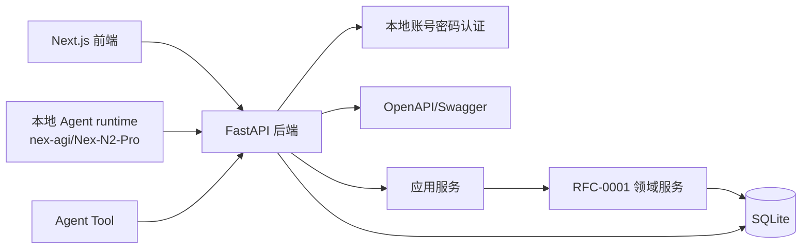
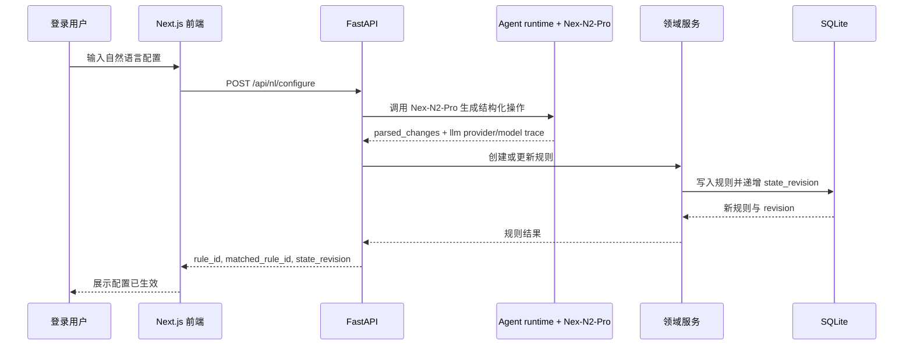
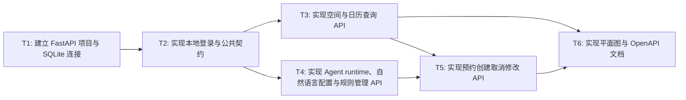

# RFC-0002: FastAPI 后端 API 与 Agent Tool 契约

## 摘要

会务系统需要同时服务 Next.js 前端、本地实际 Agent runtime 和 Agent Tool 调用。这个 RFC 定义 FastAPI 后端的应用边界、认证方式、SQLite 持久化策略、OpenAPI 契约、核心 API 路径、公共请求/响应格式、错误码和幂等规则。核心方案是：所有业务操作都通过结构化 API 调用领域服务；本地 Agent runtime 使用 nex-agi/Nex-N2-Pro 将自然语言解析为结构化操作，并调用 FastAPI 写入规则、预约和配置状态；Agent Tool 通过 OpenAPI/Swagger 了解可调用能力。

本 RFC 不设计前端页面，但定义实际 Agent/LLM 编排边界。它最重要的限制是：本期只支持本地账号密码登录，所有登录用户业务权限相同；不做管理员/成员分级；不调用真实日历、支付、餐厅、会议室或其他外部生产系统；LLM API 必须使用 nex-agi/Nex-N2-Pro。

## 动机

前端、测试和 Agent Tool 都需要稳定、可解释、可重试的后端接口。如果 API 只返回自然语言文本，前端无法可靠渲染日历和平面图，Agent 也无法安全重试创建预约或修改规则。尤其需求要求：

- 自然语言配置结果必须真正进入系统状态；
- 后续查询、预约和冲突校验必须读取这些配置；
- 504 连续修改只更新同一条规则；
- 活动室固定占用规则必须阻断中午预约；
- 合并会议室期间不能分别预约会议室一和会议室二；
- 本地实际 Agent runtime 必须使用 nex-agi/Nex-N2-Pro 生成结构化操作并调用 FastAPI；
- API 需要暴露给 Agent Tool 调用，同时核心闭环不得依赖真实日历、支付、餐厅或外部会议室系统。

因此需要一个面向机器调用和前端展示的后端 API 契约，而不是只面向浏览器页面。

## 设计

### 用户看到的完整流程

1. 用户打开 Next.js 前端，访问登录页并输入本地账号密码。
2. FastAPI 校验账号密码后返回登录态；所有登录用户拥有相同业务权限，但不能覆盖固定规则或强制绕过冲突。
3. 用户进入会议室列表、日历、平面图或自然语言输入页。
4. 前端或本地 Agent runtime 调用 `GET /api/rooms`、`POST /api/availability:check`、`GET /api/calendar` 或 `GET /api/floor-plan` 获取当前会务状态。
5. 用户输入自然语言配置，例如“这周三 504 临时维修，全天不能预约。刚才说错了，只停用下午”。
6. 本地 Agent runtime 使用 nex-agi/Nex-N2-Pro 生成结构化 `parsed_changes`，前端调用 `POST /api/nl/configure`；后端直接解析并写入房间、开放时段或规则，返回 `state_revision` 和受影响时段。
7. 用户输入自然语言预约意图，例如“下周二 10:00—11:00 想约一间小会议室开项目讨论”。
8. 本地 Agent runtime 使用 nex-agi/Nex-N2-Pro 生成结构化候选查询，前端调用 `POST /api/nl/bookings:candidates`；后端返回候选目标、排除目标和不可用原因；用户选择目标后，前端再调用 `POST /api/bookings` 创建预约。
9. 创建预约前，前端或 Agent runtime 可调用 `POST /api/availability:check` 做冲突预检；如果预约冲突或命中规则，API 返回结构化错误、冲突详情和可操作建议。
10. 用户取消预约时，前端调用取消接口；后端释放时段、递增状态版本并返回释放结果。

### 概述

FastAPI 后端位于 Next.js 前端、本地 Agent runtime、Agent Tool 和领域服务之间。它负责认证、请求校验、幂等控制、状态版本返回、OpenAPI 暴露和错误标准化；本地 Agent runtime 使用 nex-agi/Nex-N2-Pro 将用户自然语言转换为结构化 API 调用；真正的会议室规则、组合空间约束和冲突检测由 RFC-0001 定义的领域服务完成。



图读法：前端、Agent runtime 和 Agent Tool 只与 FastAPI 交互；FastAPI 不直接硬编码会务规则，而是委托领域服务处理规则和冲突。Agent runtime 是实际 Agent 层，负责 LLM 解析、工具选择和状态写入链路，而不是只展示 OpenAPI 文档。

### 本地可运行入口与服务编排

本地演示必须提供一条从登录到 Agent 驱动状态写入再到前端刷新的可重复入口：

1. 后端：启动 FastAPI，默认加载 SQLite、默认房间、固定规则、演示账号和本地 Agent runtime 配置。
2. 前端：启动 Next.js，默认通过环境变量 `NEXT_PUBLIC_API_BASE_URL` 指向 FastAPI；开发环境可使用同域代理。
3. Agent runtime：启动在 FastAPI 进程内或同仓库独立服务内均可，但必须使用 `nex-agi` provider 和 `Nex-N2-Pro` model，并通过环境变量 `LLM_PROVIDER=nex-agi`、`LLM_MODEL=Nex-N2-Pro`、`NEX_AGI_API_KEY` 配置。
4. 健康检查：`GET /api/health` 返回服务状态、SQLite 可用性、LLM provider/model、外部系统边界和当前 `state_revision`。
5. 外部系统边界：默认不配置真实日历、支付、餐厅、会议室或其他外部生产系统；核心本地闭环在禁用外部网络或 mock LLM 时仍可运行，但真实 Agent 验收必须断言实际调用 Nex-N2-Pro。

建议启动命令：

```bash
# backend
export LLM_PROVIDER=nex-agi
export LLM_MODEL=Nex-N2-Pro
export NEX_AGI_API_KEY=...
uvicorn backend.app.main:app --reload --host 127.0.0.1 --port 8000

# frontend
export NEXT_PUBLIC_API_BASE_URL=http://127.0.0.1:8000
npm run dev --workspace frontend
```

### 关键设计决策

1. **Next.js 调 FastAPI，而不是 Next.js 直接访问 SQLite**：前端只负责展示和交互，业务规则、权限、幂等和状态写入集中在后端。
2. **本期包含实际 Agent runtime**：前端自然语言入口由本地 Agent runtime 编排，Agent runtime 使用 nex-agi/Nex-N2-Pro 生成结构化操作并调用 FastAPI，确保自然语言配置、候选预约和冲突校验真实进入系统状态。
3. **LLM API 固定为 nex-agi/Nex-N2-Pro**：启动配置必须声明 provider 和 model；未配置 Nex-N2-Pro 时服务应失败或返回可观测错误，不得静默回退到其他 LLM。
4. **所有用户登录但业务权限相同**：登录用于识别当前用户、记录预约人和审计信息；本期不做管理员/成员分级，也不提供强制覆盖冲突的管理员能力。
5. **固定空间关系是不可变领域不变量**：活动室午餐不可预约、会议室一/二可合并、503/504/505/506 的小会议室关系、505 周二不可用不能被普通配置覆盖。
6. **自然语言配置直接生效但支持 dry_run 预览**：用户已确认不需要管理员确认；前端和 Agent runtime 仍可在提交前调用 `dry_run=true` 预览 `parsed_changes` 和影响时段。
7. **自然语言预约先给候选再创建**：查询类意图返回候选目标；只有用户明确选择目标后，才调用创建预约接口。
8. **OpenAPI/Swagger 是 Agent Tool 契约，不是 Agent 层替代品**：API 必须能被 Agent Tool 读取和调用；本地实际 Agent runtime 仍必须存在并纳入验收。
9. **写操作统一支持幂等和状态版本**：创建预约、取消预约、修改预约、创建/更新规则、创建/更新房间和开放时段都必须携带 `idempotency_key` 与 `expected_state_revision`，避免 Agent 或前端重试造成重复写入或丢失更新。
10. **响应必须可解释**：不可用、冲突、规则阻断都要返回 `reason_code`、`message`、`details` 和 `suggestions`，方便前端和 Agent 展示。

### 认证与权限模型

#### 登录

本地账号密码登录用于本期演示。所有登录用户业务权限相同，均可：

- 查看会议室；
- 查询可用会议室和冲突预检；
- 配置会议室、开放时段和动态规则；
- 创建预约；
- 取消预约；
- 修改预约但不强制覆盖冲突或固定规则。

管理员调整属于挑战功能范围，但本期不引入管理员/RBAC，也不暴露强制覆盖冲突能力。若未来要区分管理员和普通成员，应在新的 RFC 中设计权限模型、审计和受影响预约处理。

#### 权限边界

| 操作 | 是否要求登录 | 权限要求 | 固定规则/冲突边界 |
|---|---:|---|---|
| 查询会议室列表 | 是 | 任意登录用户 | 固定规则状态只读展示 |
| 查询可用会议室 | 是 | 任意登录用户 | 固定规则和目标存在性必须参与判断 |
| 查询日历 | 是 | 任意登录用户 | 固定占用、动态规则、组合占用只读展示 |
| 自然语言配置 | 是 | 任意登录用户 | 可修改动态规则和可配置房间/开放时段，不能覆盖固定规则 |
| 创建预约 | 是 | 任意登录用户 | 必须通过规则引擎冲突校验 |
| 取消预约 | 是 | 任意登录用户，可取消自己或同权限下可见预约 | 释放时段并返回 released_slots |
| 修改预约 | 是 | 任意登录用户 | 不能 `force=true` 绕过冲突或规则 |
| 查询平面图 | 是 | 任意登录用户 | 固定规则状态只读展示 |

固定规则删除/修改应返回 `PROTECTED_RULE` 或等价错误；`force=true` 本期不在 API schema 中启用。

### 公共请求格式

写操作必须统一支持以下字段。

```json
{
  "workspace_id": "default",
  "actor_id": "user_001",
  "idempotency_key": "stable-key",
  "expected_state_revision": 12,
  "dry_run": false
}
```

| 字段 | 是否必须 | 说明 |
|---|---:|---|
| `workspace_id` | 必须 | 本地演示默认 `default`；幂等键按 workspace 隔离 |
| `actor_id` | 必须 | 当前登录用户 ID；后端可从 token 注入，但请求模型必须保留该字段 |
| `idempotency_key` | 必须 | 稳定幂等键，由调用方生成；按 `(workspace_id, actor_id, idempotency_key, request_hash)` 记录 |
| `expected_state_revision` | 必须 | 期望写入前的状态版本；不匹配时返回 `STATE_REVISION_CONFLICT` |
| `dry_run` | 必须 | `true` 时只预览，不写入系统状态；自然语言配置和规则/房间/开放时段变更均支持 |

### 公共响应格式

成功响应：

```json
{
  "ok": true,
  "request_id": "req_xxx",
  "data": {},
  "warnings": [],
  "meta": {
    "state_revision": 13,
    "server_time": "2026-07-31T10:00:00+08:00",
    "timezone": "Asia/Shanghai"
  }
}
```

失败响应：

```json
{
  "ok": false,
  "request_id": "req_xxx",
  "error": {
    "code": "BOOKING_CONFLICT",
    "message": "该会议室在指定时段已有预约",
    "details": {},
    "suggestions": []
  },
  "meta": {
    "state_revision": 13,
    "server_time": "2026-07-31T10:00:00+08:00",
    "timezone": "Asia/Shanghai"
  }
}
```

接口示例说明：为保持可读性，部分接口示例省略了公共字段；实际 OpenAPI schema 和所有响应示例必须包含 `ok`、`request_id`、`data` 或 `error`、`warnings`、`meta.state_revision`、`meta.server_time`、`meta.timezone`。失败响应还必须包含 `error.code`、`error.message`、`error.details` 和 `error.suggestions`。

### 错误码设计

| API 错误码 | 含义 | 典型返回 |
|---|---|---|
| `UNAUTHORIZED` | 未登录或 token 无效 | 401 |
| `FORBIDDEN` | 当前用户无权执行 | 403 |
| `VALIDATION_ERROR` | 入参格式或字段错误 | 400 |
| `NATURAL_LANGUAGE_AMBIGUOUS` | 自然语言解析结果不唯一 | 400 |
| `ROOM_NOT_FOUND` | 房间不存在 | 404 |
| `COMPOSITE_NOT_FOUND` | 组合空间不存在 | 404 |
| `BOOKING_NOT_FOUND` | 预约不存在 | 404 |
| `RULE_NOT_FOUND` | 规则不存在 | 404 |
| `STATE_REVISION_CONFLICT` | 写入时状态版本已变化 | 409 |
| `IDEMPOTENCY_KEY_REUSED` | 同一幂等键内容冲突 | 409 |
| `BOOKING_CONFLICT` | 与已有预约重叠 | 409 |
| `BOOKING_BLOCKED_BY_RULE` | 命中不可预约规则 | 409 |
| `OUTSIDE_OPENING_HOURS` | 不在开放时间内 | 409 |
| `PROTECTED_RULE` | 尝试修改或删除固定规则 | 409 |
| `LLM_PROVIDER_ERROR` | Nex-N2-Pro 调用失败或配置缺失 | 502 |

| 业务原因码 `reason_code` | 含义 | 适用接口 |
|---|---|---|
| `FIXED_UNAVAILABLE` | 固定不可预约，例如活动室午餐、505 周二 | 可用查询、日历、平面图、创建预约 |
| `WEEKLY_UNAVAILABLE` | 周期性不可用 | 可用查询、日历、平面图、创建预约 |
| `TEMPORARY_MAINTENANCE` | 临时维修/动态禁用 | 可用查询、日历、平面图、创建预约 |
| `OVERLAPPING_BOOKING` | 与普通预约重叠 | 可用查询、创建预约、修改预约 |
| `OVERLAPPING_COMPOSITE_BOOKING` | 与组合预约或成员房间占用冲突 | 可用查询、创建预约、修改预约、日历、平面图 |
| `COMPOSITE_BOOKED` | 成员房间被组合空间占用 | 日历、平面图 |
| `OUTSIDE_OPENING_HOURS` | 不在开放时间内 | 可用查询、创建预约 |

### 接口契约

#### 登录接口

**路径**

```http
POST /api/auth/login
POST /api/auth/logout
GET /api/auth/me
```

**`POST /api/auth/login` 请求**

```json
{
  "username": "demo",
  "password": "demo-password"
}
```

**返回**

```json
{
  "ok": true,
  "request_id": "req_login",
  "data": {
    "user": {
      "id": "user_001",
      "name": "演示用户",
      "role": "member"
    },
    "token": "local-demo-token"
  },
  "warnings": [],
  "meta": {"state_revision": 0, "server_time": "2026-07-31T10:00:00+08:00", "timezone": "Asia/Shanghai"}
}
```

**说明**

- 本期 `role` 固定为 `member`，仅用于展示和审计。
- 本地演示可采用 SQLite 用户表或启动时 seed 的演示账号。

---

#### 查询会议室列表

**路径**

```http
GET /api/rooms
```

**请求参数**

| 参数 | 类型 | 说明 |
|---|---|---|
| `include_composite` | bool | 是否返回组合空间 |
| `date` | string | 可选，用于返回该日期状态 |
| `start_at` | string | 可选，与 `end_at` 一起用于返回时段状态 |
| `end_at` | string | 可选 |
| `capacity` | int | 可选，最小容量 |
| `equipment` | string[] | 可选，要求具备的设备 |
| `room_type` | string | 可选，例如 `small` |

**返回**

```json
{
  "ok": true,
  "request_id": "req_rooms",
  "data": {
    "rooms": [
      {
        "id": "503",
        "name": "503",
        "type": "small",
        "location": "5F",
        "capacity": 4,
        "equipment": ["whiteboard"],
        "position": {"x": 40, "y": 120, "width": 80, "height": 50},
        "status": "available",
        "protected": false
      },
      {
        "id": "activity-room",
        "name": "活动室",
        "type": "activity",
        "location": "5F",
        "capacity": 20,
        "equipment": ["projector", "whiteboard"],
        "position": {"x": 40, "y": 40, "width": 100, "height": 60},
        "status": "available",
        "protected": true
      }
    ],
    "composites": [
      {
        "id": "meeting-room-1-2",
        "name": "会议室一+会议室二",
        "member_room_ids": ["meeting-room-1", "meeting-room-2"],
        "capacity": 24,
        "equipment": ["projector", "whiteboard"],
        "status": "available",
        "protected": true
      }
    ]
  },
  "warnings": [],
  "meta": {"state_revision": 1, "server_time": "2026-07-31T10:00:00+08:00", "timezone": "Asia/Shanghai"}
}
```

**说明**

- 默认房间列表必须包含 `activity-room`、`meeting-room-1`、`meeting-room-2`、`503`、`504`、`505`、`506`，不得包含 `502`。
- `protected` 表示该对象或关系属于固定空间不变量，普通配置不能删除或覆盖。
- 房间坐标来自领域初始化或 NL 创建房间时提供的 `position`。

---

#### 会议室配置

**路径**

```http
POST /api/rooms
PATCH /api/rooms/{room_id}
POST /api/rooms/{room_id}/opening-schedules
PATCH /api/rooms/{room_id}/opening-schedules/{schedule_id}
DELETE /api/rooms/{room_id}/opening-schedules/{schedule_id}
```

**`PATCH /api/rooms/{room_id}` 请求**

```json
{
  "name": "504",
  "type": "small",
  "capacity": 4,
  "equipment": ["whiteboard"],
  "location": "5F",
  "position": {"x": 140, "y": 120, "width": 80, "height": 50},
  "active": true,
  "dry_run": false,
  "idempotency_key": "agent:room:update:504:v1",
  "expected_state_revision": 2
}
```

**`POST /api/rooms/{room_id}/opening-schedules` 请求**

```json
{
  "weekday": 3,
  "start_time": "09:00",
  "end_time": "18:00",
  "dry_run": false,
  "idempotency_key": "agent:room:opening:504:wed",
  "expected_state_revision": 3
}
```

**返回**

```json
{
  "ok": true,
  "request_id": "req_room_update",
  "data": {
    "room": {
      "id": "504",
      "name": "504",
      "type": "small",
      "capacity": 4,
      "location": "5F",
      "equipment": ["whiteboard"],
      "position": {"x": 140, "y": 120, "width": 80, "height": 50},
      "protected": false
    },
    "opening_schedule": {
      "id": "sch_504_wed",
      "weekday": 3,
      "start_time": "09:00",
      "end_time": "18:00"
    }
  },
  "warnings": [],
  "meta": {"state_revision": 4, "server_time": "2026-07-31T10:00:00+08:00", "timezone": "Asia/Shanghai"}
}
```

**说明**

- 固定房间的基础身份和固定关系不可删除；普通配置可修改容量、设备、展示名、开放时段和动态状态。
- 新增房间必须提供或分配 `position`，否则平面图以 `position=null` 展示并要求用户补充。
- 删除开放时段只允许动态配置创建的对象；固定午餐规则不得通过开放时段删除。

---

#### 查询可用会议室

**路径**

```http
POST /api/availability:query
```

**请求**

```json
{
  "start_at": "2026-08-04T10:00:00+08:00",
  "end_at": "2026-08-04T11:00:00+08:00",
  "timezone": "Asia/Shanghai",
  "capacity": 4,
  "equipment": [],
  "room_types": ["small"],
  "allow_merge": true
}
```

**返回**

```json
{
  "ok": true,
  "request_id": "req_availability_query",
  "data": {
    "available_targets": [
      {
        "target_type": "room",
        "target_id": "503",
        "name": "503",
        "type": "small",
        "capacity": 4,
        "available": true
      },
      {
        "target_type": "room",
        "target_id": "506",
        "name": "506",
        "type": "small",
        "capacity": 4,
        "available": true
      },
      {
        "target_type": "composite",
        "target_id": "meeting-room-1-2",
        "name": "会议室一+会议室二",
        "member_room_ids": ["meeting-room-1", "meeting-room-2"],
        "capacity": 24,
        "available": true
      }
    ],
    "unavailable_targets": [
      {
        "target_type": "room",
        "target_id": "505",
        "reason_code": "WEEKLY_UNAVAILABLE",
        "message": "505 每周二全天不可用"
      }
    ],
    "conflicts": []
  },
  "warnings": [],
  "meta": {"state_revision": 1, "server_time": "2026-07-31T10:00:00+08:00", "timezone": "Asia/Shanghai"}
}
```

**说明**

- `allow_merge=true` 时，`available_targets` 可以包含 `target_type=composite` 的组合空间。
- 查询结果必须已经应用固定规则、动态规则、开放时间和已有预约。
- 下周二 10:00-11:00 查询小会议室时，505 不得出现在 `available_targets`。
- `available_targets` 与 `POST /api/bookings` 使用同一 `target_type`/`target_id` 字段，前端不得再依赖 `room_id`/`composite_id` 二选一结构。

---

#### 冲突/可用性预检

**路径**

```http
POST /api/availability:check
```

**请求**

```json
{
  "target_type": "room",
  "target_id": "503",
  "start_at": "2026-08-04T10:00:00+08:00",
  "end_at": "2026-08-04T11:00:00+08:00",
  "capacity": 4,
  "equipment": []
}
```

**返回**

```json
{
  "ok": true,
  "data": {
    "available": true,
    "checks": [
      {"check_type": "target_exists", "passed": true},
      {"check_type": "opening_hours", "passed": true},
      {"check_type": "room_rule", "passed": true},
      {"check_type": "booking_overlap", "passed": true}
    ],
    "conflicts": [],
    "unavailable_reasons": []
  },
  "warnings": [],
  "meta": {"state_revision": 1, "server_time": "2026-07-31T10:00:00+08:00", "timezone": "Asia/Shanghai"}
}
```

**说明**

- 该接口是独立冲突校验端口，创建预约前可由前端或 Agent runtime 调用。
- 当 `available=false` 时返回 `409`，`error.details.conflicts` 包含 `conflict_type`、`reason_code`、`target_type`、`target_id`、`overlap_start`、`overlap_end`、`blocking_booking_id` 或 `blocking_rule_id`。
- 活动室午餐固定占用和 505 周二不可用必须在该接口返回稳定 `reason_code`。

---

#### 查询日历/时段占用

**路径**

```http
GET /api/calendar
```

**请求参数**

| 参数 | 类型 | 说明 |
|---|---|---|
| `target_type` | string | `room` 或 `composite` |
| `target_id` | string | 目标 ID |
| `date` | string | 查询日期 |
| `range_start` | string | 查询范围开始 |
| `range_end` | string | 查询范围结束 |
| `include_bookings` | bool | 是否包含预约 |
| `include_rules` | bool | 是否包含规则 |
| `include_fixed_blocks` | bool | 是否包含固定占用 |

**说明**

- 固定占用包括活动室午餐时段，但 API 不引入午餐专用规则类型。
- 前端和 Agent Tool 只把固定占用当作普通不可预约规则/时段处理。

**返回**

```json
{
  "ok": true,
  "request_id": "req_calendar",
  "data": {
    "slots": [
      {
        "start_at": "2026-08-04T10:00:00+08:00",
        "end_at": "2026-08-04T11:00:00+08:00",
        "status": "booked",
        "target_type": "room",
        "target_id": "503",
        "booking_id": "bk_123",
        "title": "项目讨论"
      },
      {
        "start_at": "2026-08-04T12:00:00+08:00",
        "end_at": "2026-08-04T13:00:00+08:00",
        "status": "blocked_by_rule",
        "rule_id": "rule_lunch_activity_room",
        "reason_code": "FIXED_UNAVAILABLE",
        "message": "活动室固定占用时段（午餐）不可预约会议"
      }
    ]
  },
  "warnings": [],
  "meta": {"state_revision": 1, "server_time": "2026-07-31T10:00:00+08:00", "timezone": "Asia/Shanghai"}
}
```

---

#### 查询预约列表

**路径**

```http
GET /api/bookings
```

**请求参数**

| 参数 | 类型 | 说明 |
|---|---|---|
| `target_type` | string | 可选，`room` 或 `composite` |
| `target_id` | string | 可选，目标 ID |
| `actor_id` | string | 可选，按预约人过滤 |
| `date` | string | 可选，查询日期 |
| `range_start` | string | 可选，查询范围开始 |
| `range_end` | string | 可选，查询范围结束 |
| `status` | string | 可选，`confirmed` 或 `cancelled` |
| `limit` | int | 可选，默认 50 |

**返回**

```json
{
  "ok": true,
  "request_id": "req_bookings",
  "data": {
    "items": [
      {
        "booking_id": "bk_123",
        "target_type": "room",
        "target_id": "503",
        "target_name": "503",
        "title": "项目讨论",
        "start_at": "2026-08-04T10:00:00+08:00",
        "end_at": "2026-08-04T11:00:00+08:00",
        "status": "confirmed",
        "organizer_id": "user_001"
      }
    ]
  },
  "warnings": [],
  "meta": {"state_revision": 1, "server_time": "2026-07-31T10:00:00+08:00", "timezone": "Asia/Shanghai"}
}
```

---

#### 查询预约详情

**路径**

```http
GET /api/bookings/{booking_id}
```

**返回**

```json
{
  "ok": true,
  "request_id": "req_booking_detail",
  "data": {
    "booking_id": "bk_123",
    "target_type": "room",
    "target_id": "503",
    "target_name": "503",
    "title": "项目讨论",
    "start_at": "2026-08-04T10:00:00+08:00",
    "end_at": "2026-08-04T11:00:00+08:00",
    "status": "confirmed",
    "organizer_id": "user_001",
    "attendees": ["user_001", "user_002"],
    "description": "",
    "created_at": "2026-07-31T10:00:00+08:00"
  },
  "warnings": [],
  "meta": {"state_revision": 1, "server_time": "2026-07-31T10:00:00+08:00", "timezone": "Asia/Shanghai"}
}
```

---

#### 自然语言配置

**路径**

```http
POST /api/nl/configure
```

**请求**

```json
{
  "utterance": "这周三 504 临时维修，全天不能预约。刚才说错了，只停用下午。",
  "workspace_id": "default",
  "actor_id": "user_001",
  "dry_run": false,
  "idempotency_key": "agent:nl-configure:user_001:504-repair-20260805:v2",
  "expected_state_revision": 15
}
```

**返回**

```json
{
  "ok": true,
  "request_id": "req_nl_configure",
  "data": {
    "intent": "update_rule",
    "llm": {"provider": "nex-agi", "model": "Nex-N2-Pro"},
    "parsed_changes": [
      {
        "operation": "upsert_rule",
        "target_type": "room",
        "target_id": "504",
        "rule_type": "temporary_maintenance",
        "time_windows": [
          {"start_at": "2026-08-05T13:00:00+08:00", "end_at": "2026-08-05T18:00:00+08:00", "recurrence": null}
        ],
        "reason": "临时维修"
      }
    ],
    "matched_rule_id": "rule_504_repair_20260805",
    "rule_id": "rule_504_repair_20260805",
    "status": "updated",
    "old_rule": {},
    "new_rule": {},
    "impacted_slots": []
  },
  "warnings": [],
  "meta": {"state_revision": 16, "server_time": "2026-07-31T10:00:00+08:00", "timezone": "Asia/Shanghai"}
}
```

**说明**

- 本期不需要先解析、管理员确认、再生效。
- 接口必须直接写入系统状态，除非 `dry_run=true`。
- 返回必须包含 `matched_rule_id`，用于证明连续修改更新的是同一条规则。

---

#### 自然语言预约候选

**路径**

```http
POST /api/nl/bookings:candidates
```

**请求**

```json
{
  "utterance": "下周二 10:00—11:00 想约一间小会议室开项目讨论，帮我看看有哪些可以用。",
  "workspace_id": "default",
  "actor_id": "user_001",
  "dry_run": true,
  "idempotency_key": "agent:nl-candidates:user_001:20260804-1000",
  "expected_state_revision": 16
}
```

**返回**

```json
{
  "ok": true,
  "request_id": "req_nl_candidates",
  "data": {
    "intent": "query_availability",
    "llm": {"provider": "nex-agi", "model": "Nex-N2-Pro"},
    "parsed_booking": {
      "start_at": "2026-08-04T10:00:00+08:00",
      "end_at": "2026-08-04T11:00:00+08:00",
      "room_type": "small",
      "title": "项目讨论"
    },
    "candidates": [
      {
        "target_type": "room",
        "target_id": "503",
        "name": "503",
        "available": true
      },
      {
        "target_type": "room",
        "target_id": "506",
        "name": "506",
        "available": true
      }
    ],
    "excluded_targets": [
      {
        "target_type": "room",
        "target_id": "505",
        "reason_code": "WEEKLY_UNAVAILABLE",
        "message": "505 每周二全天不可用"
      }
    ]
  },
  "warnings": [],
  "meta": {"state_revision": 16, "server_time": "2026-07-31T10:00:00+08:00", "timezone": "Asia/Shanghai"}
}
```

**说明**

- 该接口只返回候选，不创建预约。
- 用户选择候选后，前端调用 `POST /api/bookings`。

---

#### 创建预约

**路径**

```http
POST /api/bookings
```

**请求**

```json
{
  "target_type": "room",
  "target_id": "503",
  "room_id": "503",
  "composite_id": null,
  "start_at": "2026-08-04T10:00:00+08:00",
  "end_at": "2026-08-04T11:00:00+08:00",
  "title": "项目讨论",
  "organizer_id": "user_001",
  "attendees": ["user_001", "user_002"],
  "description": "",
  "dry_run": false,
  "idempotency_key": "agent:create-booking:user_001:2026-08-04:503:10-11",
  "expected_state_revision": 16
}
```

**返回**

```json
{
  "ok": true,
  "request_id": "req_create_booking",
  "data": {
    "booking_id": "bk_123",
    "status": "confirmed",
    "target_type": "room",
    "target_id": "503",
    "target_name": "503",
    "start_at": "2026-08-04T10:00:00+08:00",
    "end_at": "2026-08-04T11:00:00+08:00",
    "conflicts": []
  },
  "warnings": [],
  "meta": {"state_revision": 17, "server_time": "2026-07-31T10:00:00+08:00", "timezone": "Asia/Shanghai"}
}
```

**冲突返回**

```json
{
  "ok": false,
  "error": {
    "code": "BOOKING_CONFLICT",
    "message": "该会议室在指定时段已有预约",
    "details": {
      "conflicts": [
        {
          "conflict_type": "overlapping_booking",
          "reason_code": "OVERLAPPING_BOOKING",
          "target_type": "room",
          "target_id": "503",
          "booking_id": "bk_999",
          "overlap_start": "2026-08-04T10:00:00+08:00",
          "overlap_end": "2026-08-04T11:00:00+08:00"
        }
      ]
    },
    "suggestions": ["可尝试其他时段", "可选择其他可用房间"]
  },
  "warnings": [],
  "meta": {"state_revision": 16, "server_time": "2026-07-31T10:00:00+08:00", "timezone": "Asia/Shanghai"}
}
```

**说明**

- `target_type`/`target_id` 是主字段；`room_id`/`composite_id` 仅作为兼容 alias，Agent runtime 和前端新页面应优先使用主字段。
- 创建时必须执行规则引擎校验，可先调用 `POST /api/availability:check` 或复用同一规则引擎。
- 组合预约成功后，成员房间在该时段不能再被分别预约；成员房间已有预约时，组合预约必须返回 `OVERLAPPING_COMPOSITE_BOOKING`。

---

#### 取消预约

**路径**

```http
POST /api/bookings/{booking_id}/cancel
```

**请求**

```json
{
  "reason": "会议取消",
  "dry_run": false,
  "idempotency_key": "agent:cancel-booking:bk_123",
  "expected_state_revision": 17
}
```

**返回**

```json
{
  "ok": true,
  "request_id": "req_cancel_booking",
  "data": {
    "booking_id": "bk_123",
    "status": "cancelled",
    "released_slots": [
      {
        "target_type": "room",
        "target_id": "503",
        "start_at": "2026-08-04T10:00:00+08:00",
        "end_at": "2026-08-04T11:00:00+08:00"
      }
    ]
  },
  "warnings": [],
  "meta": {"state_revision": 18, "server_time": "2026-07-31T10:00:00+08:00", "timezone": "Asia/Shanghai"}
}
```

---

#### 修改预约

**路径**

```http
PATCH /api/bookings/{booking_id}
```

**请求**

```json
{
  "title": "调整后的项目讨论",
  "target_type": "room",
  "target_id": "503",
  "room_id": "503",
  "composite_id": null,
  "start_at": "2026-08-04T15:00:00+08:00",
  "end_at": "2026-08-04T16:00:00+08:00",
  "reason": "用户调整时间",
  "dry_run": false,
  "idempotency_key": "agent:update-booking:user_001:bk_123:v2",
  "expected_state_revision": 18
}
```

**返回**

```json
{
  "ok": true,
  "request_id": "req_update_booking",
  "data": {
    "booking_id": "bk_123",
    "status": "updated",
    "target_type": "room",
    "target_id": "503",
    "old_booking": {},
    "new_booking": {},
    "conflicts": []
  },
  "warnings": [],
  "meta": {"state_revision": 19, "server_time": "2026-07-31T10:00:00+08:00", "timezone": "Asia/Shanghai"}
}
```

**说明**

- 本期不在 API schema 中启用 `force=true`；修改预约同样不能绕过冲突或固定规则。
- 组合预约修改必须同步校验成员房间冲突。

---

#### 规则管理

**路径**

```http
GET /api/rules
GET /api/rules/{rule_id}
POST /api/rules
PATCH /api/rules/{rule_id}
DELETE /api/rules/{rule_id}
```

**`GET /api/rules` 请求参数**

| 参数 | 类型 | 说明 |
|---|---|---|
| `target_type` | string | 可选，`room` 或 `composite` |
| `target_id` | string | 可选，目标 ID |
| `rule_type` | string | 可选，例如 `temporary_maintenance` |
| `fixed` | bool | 可选，只返回固定或动态规则 |
| `date` | string | 可选，过滤影响该日期的规则 |
| `limit` | int | 可选，默认 100 |

**`POST /api/rules` 请求**

```json
{
  "rule_type": "temporary_maintenance",
  "target_type": "room",
  "target_id": "504",
  "time_windows": [
    {"start_at": "2026-08-05T13:00:00+08:00", "end_at": "2026-08-05T18:00:00+08:00", "recurrence": null}
  ],
  "reason": "临时维修",
  "match_key": "504:temporary_maintenance:2026-08-05",
  "dry_run": false,
  "idempotency_key": "agent:rule:user_001:504:repair:20260805",
  "expected_state_revision": 19
}
```

**`GET /api/rules` 返回**

```json
{
  "ok": true,
  "request_id": "req_rules",
  "data": {
    "items": [
      {
        "rule_id": "rule_lunch_activity_room",
        "rule_type": "lunch_block",
        "target_type": "room",
        "target_id": "activity-room",
        "time_windows": [
          {"start_at": "12:00", "end_at": "13:00", "recurrence": "weekly"}
        ],
        "reason": "活动室午餐固定占用",
        "fixed": true,
        "editable": false
      },
      {
        "rule_id": "rule_505_tuesday",
        "rule_type": "weekly_unavailable",
        "target_type": "room",
        "target_id": "505",
        "time_windows": [
          {"start_at": "00:00", "end_at": "23:59", "recurrence": "weekly:tuesday"}
        ],
        "reason": "505 每周二全天不可用",
        "fixed": true,
        "editable": false
      }
    ]
  },
  "warnings": [],
  "meta": {"state_revision": 15, "server_time": "2026-07-31T10:00:00+08:00", "timezone": "Asia/Shanghai"}
}
```

**`GET /api/rules/{rule_id}` 返回**

```json
{
  "ok": true,
  "request_id": "req_rule_detail",
  "data": {
    "rule_id": "rule_504_repair_20260805",
    "rule_type": "temporary_maintenance",
    "target_type": "room",
    "target_id": "504",
    "time_windows": [
      {"start_at": "2026-08-05T13:00:00+08:00", "end_at": "2026-08-05T18:00:00+08:00", "recurrence": null}
    ],
    "reason": "临时维修",
    "fixed": false,
    "editable": true,
    "created_by": "user_001",
    "updated_by": "user_001"
  },
  "warnings": [],
  "meta": {"state_revision": 16, "server_time": "2026-07-31T10:00:00+08:00", "timezone": "Asia/Shanghai"}
}
```

**`POST /api/rules` 返回**

```json
{
  "ok": true,
  "request_id": "req_rule_upsert",
  "data": {
    "rule_id": "rule_504_repair_20260805",
    "matched_rule_id": "rule_504_repair_20260805",
    "status": "updated",
    "old_rule": {},
    "new_rule": {},
    "impacted_slots": []
  },
  "warnings": [],
  "meta": {"state_revision": 17, "server_time": "2026-07-31T10:00:00+08:00", "timezone": "Asia/Shanghai"}
}
```

**说明**

- `GET /api/rules` 支持按目标、规则类型、fixed/dynamic 和日期过滤，用于规则配置页和 Agent Tool 读取。
- `POST /api/rules` 支持创建或匹配更新规则。
- `PATCH /api/rules/{rule_id}` 用于显式修改已有规则，请求同样使用 `time_windows: [{start_at, end_at, recurrence}]`。
- `DELETE /api/rules/{rule_id}` 只允许删除动态规则；删除固定规则返回 `PROTECTED_RULE`。
- 固定规则不能被普通用户覆盖、删除或改为可预约。

---

#### 平面图视图

**路径**

```http
GET /api/floor-plan
```

**请求参数**

| 参数 | 类型 | 说明 |
|---|---|---|
| `floor_id` | string | 例如 `5F` |
| `date` | string | 查询日期 |
| `time` | string | 查询时刻 |
| `include_status` | bool | 是否返回状态 |
| `include_rules` | bool | 是否返回规则原因 |
| `include_bookings` | bool | 是否返回预约摘要 |

**返回**

```json
{
  "ok": true,
  "request_id": "req_floor_plan",
  "data": {
    "floor": {
      "id": "5F",
      "name": "5楼"
    },
    "rooms": [
      {
        "id": "503",
        "name": "503",
        "position": {"x": 40, "y": 120, "width": 80, "height": 50},
        "status": "available",
        "reason_code": null,
        "message": "可用"
      },
      {
        "id": "504",
        "name": "504",
        "position": {"x": 140, "y": 120, "width": 80, "height": 50},
        "status": "blocked_by_rule",
        "reason_code": "TEMPORARY_MAINTENANCE",
        "message": "临时维修"
      },
      {
        "id": "505",
        "name": "505",
        "position": {"x": 240, "y": 120, "width": 80, "height": 50},
        "status": "fixed_unavailable",
        "reason_code": "WEEKLY_UNAVAILABLE",
        "message": "505 每周二全天不可用"
      }
    ],
    "composites": [
      {
        "id": "meeting-room-1-2",
        "name": "会议室一+会议室二",
        "member_room_ids": ["meeting-room-1", "meeting-room-2"],
        "position": {"x": 80, "y": 220, "width": 200, "height": 70},
        "status": "available",
        "message": "可合并预约"
      }
    ],
    "member_occupancies": [
      {
        "composite_id": "meeting-room-1-2",
        "member_room_id": "meeting-room-1",
        "affected_by_composite": false,
        "message": "成员房间当前未被组合空间占用"
      }
    ]
  },
  "warnings": [],
  "meta": {"state_revision": 17, "server_time": "2026-07-31T10:00:00+08:00", "timezone": "Asia/Shanghai"}
}
```

### 自然语言解析边界与 LLM 契约

自然语言接口必须由本地实际 Agent runtime 调用 `nex-agi/Nex-N2-Pro` 驱动；OpenAPI/Swagger 只提供 Agent Tool 契约，不能替代 Agent 层。

Agent runtime 配置：

| 配置 | 必填 | 说明 |
|---|---:|---|
| `LLM_PROVIDER` | 是 | 固定为 `nex-agi` |
| `LLM_MODEL` | 是 | 固定为 `Nex-N2-Pro` |
| `NEX_AGI_API_KEY` | 是 | 真实验收必须提供，不允许静默回退到其他模型 |
| `LLM_TIMEOUT_SECONDS` | 否 | 建议 30-60 秒，超时返回 `LLM_PROVIDER_ERROR` |
| `LLM_MAX_RETRIES` | 否 | 建议 1-2 次，失败后返回结构化错误 |

自然语言配置必须能解析：

- 新增或修改会议室；
- 修改容量、设备、位置；
- 修改开放时段；
- 新增或修改不可预约规则；
- 连续修改同一条规则。

自然语言预约候选必须能解析：

- 日期；
- 开始时间；
- 结束时间；
- 房间类型；
- 容量或人数；
- 设备；
- 会议标题或用途。

如果解析不唯一，应返回 `NATURAL_LANGUAGE_AMBIGUOUS`，并列出候选解释。

### 幂等与状态版本

#### 幂等键

所有写操作必须携带 `idempotency_key`。幂等语义如下：

| 场景 | 行为 |
|---|---|
| 同一 `idempotency_key` + 同一请求内容 | 返回上一次成功结果，不重复写入 |
| 同一 `idempotency_key` + 不同请求内容 | 返回 `IDEMPOTENCY_KEY_REUSED` |
| 不同 `idempotency_key` | 视为不同操作 |

#### 状态版本

每次成功写入后，响应返回新的 `state_revision`。如果请求携带 `expected_state_revision` 且与当前版本不一致，返回 `STATE_REVISION_CONFLICT`。

### Agent Tool 调用边界

本地实际 Agent runtime 通过 OpenAPI/Swagger 获取以下能力，并使用 Nex-N2-Pro 生成结构化调用参数：

- `GET /api/rooms`：读取会议室、组合空间和 `position`。
- `GET /api/rules`：读取规则列表、fixed/dynamic 和可编辑性。
- `POST /api/rooms`、`PATCH /api/rooms/{room_id}`、`POST/PATCH /api/rooms/{room_id}/opening-schedules`：配置会议室和开放时段。
- `POST /api/rules`、`PATCH /api/rules/{rule_id}`、`DELETE /api/rules/{rule_id}`：创建、匹配更新、修改或删除动态规则。
- `POST /api/nl/configure`：自然语言配置会议室、开放时段或规则。
- `POST /api/nl/bookings:candidates`：解析自然语言预约意图并返回候选。
- `POST /api/availability:query`：查询可用会议室。
- `POST /api/availability:check`：创建预约前执行冲突/可用性预检。
- `GET /api/calendar`：查询日历/时段占用。
- `POST /api/bookings`：创建预约。
- `GET /api/bookings`、`GET /api/bookings/{booking_id}`：查询预约列表和详情。
- `POST /api/bookings/{booking_id}/cancel`：取消预约。
- `PATCH /api/bookings/{booking_id}`：修改预约。
- `GET /api/floor-plan`：查询平面图状态。

Agent Tool 调用时应遵循：

1. 先登录或携带有效 token。
2. 写操作必须生成稳定 `idempotency_key`。
3. 自然语言配置直接调用配置接口，写入系统状态。
4. 自然语言预约先调用候选接口，用户确认后再创建预约。
5. 遇到 `STATE_REVISION_CONFLICT` 时重新读取状态并重试。
6. 遇到 `NATURAL_LANGUAGE_AMBIGUOUS` 时向用户追问。

### 架构图



## 权衡取舍

### 考虑过的替代方案

#### 替代方案一：只设计自然语言接口

未采用。自然语言接口无法稳定支持前端渲染、测试和 Agent 重试。结构化 API 更适合作为系统边界。

#### 替代方案二：Next.js API Routes 直接承载业务逻辑

未采用。虽然 Next.js 可以写后端逻辑，但会务规则、SQLite 写入、OpenAPI 契约和 Agent Tool 调用更适合集中在 FastAPI 服务中。

#### 替代方案三：不做登录，只模拟用户

未采用。用户明确需要登录系统。虽然本期权限相同，但登录仍是识别用户、记录预约和审计的必要基础。

### 缺点

- 同时维护 Next.js 和 FastAPI 会增加本地启动复杂度。
- 本地账号密码登录安全性有限，只适合演示环境。
- OpenAPI 契约需要随 API 变化持续维护。
- 幂等键和状态版本会增加调用方实现成本。

## 实现计划

### 阶段划分

- [ ] Phase 1: 建立 FastAPI 项目、SQLite 连接、认证和本地账号 seed。
- [ ] Phase 2: 实现公共响应、错误码、幂等和状态版本中间件。
- [ ] Phase 3: 实现会议室、日历、可用查询和平面图 API。
- [ ] Phase 4: 实现本地 Agent runtime、Nex-N2-Pro 调用、自然语言配置、自然语言预约候选和规则管理 API。
- [ ] Phase 5: 实现预约创建、取消、修改、预约列表/详情和 OpenAPI 文档。
- [ ] Phase 6: 添加 API 集成测试、LLM trace 验收和基础场景验收测试。

### 子任务分解

#### 依赖关系图



#### 子任务列表

| ID | 标题 | 依赖 | Ref |
|----|------|------|-----|
| T1 | 建立 FastAPI 项目与 SQLite 连接 | - | - |
| T2 | 实现本地登录与公共契约 | T1 | - |
| T3 | 实现空间与日历查询 API | T2 | - |
| T4 | 实现 Agent runtime、自然语言配置与规则管理 API | T2 | - |
| T5 | 实现预约创建取消修改 API | T3, T4 | - |
| T6 | 实现平面图与 OpenAPI 文档 | T3, T5 | - |

#### 子任务定义

**T1: 建立 FastAPI 项目与 SQLite 连接**
- **范围**: 初始化 FastAPI 应用、SQLite 连接、配置、日志和基础目录结构。
- **验收标准**: 服务可启动；SQLite 可读写；基础健康检查接口返回正常。

**T2: 实现本地登录与公共契约**
- **范围**: 实现本地账号密码登录、退出、当前用户查询、统一响应格式、错误码、幂等和状态版本机制。
- **验收标准**: 未登录访问业务 API 被拒绝；登录后返回用户信息；写操作能识别幂等键和状态版本。

**T3: 实现空间与日历查询 API**
- **范围**: 实现会议室列表、可用会议室查询、日历/时段占用 API。
- **验收标准**: 查询结果应用固定规则、动态规则、开放时间和已有预约；不可用原因结构化返回。

**T4: 实现 Agent runtime、自然语言配置与规则管理 API**
- **范围**: 实现本地 Agent runtime、Nex-N2-Pro 调用、自然语言配置接口、规则列表/详情/创建/更新/删除接口、规则匹配和连续修改逻辑。
- **验收标准**: 自然语言配置直接写入规则；连续修改 504 维修规则只更新同一条规则；真实验收能观测到 Nex-N2-Pro 调用。

**T5: 实现预约创建取消修改 API**
- **范围**: 实现预约列表/详情、创建预约、取消预约、修改预约、审计记录和冲突返回。
- **验收标准**: 创建预约后日历可见；取消后时段释放；冲突返回结构化原因；不暴露强制调整能力。

**T6: 实现平面图与 OpenAPI 文档**
- **范围**: 实现平面图状态 API、静态房间坐标返回、组合空间占用返回、OpenAPI/Swagger 文档和 Agent Tool 调用说明。
- **验收标准**: 平面图状态与日历、规则、预约一致；Swagger 能展示所有 API、请求和响应模型。

### 影响范围

- `backend/app/` - FastAPI 应用入口、路由、依赖注入
- `backend/auth/` - 本地账号密码认证
- `backend/api/` - API 路由和请求/响应模型
- `backend/schemas/` - Pydantic 请求/响应模型
- `backend/services/` - 应用服务、自然语言解析服务、规则服务
- `backend/repositories/` - SQLite 仓储
- `backend/tests/` - API 集成测试
- `docs/openapi/` - 可选的导出版 OpenAPI 文档

## 测试方案

### 单元测试

- 登录成功与失败。
- 统一响应格式和错误码。
- 幂等键重复写入行为。
- 状态版本冲突行为。
- 自然语言配置解析结果和 Nex-N2-Pro 调用参数。
- 自然语言预约候选解析结果和候选 target_type/target_id。
- 规则列表、详情、创建、更新和删除。

### 集成测试

- 登录后可查询会议室列表。
- 未登录不能访问业务 API。
- 下周二 10:00-11:00 查询小会议室，505 不可用，502 不出现。
- 明天中午预约活动室被固定占用规则拒绝。
- 本周五 14:00-16:00 创建组合会议室预约，成功后成员房间不可分别预约；已有成员预约时组合预约被拒绝。
- 504 临时维修连续修改只更新同一条规则，GET /api/rules 返回 time_windows 和 editable=false/true。
- 取消预约后时段释放，释放后可重订。
- Swagger 文档包含所有 API 和模型。
- 真实 Agent 验收断言 LLM provider/model 为 nex-agi/Nex-N2-Pro，且无真实外部生产系统调用。

### 手动验证

1. 配置 `LLM_PROVIDER=nex-agi`、`LLM_MODEL=Nex-N2-Pro`、`NEX_AGI_API_KEY` 并启动 FastAPI、Next.js 和 Agent runtime。
2. 启动 FastAPI 服务并访问 Swagger。
3. 使用演示账号登录。
4. 查询会议室列表，确认默认空间存在且包含 504、不包含 502。
5. 查询下周二小会议室可用结果，确认 505 不可用。
6. 尝试中午预约活动室，确认被固定占用拒绝。
7. 创建组合会议室预约，再尝试分别预约会议室一或会议室二，确认冲突。
8. 配置 504 全天维修后改为下午维修，确认规则只更新一条。
9. 通过自然语言候选接口选择 503 创建预约，再取消并释放后重订。
10. 查看平面图 API 返回的房间状态、组合空间和 504 节点。

## 未解决的问题

- 真实验收时 Nex-N2-Pro 的可用性与限流策略需要由运行环境确认；RFC 不引入其他 LLM 回退。
- 本地演示账号和密码由实现阶段 seed；本期不引入管理员/RBAC 或强制覆盖冲突能力。

## 参考资料

- RFC-0001: 会务系统领域模型与规则引擎
- RFC-0003: Next.js 前端交互设计
- FastAPI OpenAPI / Swagger 文档
- 用户需求：Topic A：会务系统
