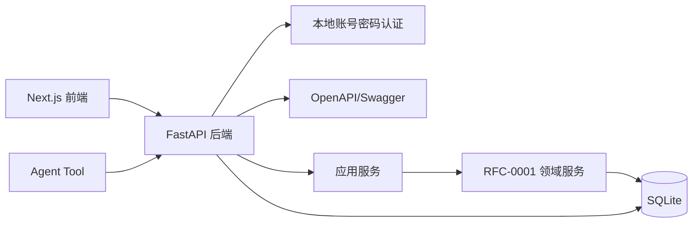
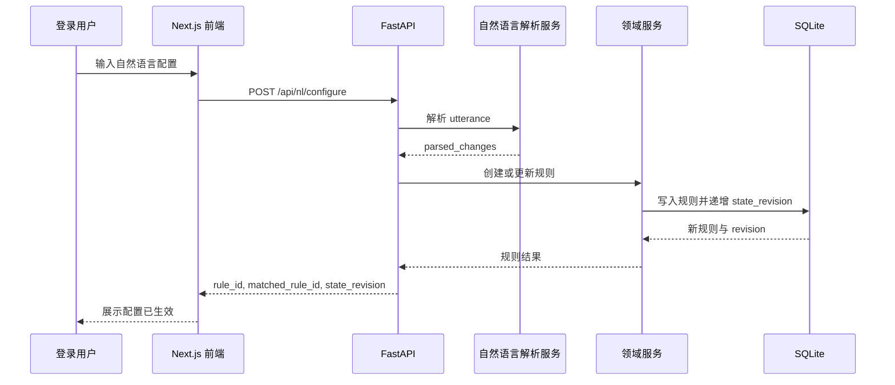
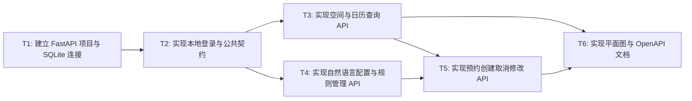

# RFC-0002: FastAPI 后端 API 与 Agent Tool 契约

## 摘要

会务系统需要同时服务 Next.js 前端和未来的 Agent Tool 调用。这个 RFC 定义 FastAPI 后端的应用边界、认证方式、SQLite 持久化策略、OpenAPI 契约、核心 API 路径、公共请求/响应格式、错误码和幂等规则。核心方案是：所有业务操作都通过结构化 API 调用领域服务；自然语言接口返回结构化解析结果并直接写入系统状态；Agent Tool 通过 OpenAPI/Swagger 了解可调用能力，但本期不接入真实 NAC agent。

本 RFC 不设计前端页面，也不实现具体 Agent。它最重要的限制是：本期只支持本地账号密码登录，所有登录用户权限相同；不做管理员/成员分级，不做真实 NAC agent 接入。

## 动机

前端、测试和 Agent Tool 都需要稳定、可解释、可重试的后端接口。如果 API 只返回自然语言文本，前端无法可靠渲染日历和平面图，Agent 也无法安全重试创建预约或修改规则。尤其需求要求：

- 自然语言配置结果必须真正进入系统状态；
- 后续查询、预约和冲突校验必须读取这些配置；
- 504 连续修改只更新同一条规则；
- 活动室午餐规则必须阻断中午预约；
- 合并会议室期间不能分别预约会议室一和会议室二；
- API 需要暴露给 Agent Tool 调用。

因此需要一个面向机器调用和前端展示的后端 API 契约，而不是只面向浏览器页面。

## 设计

### 用户看到的完整流程

1. 用户打开 Next.js 前端，访问登录页并输入本地账号密码。
2. FastAPI 校验账号密码后返回登录态；所有登录用户拥有相同业务权限。
3. 用户进入会议室列表、日历、平面图或自然语言输入页。
4. 前端调用 `GET /api/rooms`、`POST /api/availability:query`、`GET /api/calendar` 或 `GET /api/floor-plan` 获取当前会务状态。
5. 用户输入自然语言配置，例如“这周三 504 临时维修，全天不能预约。刚才说错了，只停用下午”。
6. 前端调用 `POST /api/nl/configure`，后端直接解析并写入规则，返回 `rule_id`、`matched_rule_id`、`state_revision` 和受影响时段。
7. 用户输入自然语言预约意图，例如“下周二 10:00—11:00 想约一间小会议室开项目讨论”。
8. 前端调用 `POST /api/nl/bookings:candidates`，后端返回候选房间和不可用原因；用户选择房间后，前端再调用 `POST /api/bookings` 创建预约。
9. 如果预约冲突或命中规则，API 返回结构化错误、冲突详情和可操作建议；前端展示给用户。
10. 用户取消预约时，前端调用取消接口；后端释放时段、递增状态版本并返回释放结果。

### 概述

FastAPI 后端位于 Next.js 前端、Agent Tool 和领域服务之间。它负责认证、请求校验、幂等控制、状态版本返回、OpenAPI 暴露和错误标准化；真正的会议室规则、组合空间约束和冲突检测由 RFC-0001 定义的领域服务完成。



图读法：前端和 Agent Tool 只与 FastAPI 交互；FastAPI 不直接硬编码会务规则，而是委托领域服务处理规则和冲突。

### 关键设计决策

1. **Next.js 调 FastAPI，而不是 Next.js 直接访问 SQLite**：前端只负责展示和交互，业务规则、权限、幂等和状态写入集中在后端。
2. **所有用户登录但权限相同**：登录用于识别当前用户、记录预约人和审计信息；本期不做管理员/成员分级。
3. **自然语言配置直接生效**：用户已确认不需要“先解析、管理员确认、再生效”。自然语言配置接口返回结构化解析结果，并直接写入规则。
4. **自然语言预约先给候选再创建**：查询类意图返回候选房间；只有用户明确选择房间后，才调用创建预约接口。
5. **OpenAPI/Swagger 是 Agent Tool 的主要契约**：本期不接入真实 NAC agent，但 API 必须能被 Agent Tool 读取和调用。
6. **写操作统一支持幂等**：创建预约、取消预约、修改预约、创建/更新规则都必须携带 `idempotency_key`，避免 Agent 或前端重试造成重复写入。
7. **响应必须可解释**：不可用、冲突、规则阻断都要返回 `reason_code`、`message`、`details` 和 `suggestions`，方便前端和 Agent 展示。

### 认证与权限模型

#### 登录

本地账号密码登录用于本期演示。所有登录用户业务权限相同，均可：

- 查看会议室；
- 查询可用会议室；
- 配置会议室和规则；
- 创建预约；
- 取消预约；
- 修改或强制调整预约。

#### 权限边界

| 操作 | 是否要求登录 | 权限要求 |
|---|---:|---|
| 查询会议室列表 | 是 | 任意登录用户 |
| 查询可用会议室 | 是 | 任意登录用户 |
| 查询日历 | 是 | 任意登录用户 |
| 自然语言配置 | 是 | 任意登录用户 |
| 创建预约 | 是 | 任意登录用户 |
| 取消预约 | 是 | 任意登录用户，可取消自己或同权限下可见预约 |
| 修改预约 | 是 | 任意登录用户 |
| 查询平面图 | 是 | 任意登录用户 |

本期不做角色分级。如果未来要区分管理员和普通成员，应在新的 RFC 中设计权限模型。

### 公共请求格式

写操作建议统一支持以下字段。

```json
{
  "workspace_id": "default",
  "actor_id": "user_001",
  "idempotency_key": "stable-key",
  "expected_state_revision": 12,
  "dry_run": false
}
```

| 字段 | 是否必须 | 说明 |
|---|---:|---|
| `workspace_id` | 建议必须 | 本地演示默认 `default` |
| `actor_id` | 写操作必须 | 当前登录用户 ID |
| `idempotency_key` | 写操作必须 | 稳定幂等键，由调用方生成 |
| `expected_state_revision` | 建议必须 | 期望写入前的状态版本；不匹配时返回冲突 |
| `dry_run` | 建议必须 | `true` 时只预览，不写入系统状态 |

### 公共响应格式

成功响应：

```json
{
  "ok": true,
  "request_id": "req_xxx",
  "data": {},
  "warnings": [],
  "meta": {
    "state_revision": 13,
    "server_time": "2026-07-31T10:00:00+08:00",
    "timezone": "Asia/Shanghai"
  }
}
```

失败响应：

```json
{
  "ok": false,
  "request_id": "req_xxx",
  "error": {
    "code": "BOOKING_CONFLICT",
    "message": "该会议室在指定时段已有预约",
    "details": {},
    "suggestions": []
  },
  "meta": {
    "state_revision": 13,
    "server_time": "2026-07-31T10:00:00+08:00",
    "timezone": "Asia/Shanghai"
  }
}
```

### 错误码设计

| 错误码 | 含义 | 典型返回 |
|---|---|---|
| `UNAUTHORIZED` | 未登录或 token 无效 | 401 |
| `FORBIDDEN` | 当前用户无权执行 | 403 |
| `VALIDATION_ERROR` | 入参格式或字段错误 | 400 |
| `ROOM_NOT_FOUND` | 房间不存在 | 404 |
| `COMPOSITE_NOT_FOUND` | 组合空间不存在 | 404 |
| `BOOKING_NOT_FOUND` | 预约不存在 | 404 |
| `RULE_NOT_FOUND` | 规则不存在 | 404 |
| `BOOKING_CONFLICT` | 与已有预约重叠 | 409 |
| `BOOKING_BLOCKED_BY_RULE` | 命中不可预约规则 | 409 |
| `OUTSIDE_OPENING_HOURS` | 不在开放时间内 | 409 |
| `STATE_REVISION_CONFLICT` | 写入时状态版本已变化 | 409 |
| `IDEMPOTENCY_KEY_REUSED` | 同一幂等键内容冲突 | 409 |
| `NATURAL_LANGUAGE_AMBIGUOUS` | 自然语言解析结果不唯一 | 400 |

### 接口契约

#### 登录接口

**路径**

```http
POST /api/auth/login
POST /api/auth/logout
GET /api/auth/me
```

**`POST /api/auth/login` 请求**

```json
{
  "username": "demo",
  "password": "demo-password"
}
```

**返回**

```json
{
  "ok": true,
  "data": {
    "user": {
      "id": "user_001",
      "name": "演示用户",
      "role": "member"
    },
    "token": "local-demo-token"
  }
}
```

**说明**

- 本期 `role` 固定为 `member`，仅用于展示和审计。
- 本地演示可采用 SQLite 用户表或启动时 seed 的演示账号。

---

#### 查询会议室列表

**路径**

```http
GET /api/rooms
```

**请求参数**

| 参数 | 类型 | 说明 |
|---|---|---|
| `include_composite` | bool | 是否返回组合空间 |
| `date` | string | 可选，用于返回该日期状态 |
| `start_at` | string | 可选，与 `end_at` 一起用于返回时段状态 |
| `end_at` | string | 可选 |
| `capacity` | int | 可选，最小容量 |
| `equipment` | string[] | 可选，要求具备的设备 |
| `room_type` | string | 可选，例如 `small` |

**返回**

```json
{
  "ok": true,
  "data": {
    "rooms": [
      {
        "id": "503",
        "name": "503",
        "type": "small",
        "location": "5F",
        "capacity": 4,
        "equipment": ["whiteboard"],
        "status": "available"
      }
    ],
    "composites": [
      {
        "id": "meeting-room-1-2",
        "name": "会议室一+会议室二",
        "member_room_ids": ["meeting-room-1", "meeting-room-2"],
        "capacity": 24,
        "equipment": ["projector", "whiteboard"],
        "status": "available"
      }
    ]
  }
}
```

---

#### 查询可用会议室

**路径**

```http
POST /api/availability:query
```

**请求**

```json
{
  "start_at": "2026-08-04T10:00:00+08:00",
  "end_at": "2026-08-04T11:00:00+08:00",
  "timezone": "Asia/Shanghai",
  "capacity": 4,
  "equipment": [],
  "room_types": ["small"],
  "allow_merge": false
}
```

**返回**

```json
{
  "ok": true,
  "data": {
    "available_rooms": [
      {
        "id": "503",
        "name": "503",
        "type": "small",
        "capacity": 4,
        "reason": "可用"
      },
      {
        "id": "506",
        "name": "506",
        "type": "small",
        "capacity": 4,
        "reason": "可用"
      }
    ],
    "unavailable_reasons": [
      {
        "room_id": "505",
        "reason_code": "WEEKLY_UNAVAILABLE",
        "message": "505 每周二全天不可用"
      }
    ],
    "conflicts": []
  }
}
```

**说明**

- `allow_merge=true` 时，返回结果可以包含组合空间。
- 查询结果必须已经应用固定规则、动态规则、开放时间和已有预约。
- 下周二 10:00-11:00 查询小会议室时，505 不得出现在 `available_rooms`。

---

#### 查询日历/时段占用

**路径**

```http
GET /api/calendar
```

**请求参数**

| 参数 | 类型 | 说明 |
|---|---|---|
| `target_type` | string | `room` 或 `composite` |
| `target_id` | string | 目标 ID |
| `date` | string | 查询日期 |
| `range_start` | string | 查询范围开始 |
| `range_end` | string | 查询范围结束 |
| `include_bookings` | bool | 是否包含预约 |
| `include_rules` | bool | 是否包含规则 |
| `include_lunch_blocks` | bool | 是否包含午餐占用 |

**返回**

```json
{
  "ok": true,
  "data": {
    "slots": [
      {
        "start_at": "2026-08-04T10:00:00+08:00",
        "end_at": "2026-08-04T11:00:00+08:00",
        "status": "booked",
        "booking_id": "bk_123",
        "title": "项目讨论"
      },
      {
        "start_at": "2026-08-04T12:00:00+08:00",
        "end_at": "2026-08-04T13:00:00+08:00",
        "status": "blocked_by_rule",
        "rule_id": "rule_lunch_activity_room",
        "reason_code": "LUNCH_BLOCK",
        "message": "活动室午餐时段不可预约会议"
      }
    ]
  }
}
```

---

#### 自然语言配置

**路径**

```http
POST /api/nl/configure
```

**请求**

```json
{
  "utterance": "这周三 504 临时维修，全天不能预约。刚才说错了，只停用下午。",
  "dry_run": false,
  "idempotency_key": "agent:nl-configure:admin_001:504-repair-20260805:v2",
  "expected_state_revision": 15
}
```

**返回**

```json
{
  "ok": true,
  "data": {
    "intent": "update_rule",
    "parsed_changes": [
      {
        "target_type": "room",
        "target_id": "504",
        "rule_type": "temporary_maintenance",
        "start_at": "2026-08-05T13:00:00+08:00",
        "end_at": "2026-08-05T18:00:00+08:00",
        "reason": "临时维修"
      }
    ],
    "matched_rule_id": "rule_504_repair_20260805",
    "rule_id": "rule_504_repair_20260805",
    "status": "updated",
    "old_rule": {},
    "new_rule": {},
    "impacted_slots": []
  }
}
```

**说明**

- 本期不需要先解析、管理员确认、再生效。
- 接口必须直接写入系统状态，除非 `dry_run=true`。
- 返回必须包含 `matched_rule_id`，用于证明连续修改更新的是同一条规则。

---

#### 自然语言预约候选

**路径**

```http
POST /api/nl/bookings:candidates
```

**请求**

```json
{
  "utterance": "下周二 10:00—11:00 想约一间小会议室开项目讨论，帮我看看有哪些可以用。",
  "dry_run": true
}
```

**返回**

```json
{
  "ok": true,
  "data": {
    "intent": "query_availability",
    "parsed_booking": {
      "start_at": "2026-08-04T10:00:00+08:00",
      "end_at": "2026-08-04T11:00:00+08:00",
      "room_type": "small",
      "title": "项目讨论"
    },
    "candidates": [
      {
        "room_id": "503",
        "name": "503",
        "available": true
      },
      {
        "room_id": "506",
        "name": "506",
        "available": true
      }
    ],
    "excluded_rooms": [
      {
        "room_id": "505",
        "reason_code": "WEEKLY_UNAVAILABLE",
        "message": "505 每周二全天不可用"
      }
    ]
  }
}
```

**说明**

- 该接口只返回候选，不创建预约。
- 用户选择候选后，前端调用 `POST /api/bookings`。

---

#### 创建预约

**路径**

```http
POST /api/bookings
```

**请求**

```json
{
  "room_id": "503",
  "composite_id": null,
  "start_at": "2026-08-04T10:00:00+08:00",
  "end_at": "2026-08-04T11:00:00+08:00",
  "title": "项目讨论",
  "organizer_id": "user_001",
  "attendees": ["user_001", "user_002"],
  "description": "",
  "dry_run": false,
  "idempotency_key": "agent:create-booking:2026-08-04:503:10-11",
  "expected_state_revision": 16
}
```

**返回**

```json
{
  "ok": true,
  "data": {
    "booking_id": "bk_123",
    "status": "confirmed",
    "room": {
      "id": "503",
      "name": "503",
      "type": "small"
    },
    "start_at": "2026-08-04T10:00:00+08:00",
    "end_at": "2026-08-04T11:00:00+08:00",
    "conflicts": []
  }
}
```

**冲突返回**

```json
{
  "ok": false,
  "error": {
    "code": "BOOKING_CONFLICT",
    "message": "该会议室在指定时段已有预约",
    "details": {
      "conflicts": [
        {
          "conflict_type": "overlapping_booking",
          "booking_id": "bk_999",
          "overlap_start": "2026-08-04T10:00:00+08:00",
          "overlap_end": "2026-08-04T11:00:00+08:00"
        }
      ]
    },
    "suggestions": ["可尝试其他时段", "可选择其他可用房间"]
  }
}
```

**说明**

- `room_id` 与 `composite_id` 二选一。
- 创建时必须执行规则引擎校验。
- 组合预约成功后，成员房间在该时段不能再被分别预约。

---

#### 取消预约

**路径**

```http
POST /api/bookings/{booking_id}/cancel
```

**请求**

```json
{
  "reason": "会议取消",
  "dry_run": false,
  "idempotency_key": "agent:cancel-booking:bk_123",
  "expected_state_revision": 17
}
```

**返回**

```json
{
  "ok": true,
  "data": {
    "booking_id": "bk_123",
    "status": "cancelled",
    "released_slots": [
      {
        "room_id": "503",
        "start_at": "2026-08-04T10:00:00+08:00",
        "end_at": "2026-08-04T11:00:00+08:00"
      }
    ]
  }
}
```

---

#### 修改预约

**路径**

```http
PATCH /api/bookings/{booking_id}
```

**请求**

```json
{
  "title": "调整后的项目讨论",
  "room_id": "503",
  "composite_id": null,
  "start_at": "2026-08-04T15:00:00+08:00",
  "end_at": "2026-08-04T16:00:00+08:00",
  "force": false,
  "reason": "用户调整时间",
  "dry_run": false,
  "idempotency_key": "agent:update-booking:bk_123:v2",
  "expected_state_revision": 18
}
```

**返回**

```json
{
  "ok": true,
  "data": {
    "booking_id": "bk_123",
    "status": "updated",
    "old_booking": {},
    "new_booking": {},
    "conflicts": []
  }
}
```

**说明**

- `force=true` 时允许登录用户覆盖冲突，但仍需记录审计。
- 被强制影响的预约应标记为 `moved` 或 `cancelled_by_user`。

---

#### 规则管理

**路径**

```http
POST /api/rules
PATCH /api/rules/{rule_id}
GET /api/rules/{rule_id}
DELETE /api/rules/{rule_id}
```

**`POST /api/rules` 请求**

```json
{
  "rule_type": "temporary_maintenance",
  "target_type": "room",
  "target_id": "504",
  "time_window": {
    "start_at": "2026-08-05T13:00:00+08:00",
    "end_at": "2026-08-05T18:00:00+08:00"
  },
  "recurrence": null,
  "reason": "临时维修",
  "match_key": "504:temporary_maintenance:2026-08-05",
  "dry_run": false,
  "idempotency_key": "agent:rule:504:repair:20260805",
  "expected_state_revision": 19
}
```

**返回**

```json
{
  "ok": true,
  "data": {
    "rule_id": "rule_504_repair_20260805",
    "matched_rule_id": "rule_504_repair_20260805",
    "status": "updated",
    "old_rule": {},
    "new_rule": {},
    "impacted_slots": []
  }
}
```

**说明**

- `POST /api/rules` 支持创建或匹配更新规则。
- `PATCH /api/rules/{rule_id}` 用于显式修改已有规则。
- `DELETE /api/rules/{rule_id}` 用于删除动态规则，不建议删除固定规则。

---

#### 平面图视图

**路径**

```http
GET /api/floor-plan
```

**请求参数**

| 参数 | 类型 | 说明 |
|---|---|---|
| `floor_id` | string | 例如 `5F` |
| `date` | string | 查询日期 |
| `time` | string | 查询时刻 |
| `include_status` | bool | 是否返回状态 |
| `include_rules` | bool | 是否返回规则原因 |
| `include_bookings` | bool | 是否返回预约摘要 |

**返回**

```json
{
  "ok": true,
  "data": {
    "floor": {
      "id": "5F",
      "name": "5楼"
    },
    "rooms": [
      {
        "id": "504",
        "name": "504",
        "position": {
          "x": 120,
          "y": 80,
          "width": 80,
          "height": 50
        },
        "status": "blocked_by_rule",
        "reason_code": "TEMPORARY_MAINTENANCE",
        "message": "临时维修"
      }
    ]
  }
}
```

### 自然语言解析边界

本期 API 契约只要求返回结构化解析结果，不要求内置完整 Agent。

自然语言配置必须能解析：

- 新增或修改会议室；
- 修改容量、设备、位置；
- 修改开放时段；
- 新增或修改不可预约规则；
- 连续修改同一条规则。

自然语言预约候选必须能解析：

- 日期；
- 开始时间；
- 结束时间；
- 房间类型；
- 容量或人数；
- 设备；
- 会议标题或用途。

如果解析不唯一，应返回 `NATURAL_LANGUAGE_AMBIGUOUS`，并列出候选解释。

### 幂等与状态版本

#### 幂等键

所有写操作必须携带 `idempotency_key`。幂等语义如下：

| 场景 | 行为 |
|---|---|
| 同一 `idempotency_key` + 同一请求内容 | 返回上一次成功结果，不重复写入 |
| 同一 `idempotency_key` + 不同请求内容 | 返回 `IDEMPOTENCY_KEY_REUSED` |
| 不同 `idempotency_key` | 视为不同操作 |

#### 状态版本

每次成功写入后，响应返回新的 `state_revision`。如果请求携带 `expected_state_revision` 且与当前版本不一致，返回 `STATE_REVISION_CONFLICT`。

### Agent Tool 调用边界

本期只设计 API 契约，不接入真实 NAC agent。Agent Tool 应通过 OpenAPI/Swagger 获取以下能力：

- `POST /api/nl/configure`：配置会议室或规则。
- `POST /api/nl/bookings:candidates`：解析自然语言预约意图并返回候选。
- `POST /api/availability:query`：查询可用会议室。
- `GET /api/calendar`：查询日历/时段占用。
- `POST /api/bookings`：创建预约。
- `POST /api/bookings/{booking_id}/cancel`：取消预约。
- `PATCH /api/bookings/{booking_id}`：修改预约。
- `GET /api/floor-plan`：查询平面图状态。

Agent Tool 调用时应遵循：

1. 先登录或携带有效 token。
2. 写操作必须生成稳定 `idempotency_key`。
3. 自然语言配置直接调用配置接口，写入系统状态。
4. 自然语言预约先调用候选接口，用户确认后再创建预约。
5. 遇到 `STATE_REVISION_CONFLICT` 时重新读取状态并重试。
6. 遇到 `NATURAL_LANGUAGE_AMBIGUOUS` 时向用户追问。

### 架构图



## 权衡取舍

### 考虑过的替代方案

#### 替代方案一：只设计自然语言接口

未采用。自然语言接口无法稳定支持前端渲染、测试和 Agent 重试。结构化 API 更适合作为系统边界。

#### 替代方案二：Next.js API Routes 直接承载业务逻辑

未采用。虽然 Next.js 可以写后端逻辑，但会务规则、SQLite 写入、OpenAPI 契约和 Agent Tool 调用更适合集中在 FastAPI 服务中。

#### 替代方案三：不做登录，只模拟用户

未采用。用户明确需要登录系统。虽然本期权限相同，但登录仍是识别用户、记录预约和审计的必要基础。

### 缺点

- 同时维护 Next.js 和 FastAPI 会增加本地启动复杂度。
- 本地账号密码登录安全性有限，只适合演示环境。
- OpenAPI 契约需要随 API 变化持续维护。
- 幂等键和状态版本会增加调用方实现成本。

## 实现计划

### 阶段划分

- [ ] Phase 1: 建立 FastAPI 项目、SQLite 连接、认证和本地账号 seed。
- [ ] Phase 2: 实现公共响应、错误码、幂等和状态版本中间件。
- [ ] Phase 3: 实现会议室、日历、可用查询和平面图 API。
- [ ] Phase 4: 实现自然语言配置、自然语言预约候选和规则管理 API。
- [ ] Phase 5: 实现预约创建、取消、修改和 OpenAPI 文档。
- [ ] Phase 6: 添加 API 集成测试和基础场景验收测试。

### 子任务分解

#### 依赖关系图



#### 子任务列表

| ID | 标题 | 依赖 | Ref |
|----|------|------|-----|
| T1 | 建立 FastAPI 项目与 SQLite 连接 | - | - |
| T2 | 实现本地登录与公共契约 | T1 | - |
| T3 | 实现空间与日历查询 API | T2 | - |
| T4 | 实现自然语言配置与规则管理 API | T2 | - |
| T5 | 实现预约创建取消修改 API | T3, T4 | - |
| T6 | 实现平面图与 OpenAPI 文档 | T3, T5 | - |

#### 子任务定义

**T1: 建立 FastAPI 项目与 SQLite 连接**
- **范围**: 初始化 FastAPI 应用、SQLite 连接、配置、日志和基础目录结构。
- **验收标准**: 服务可启动；SQLite 可读写；基础健康检查接口返回正常。

**T2: 实现本地登录与公共契约**
- **范围**: 实现本地账号密码登录、退出、当前用户查询、统一响应格式、错误码、幂等和状态版本机制。
- **验收标准**: 未登录访问业务 API 被拒绝；登录后返回用户信息；写操作能识别幂等键和状态版本。

**T3: 实现空间与日历查询 API**
- **范围**: 实现会议室列表、可用会议室查询、日历/时段占用 API。
- **验收标准**: 查询结果应用固定规则、动态规则、开放时间和已有预约；不可用原因结构化返回。

**T4: 实现自然语言配置与规则管理 API**
- **范围**: 实现自然语言配置接口、规则创建/更新/删除接口、规则匹配和连续修改逻辑。
- **验收标准**: 自然语言配置直接写入规则；连续修改 504 维修规则只更新同一条规则。

**T5: 实现预约创建取消修改 API**
- **范围**: 实现创建预约、取消预约、修改预约、强制调整、审计记录和冲突返回。
- **验收标准**: 创建预约后日历可见；取消后时段释放；冲突返回结构化原因。

**T6: 实现平面图与 OpenAPI 文档**
- **范围**: 实现平面图状态 API、静态房间坐标返回、OpenAPI/Swagger 文档和 Agent Tool 调用说明。
- **验收标准**: 平面图状态与日历、规则、预约一致；Swagger 能展示所有 API、请求和响应模型。

### 影响范围

- `backend/app/` - FastAPI 应用入口、路由、依赖注入
- `backend/auth/` - 本地账号密码认证
- `backend/api/` - API 路由和请求/响应模型
- `backend/schemas/` - Pydantic 请求/响应模型
- `backend/services/` - 应用服务、自然语言解析服务、规则服务
- `backend/repositories/` - SQLite 仓储
- `backend/tests/` - API 集成测试
- `docs/openapi/` - 可选的导出版 OpenAPI 文档

## 测试方案

### 单元测试

- 登录成功与失败。
- 统一响应格式和错误码。
- 幂等键重复写入行为。
- 状态版本冲突行为。
- 自然语言配置解析结果。
- 自然语言预约候选解析结果。
- 规则创建、更新和删除。

### 集成测试

- 登录后可查询会议室列表。
- 未登录不能访问业务 API。
- 下周二 10:00-11:00 查询小会议室，505 不可用，502 不出现。
- 明天中午预约活动室被午餐规则拒绝。
- 本周五 14:00-16:00 创建组合会议室预约，成功后成员房间不可分别预约。
- 504 临时维修连续修改只更新同一条规则。
- 取消预约后时段释放。
- Swagger 文档包含所有 API 和模型。

### 手动验证

1. 启动 FastAPI 服务并访问 Swagger。
2. 使用演示账号登录。
3. 查询会议室列表，确认默认空间存在。
4. 查询下周二小会议室可用结果。
5. 尝试中午预约活动室，确认被拒绝。
6. 创建组合会议室预约，再尝试分别预约会议室一或会议室二。
7. 配置 504 全天维修后改为下午维修，确认规则只更新一条。
8. 查看平面图 API 返回的房间状态。

## 未解决的问题

无。当前 API 契约、认证方式、Agent Tool 对接范围、登录权限和自然语言确认策略已在需求澄清中确认。

## 参考资料

- RFC-0001: 会务系统领域模型与规则引擎
- RFC-0003: Next.js 前端交互设计
- FastAPI OpenAPI / Swagger 文档
- 用户需求：Topic A：会务系统
