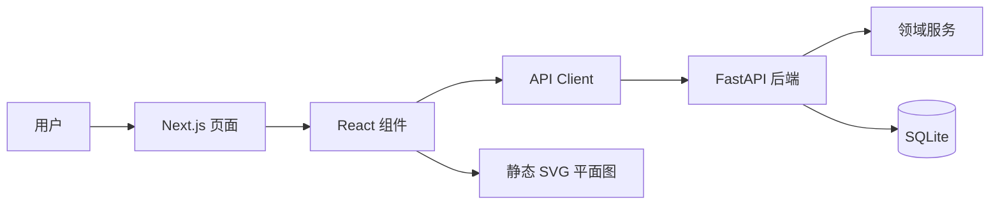
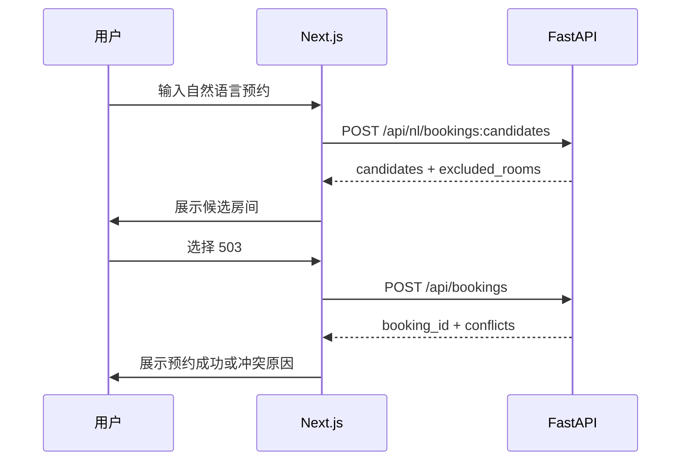
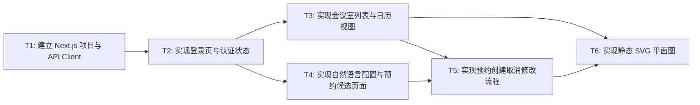

# RFC-0003: Next.js 前端交互设计

## 摘要

会务系统需要让团队成员通过网页完成登录、查看会议室、查询可用时段、自然语言配置规则、选择候选房间并创建预约。这个 RFC 定义 Next.js 前端的页面结构、核心交互流程、状态管理、与 FastAPI 的调用关系、静态 SVG 平面图设计和错误展示方式。核心方案是：前端通过 FastAPI OpenAPI 契约调用后端 API，把规则、预约、日历和平面图状态统一展示给用户。

本 RFC 不设计 Agent，也不实现真实 NAC agent 接入。它最重要的限制是：本期使用静态 SVG 平面图和本地演示登录，所有登录用户权限相同；自然语言配置直接生效，自然语言预约先返回候选再创建。

## 动机

如果只有后端 API，用户无法直观理解会议室状态、冲突原因和规则变化。需求中明确要求前端能正常展示，并且支持会议室列表、日历或时段视图、自然语言配置、自然语言预订、取消预约、合并会议室、动态禁用和地图/平面图视图。

因此前端需要把后端返回的结构化状态转化为可操作的界面：

- 用户能看到哪些房间可用；
- 用户能理解为什么活动室中午固定占用不能预约；
- 用户能知道 505 周二不可用；
- 用户能查看会议室一和会议室二合并后的占用状态；
- 用户能在平面图上看到 504 临时维修；
- 用户能通过自然语言完成查询和配置。

## 设计

### 用户看到的完整流程

1. 用户打开网站，进入本地登录页，输入演示账号和密码。
2. 登录成功后进入会务系统首页，首页展示会议室列表、今日状态摘要和常用操作入口。
3. 用户进入“查询可用会议室”，输入“下周二 10:00—11:00 想约一间小会议室开项目讨论”。
4. 前端调用自然语言预约候选接口，展示候选房间 503、506，并说明 505 因周二全天不可用被排除。
5. 用户选择 503 并确认创建预约，前端调用创建预约接口。
6. 如果预约成功，前端刷新日历和平面图，展示新预约；如果冲突，前端展示冲突原因和建议。
7. 用户进入“规则配置”，输入“这周三 504 临时维修，全天不能预约。刚才说错了，只停用下午”。
8. 前端调用自然语言配置接口，后端直接写入规则；前端展示更新后的规则摘要，并在日历和平面图中反映 504 下午不可预约。
9. 用户进入日历视图，选择某个会议室和日期，查看预约、固定占用、临时禁用和合并占用。
10. 用户进入平面图视图，通过静态 SVG 查看 5F 房间位置和实时状态。

### 概述

前端采用 Next.js 构建，负责页面、交互、状态缓存和错误展示。业务状态来自 FastAPI 后端，前端不直接访问 SQLite，也不直接执行冲突校验。前端通过 API client 统一调用后端，并把响应转换为页面状态。



图读法：用户与页面和组件交互；组件通过 API Client 调用 FastAPI；FastAPI 返回结构化会务状态；平面图组件只负责展示房间坐标和状态，不自行判断规则。

### 概念模型

前端的核心概念包括：

| 概念 | 说明 |
|---|---|
| `Room` | 会议室基础信息，例如名称、位置、容量、设备、类型 |
| `CompositeRoom` | 组合会议室，例如会议室一+会议室二 |
| `Booking` | 预约记录，包括标题、时间、发起人、状态 |
| `Rule` | 不可预约规则，例如午餐、临时维修、周二不可用 |
| `Slot` | 日历中的一个时间段，可能表示空闲、预约、固定占用或禁用 |
| `FloorPlanNode` | 平面图中的房间节点，包含坐标和当前状态 |
| `NaturalLanguageResult` | 自然语言配置或预约候选的结构化解析结果 |

这些概念都由后端 API 返回，前端只负责展示、选择和触发下一步操作。

### 页面结构

#### 登录页 `/login`

目标：让用户进入系统。

主要元素：

- 用户名输入框；
- 密码输入框；
- 登录按钮；
- 错误提示。

交互：

1. 用户输入账号密码。
2. 前端调用 `POST /api/auth/login`。
3. 成功后保存登录态并跳转到首页。
4. 失败时展示明确错误。

#### 首页 `/`

目标：展示会务系统入口和当前状态摘要。

主要模块：

- 今日会议室状态摘要；
- 快速查询可用会议室；
- 快速自然语言预约；
- 快速规则配置；
- 最近预约列表；
- 平面图入口。

#### 会议室列表页 `/rooms`

目标：展示所有会议室和组合空间。

主要元素：

- 房间卡片或表格；
- 房间名称、位置、容量、设备、类型；
- 当前状态；
- 查看详情按钮；
- 编辑基础信息入口。

数据来源：

- `GET /api/rooms`

#### 日历/时段视图页 `/calendar`

目标：查看某个会议室在指定日期或时段的占用情况。

主要元素：

- 房间选择器；
- 日期选择器；
- 时间范围选择器；
- 日历时间轴；
- 预约块；
- 规则占用块；
- 固定占用块；
- 固定占用不单独设计为午餐模块，统一按不可预约时段展示。
- 冲突提示。

数据来源：

- `GET /api/calendar`

状态展示：

| 状态 | 展示颜色建议 | 含义 |
|---|---|---|
| `available` | 绿色 | 可预约 |
| `booked` | 蓝色 | 已被预约 |
| `blocked_by_rule` | 橙色 | 被规则阻断 |
| `fixed_unavailable` | 黄色 | 午餐占用 |
| `maintenance` | 红色 | 维护中 |
| `composite_booked` | 紫色 | 被组合空间占用 |

#### 自然语言查询页 `/nl/query`

目标：让用户用自然语言查询可用会议室或预约候选。

主要元素：

- 输入框；
- 示例提示；
- 提交按钮；
- 解析结果展示；
- 候选房间列表；
- 不可用原因列表；
- “创建预约”按钮。

典型输入：

> 下周二 10:00—11:00 想约一间小会议室开项目讨论，帮我看看有哪些可以用。

数据来源：

- `POST /api/nl/bookings:candidates`

交互：

1. 用户输入自然语言。
2. 前端调用候选接口。
3. 后端返回 `parsed_booking`、`candidates`、`excluded_rooms`。
4. 前端展示候选房间和排除原因。
5. 用户选择候选房间后，前端调用 `POST /api/bookings`。

#### 规则配置页 `/rules`

目标：让登录用户通过自然语言或表单配置会议室和规则。

主要元素：

- 自然语言输入框；
- 示例提示；
- 提交按钮；
- 解析结果；
- 规则列表；
- 编辑规则按钮；
- 删除规则按钮。

典型输入：

> 这周三 504 临时维修，全天不能预约。刚才说错了，只停用下午。

数据来源：

- `POST /api/nl/configure`
- `POST /api/rules`
- `PATCH /api/rules/{rule_id}`
- `DELETE /api/rules/{rule_id}`

交互：

1. 用户输入自然语言配置。
2. 前端调用自然语言配置接口。
3. 后端直接写入规则。
4. 前端展示 `matched_rule_id`、`old_rule`、`new_rule` 和 `state_revision`。
5. 前端刷新日历和平面图。

#### 预约详情页 `/bookings/[id]`

目标：查看预约详情，并支持取消或修改。

主要元素：

- 预约标题、时间、房间、发起人、参与人；
- 修改按钮；
- 取消按钮；
- 冲突提示；
- 审计信息。

数据来源：

- `GET /api/bookings/{id}`
- `POST /api/bookings/{id}/cancel`
- `PATCH /api/bookings/{id}`

#### 平面图页 `/floor-plan`

目标：在静态 SVG 上查看房间位置和状态。

主要元素：

- 5F 静态 SVG；
- 房间节点；
- 状态颜色；
- 房间名称；
- 当前预约或规则提示；
- 时间选择器。

数据来源：

- `GET /api/floor-plan`

交互：

1. 用户选择日期和时刻。
2. 前端调用平面图 API。
3. 后端返回房间坐标和状态。
4. 前端在 SVG 上用颜色标记房间状态。
5. 点击房间节点后跳转到日历页。

### 关键设计决策

1. **前端不直接判断规则**：所有冲突、固定占用、临时禁用、组合空间约束都由 FastAPI 返回，前端只展示和触发操作。
2. **自然语言配置直接生效**：用户已确认不需要确认流程，因此规则配置页提交后直接写入系统状态。
3. **自然语言预约先给候选再创建**：查询类意图不直接创建预约，避免误预约。
4. **静态 SVG 平面图作为本期方案**：本期使用内置 SVG 和房间坐标，不接真实地图服务。
5. **所有页面共享 API Client**：前端统一封装认证、错误处理、状态版本和重试逻辑。
6. **错误必须可读**：前端展示 API 返回的 `message`、`reason_code` 和 `suggestions`，不展示底层异常堆栈。

### 接口契约

#### 登录接口

前端调用：

```http
POST /api/auth/login
```

请求：

```json
{
  "username": "demo",
  "password": "demo-password"
}
```

成功后保存 token，并在后续请求中带上。

#### 会议室列表

前端调用：

```http
GET /api/rooms
```

展示字段：

- `id`
- `name`
- `type`
- `location`
- `capacity`
- `equipment`
- `status`

#### 可用会议室查询

前端调用：

```http
POST /api/availability:query
```

用于：

- 查询某个时间段的可用房间；
- 查询组合空间是否可用；
- 展示不可用原因。

#### 日历/时段占用

前端调用：

```http
GET /api/calendar
```

用于：

- 日历页时间轴；
- 预约详情页；
- 平面图点击后的房间状态。

#### 自然语言配置

前端调用：

```http
POST /api/nl/configure
```

用于：

- 自然语言新增或修改会议室；
- 自然语言新增或修改规则；
- 连续修改同一条规则。

#### 自然语言预约候选

前端调用：

```http
POST /api/nl/bookings:candidates
```

用于：

- 解析用户自然语言意图；
- 展示候选房间；
- 展示排除原因；
- 为创建预约提供输入。

#### 创建预约

前端调用：

```http
POST /api/bookings
```

用于：

- 用户选择候选房间后创建预约；
- 用户手动选择房间和时间后创建预约。

#### 取消预约

前端调用：

```http
POST /api/bookings/{booking_id}/cancel
```

用于：

- 取消已有预约；
- 释放时段。

#### 修改预约

前端调用：

```http
PATCH /api/bookings/{booking_id}
```

用于：

- 修改预约时间；
- 修改预约标题；
- 强制调整预约。

#### 平面图

前端调用：

```http
GET /api/floor-plan
```

用于：

- 静态 SVG 平面图；
- 房间状态展示；
- 点击房间跳转日历。

### 状态管理

前端建议维护以下状态：

| 状态 | 来源 | 用途 |
|---|---|---|
| `auth` | 登录接口 | 判断是否登录、当前用户 |
| `rooms` | `GET /api/rooms` | 会议室列表、房间详情 |
| `availability` | `POST /api/availability:query` | 可用房间查询结果 |
| `calendar` | `GET /api/calendar` | 日历时间轴 |
| `bookings` | 预约相关接口 | 预约列表、详情、取消、修改 |
| `rules` | 规则相关接口 | 规则列表、规则编辑 |
| `floorPlan` | `GET /api/floor-plan` | 平面图节点状态 |
| `errors` | API 响应 | 展示错误和建议 |

### 错误展示规则

前端应优先展示 API 返回的 `error.message`，其次展示 `reason_code`，最后展示 `suggestions`。

#### 示例

如果预约冲突，前端展示：

- 标题：预约冲突
- 内容：该会议室在指定时段已有预约
- 详情：冲突预约 ID、重叠时间
- 建议：可尝试其他时段，或选择其他可用房间

如果规则阻断，前端展示：

- 标题：该时段不可预约
- 内容：活动室固定占用时段（午餐）不可预约会议
- 规则 ID：`rule_lunch_activity_room`
- 建议：请选择该固定占用以外的时段

### 静态 SVG 平面图设计

#### 设计原则

- SVG 中每个房间是一个可点击节点。
- 节点位置由后端 `position` 返回，或由前端固定映射。
- 节点颜色根据 `status` 变化。
- 节点 tooltip 展示房间名称、状态、原因。
- 点击节点跳转到日历页。

#### 状态颜色建议

| 状态 | 颜色 |
|---|---|
| `available` | 绿色 |
| `booked` | 蓝色 |
| `blocked_by_rule` | 橙色 |
| `fixed_unavailable` | 黄色 |
| `maintenance` | 红色 |
| `composite_booked` | 紫色 |

#### 示例节点

```json
{
  "id": "504",
  "name": "504",
  "position": {
    "x": 120,
    "y": 80,
    "width": 80,
    "height": 50
  },
  "status": "blocked_by_rule",
  "message": "临时维修"
}
```

### 架构图



## 权衡取舍

### 考虑过的替代方案

#### 替代方案一：前端直接调用 SQLite 或本地文件

未采用。前端直接访问数据会绕过权限、幂等、冲突校验和状态版本，也无法被 Agent Tool 复用。

#### 替代方案二：不做登录页，先模拟用户

未采用。用户明确需要登录系统。虽然本期权限相同，但登录仍是识别用户和记录操作的基础。

#### 替代方案三：真实地图服务

未采用。当前需求只需要本地演示和固定楼层视图，静态 SVG 更简单、可控，也足够支持状态展示。

### 缺点

- 静态 SVG 不适合复杂楼层或动态地图。
- 自然语言配置直接生效，误输入会立即改变系统状态。
- 前端需要维护较多页面状态，复杂度高于简单 CRUD 页面。
- 所有用户权限相同，暂时无法限制普通用户修改规则。

## 实现计划

### 阶段划分

- [ ] Phase 1: 建立 Next.js 项目、路由、API Client 和登录页。
- [ ] Phase 2: 实现会议室列表、日历视图和可用查询页面。
- [ ] Phase 3: 实现自然语言配置和自然语言预约候选页面。
- [ ] Phase 4: 实现预约创建、取消和修改流程。
- [ ] Phase 5: 实现静态 SVG 平面图。
- [ ] Phase 6: 增加前端错误展示、加载态和基础场景验收。

### 子任务分解

#### 依赖关系图



#### 子任务列表

| ID | 标题 | 依赖 | Ref |
|----|------|------|-----|
| T1 | 建立 Next.js 项目与 API Client | - | - |
| T2 | 实现登录页与认证状态 | T1 | - |
| T3 | 实现会议室列表与日历视图 | T2 | - |
| T4 | 实现自然语言配置与预约候选页面 | T2 | - |
| T5 | 实现预约创建取消修改流程 | T3, T4 | - |
| T6 | 实现静态 SVG 平面图 | T3, T5 | - |

#### 子任务定义

**T1: 建立 Next.js 项目与 API Client**
- **范围**: 初始化 Next.js 项目、路由结构、全局样式、API Client、错误处理和基础布局。
- **验收标准**: 项目可启动；API Client 能统一处理 token、错误和响应格式。

**T2: 实现登录页与认证状态**
- **范围**: 实现 `/login` 页面、登录态保存、退出登录、当前用户展示。
- **验收标准**: 未登录用户访问业务页面会跳转登录；登录成功后进入首页。

**T3: 实现会议室列表与日历视图**
- **范围**: 实现会议室列表页、日历页、房间选择器、日期选择器和时段展示。
- **验收标准**: 能展示默认会议室；日历能显示预约、固定占用和规则占用。

**T4: 实现自然语言配置与预约候选页面**
- **范围**: 实现自然语言配置输入、解析结果展示、候选房间展示和排除原因展示。
- **验收标准**: 自然语言配置直接生效；自然语言预约先返回候选，不直接创建预约。

**T5: 实现预约创建取消修改流程**
- **范围**: 实现创建预约、取消预约、修改预约、冲突提示和成功反馈。
- **验收标准**: 创建预约后日历更新；取消后时段释放；修改预约后状态一致。

**T6: 实现静态 SVG 平面图**
- **范围**: 实现 5F 静态 SVG、房间节点、状态颜色、tooltip 和点击跳转日历。
- **验收标准**: 平面图状态与后端 API 一致；点击房间可查看对应日历。

### 影响范围

- `frontend/app/` - Next.js 页面和路由
- `frontend/components/` - 会议室卡片、日历、平面图、自然语言输入组件
- `frontend/lib/api/` - API Client、错误处理、认证封装
- `frontend/lib/state/` - 前端状态管理
- `frontend/styles/` - 全局样式、颜色状态
- `frontend/assets/` - 静态 SVG 平面图资源
- `frontend/tests/` - 前端组件测试和 E2E 测试

## 测试方案

### 单元测试

- 登录表单校验。
- API Client token 注入。
- 错误消息格式化。
- 日历状态颜色映射。
- 平面图节点状态渲染。
- 自然语言候选结果展示。

### 集成测试

- 登录后进入首页。
- 会议室列表能显示默认房间。
- 日历能显示预约和规则占用。
- 自然语言配置能更新规则并刷新页面。
- 自然语言预约候选能展示 503、506 和 505 排除原因。
- 创建预约后日历更新。
- 取消预约后时段释放。
- 平面图状态与日历一致。

### 手动验证

1. 打开网站并登录。
2. 查看会议室列表。
3. 输入“下周二 10:00—11:00 想约一间小会议室开项目讨论”。
4. 确认 503、506 可用，505 被排除。
5. 选择 503 并创建预约。
6. 输入“明天中午想预约活动室开会”，确认被固定占用规则拒绝。
7. 输入“这周三 504 临时维修，全天不能预约。刚才说错了，只停用下午”，确认规则更新。
8. 打开平面图，确认 504 状态变化。

## 未解决的问题

无。当前页面结构、静态 SVG 方案、登录方式和自然语言交互策略已在需求澄清中确认。

## 参考资料

- RFC-0001: 会务系统领域模型与规则引擎
- RFC-0002: FastAPI 后端 API 与 Agent Tool 契约
- 用户需求：Topic A：会务系统
