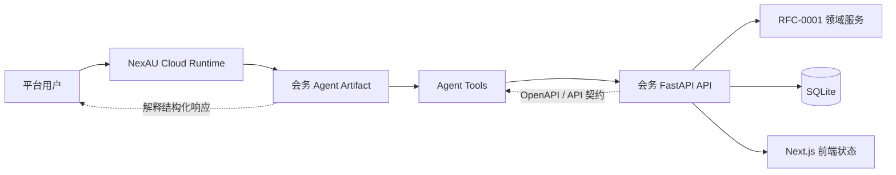
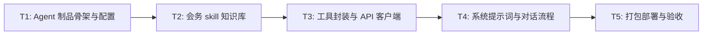

# RFC-0004: NAC 会务 Agent 制品与工具契约

- **状态**: draft
- **优先级**: P1
- **标签**: `agent`, `nac`, `artifact`, `meeting-room`, `tool-contract`
- **影响服务**: NAC Agent 制品、FastAPI 后端、Next.js 前端、会务领域模型
- **创建日期**: 2026-07-31
- **更新日期**: 2026-07-31

## 摘要

本 RFC 定义运行在 NexAU Cloud（NAC）上的会务 Agent 制品设计。平台调用该 Agent 与用户对话，Agent 通过工具调用会务系统 FastAPI 接口，完成会议室查询、自然语言配置、预约候选、创建/取消/修改预约、日历与平面图状态解释等任务。Agent 不直接访问 SQLite，也不在前端或 prompt 中硬编码会务规则；规则、冲突校验、组合空间约束和状态版本仍由 RFC-0001 的领域模型与规则引擎维护，由 RFC-0002 的 FastAPI API 暴露。

本 RFC 只设计 NAC Agent 制品的入口、提示词边界、工具契约、运行策略和验收方式；不实现具体代码。实现时可直接引用 RFC-0001、RFC-0002、RFC-0003 的模块定义。

## 动机

会务系统已经拆分为三个核心 RFC：

- RFC-0001 定义领域模型、固定空间关系、规则、预约和冲突校验；
- RFC-0002 定义 FastAPI 后端 API 与 Agent Tool 契约；
- RFC-0003 定义 Next.js 前端交互。

但赛题要求作品包含实际 Agent 层，平台会调用 Agent 对话，Agent 可以调用工具通过接口操作平台。仅有后端 API 和前端页面不足以说明 NAC 上的 Agent 如何被打包、如何理解会务领域、如何选择工具、如何避免越权或绕过冲突校验。

因此需要一个独立 RFC，明确 NAC Agent 制品的职责边界：

1. 平台如何注册和加载会务 Agent；
2. Agent 如何理解会务系统背景与固定约束；
3. Agent 如何把用户自然语言转换为 RFC-0002 的结构化 API 调用；
4. Agent 如何解释 FastAPI 返回的结构化状态；
5. Agent 如何保证不直接修改数据库、不绕过规则引擎、不承诺真实日历/支付/餐厅等外部系统。

## 设计

### 概述

NAC Agent 制品由 `nexau.json`、`agent.yaml`、`systemprompt.md`、工具定义和可选 skill 组成。Agent 部署到 NAC 后，由平台根据会话上下文调用 Agent；Agent 使用结构化模型调用工具，通过 FastAPI API 与本地会务系统交互。

核心边界如下：

- Agent 负责对话、意图识别、澄清、工具选择和结果解释；
- FastAPI 负责认证、请求校验、幂等、状态版本、错误码和结构化响应；
- 领域服务负责规则、组合空间、冲突校验和状态写入；
- Next.js 前端负责真实 Web 操作闭环和可视化展示；
- Agent 不直接访问 SQLite，不直接调用数据库，不绕过 FastAPI；
- Agent 不硬编码领域规则，只把固定约束作为对话与工具选择的安全边界。



图读法：平台用户与 Agent 对话；Agent 通过工具调用 FastAPI；FastAPI 是操作会务系统的唯一后端边界；Next.js 前端继续作为本地 Web 应用入口，和 Agent 共享同一套 FastAPI 状态。

### 关键设计决策

1. **Agent 制品独立于本地 Web 应用，但共享同一套 API 契约**：NAC Agent 运行在平台 runtime 中，前端运行在本地或演示环境；二者都通过 RFC-0002 的 FastAPI API 操作会务系统，避免各自维护不同业务语义。
2. **Agent 不直接访问数据库或领域服务代码**：所有写操作必须通过 FastAPI，确保 `idempotency_key`、`expected_state_revision`、固定规则保护和结构化错误返回生效。
3. **固定空间关系写入 Agent 系统提示词，但规则引擎仍是唯一执行来源**：提示词用于帮助 Agent 正确澄清和解释，例如活动室午餐不可预约、505 周二不可用、会议室一/二可合并；最终是否可预约必须由 FastAPI 和领域服务判断。
4. **工具粒度围绕 RFC-0002 API 资源设计**：工具不直接暴露数据库 CRUD，而是暴露“查询空间”“查询可用时段”“配置规则”“创建/取消/修改预约”“读取日历/平面图”等面向任务的工具。
5. **自然语言写操作先确认再提交**：对于创建预约、修改/删除规则、取消预约等写操作，Agent 应先展示结构化候选或影响摘要；用户明确确认后再生成稳定 `idempotency_key` 并调用写接口。
6. **LLM 模型遵循 NAC 制品规范**：`agent.yaml` 中可固定使用平台授权模型卡 `nex-agi/Nex-N2-Pro`，不得写入 `base_url` 或 `api_key`；连接信息由平台按模型卡注入。
7. **工具调用结果必须结构化解释**：Agent 不得只复述 JSON；应把 `available_targets`、`excluded_targets`、`reason_code`、`state_revision`、冲突详情和建议转换为中文自然语言。
8. **不引入管理员/RBAC 或强制覆盖冲突能力**：本 RFC 与 RFC-0001/0002/0003 保持一致，本期所有登录用户业务权限相同，Agent 不承诺管理员调整或强制覆盖冲突。

### 制品结构

```text
meeting-agent/
├── nexau.json
├── agent.yaml
├── systemprompt.md
├── NEXAU.md
├── tools/
│   ├── get_meeting_state.tool.yaml
│   ├── check_availability.tool.yaml
│   ├── configure_meeting_state.tool.yaml
│   ├── manage_rules.tool.yaml
│   ├── manage_bookings.tool.yaml
│   ├── get_calendar.tool.yaml
│   └── get_floor_plan.tool.yaml
└── skills/
    └── meeting-system/
        ├── SKILL.md
        └── references/
            ├── domain.md
            ├── api-contract.md
            └── frontend-flow.md
```

#### `nexau.json`

`nexau.json` 只负责把 Agent 名称映射到 `agent.yaml`。

```json
{
  "agents": {
    "meeting_assistant": "agent.yaml"
  },
  "excluded": [
    ".git/",
    ".env",
    "node_modules/",
    "__pycache__/",
    "dist/",
    ".nac/"
  ]
}
```

#### `agent.yaml`

`agent.yaml` 声明 Agent 名称、系统提示词、模型、工具、上下文和执行上限。

```yaml
type: agent
name: meeting_assistant
description: 会务系统 Agent，负责通过 FastAPI 工具查询和操作本地会务系统。
system_prompt: ./systemprompt.md
system_prompt_type: jinja
llm_config:
  model: nex-agi/Nex-N2-Pro
  max_tokens: 12000
  temperature: 0.2
tools:
  - name: get_meeting_state
    yaml_path: tools/get_meeting_state.tool.yaml
    binding: custom_tools.meeting_tools:get_meeting_state
  - name: check_availability
    yaml_path: tools/check_availability.tool.yaml
    binding: custom_tools.meeting_tools:check_availability
  - name: configure_meeting_state
    yaml_path: tools/configure_meeting_state.tool.yaml
    binding: custom_tools.meeting_tools:configure_meeting_state
  - name: manage_rules
    yaml_path: tools/manage_rules.tool.yaml
    binding: custom_tools.meeting_tools:manage_rules
  - name: manage_bookings
    yaml_path: tools/manage_bookings.tool.yaml
    binding: custom_tools.meeting_tools:manage_bookings
  - name: get_calendar
    yaml_path: tools/get_calendar.tool.yaml
    binding: custom_tools.meeting_tools:get_calendar
  - name: get_floor_plan
    yaml_path: tools/get_floor_plan.tool.yaml
    binding: custom_tools.meeting_tools:get_floor_plan
max_iterations: 18
max_context_tokens: 128000
tool_call_mode: structured
middlewares:
  - import: nexau.archs.main_sub.execution.middleware.context_compaction:ContextCompactionMiddleware
    params:
      threshold: 0.6
```

> 说明：上述 YAML 是 RFC 级配置契约，不包含任何密钥。部署时 `nex-agi/Nex-N2-Pro` 的连接信息由平台模型卡注入。

#### `systemprompt.md`

系统提示词应包含以下内容：

1. 角色：会务系统 Agent，帮助用户查询、配置和预约会议室；
2. 固定领域约束：活动室午餐不可预约、会议室一/二可合并、503/505/506 是小会议室、505 周二全天不可用；
3. 工作流：先识别意图，再查询必要状态，必要时澄清，写操作先确认，最后调用工具并解释结果；
4. 工具使用规则：只通过工具调用 FastAPI，不直接访问数据库，不绕过规则引擎；
5. 写操作规则：创建/修改/删除/取消必须准备 `idempotency_key` 和 `expected_state_revision`，并尊重 `STATE_REVISION_CONFLICT`；
6. 安全边界：不承诺真实日历、支付、餐厅、外部会议室系统、管理员/RBAC、强制覆盖冲突；
7. 回复风格：中文、简洁、结构化，明确展示可用、不可用、冲突原因和下一步建议。

#### 工具契约

工具定义应暴露为 RFC-0002 API 的轻量封装。每个工具输入输出保持 JSON 友好，便于 NAC runtime 记录 trace。

| 工具 | 主要职责 | 对应 RFC-0002 API |
|---|---|---|
| `get_meeting_state` | 读取健康状态、会议室、组合空间、规则摘要 | `GET /api/health`、`GET /api/rooms`、`GET /api/rules` |
| `check_availability` | 查询指定时段可用目标、候选和不可用原因 | `POST /api/availability:check` |
| `configure_meeting_state` | 自然语言配置房间、开放时段、规则；支持 `dry_run` | `POST /api/nl/configure` |
| `manage_rules` | 创建、读取、更新、删除规则；固定规则受保护 | `POST/PATCH/GET/DELETE /api/rules...` |
| `manage_bookings` | 创建、取消、修改预约；自然语言预约候选确认 | `POST /api/bookings`、`POST /api/bookings:cancel`、`PATCH /api/bookings/{booking_id}` |
| `get_calendar` | 查询指定房间/日期/时段状态 | `GET /api/calendar` |
| `get_floor_plan` | 查询平面图节点和状态 | `GET /api/floor-plan` |

工具层不新增业务规则，只做以下封装：

- 注入默认 `workspace_id`，例如 `default`；
- 从会话或请求上下文读取 `actor_id`；
- 为写操作生成稳定 `idempotency_key`；
- 读取当前 `state_revision` 并填入 `expected_state_revision`；
- 对 `STATE_REVISION_CONFLICT` 进行重试前提示，而不是静默覆盖；
- 将 FastAPI 错误转换为 Agent 可读的 `reason_code` 和建议。

### 对话与工具编排

#### 查询类意图

1. 识别用户要查询的是会议室列表、可用时段、日历还是平面图；
2. 若缺少日期、时间范围、房间类型或房间 ID，先澄清；
3. 调用 `check_availability`、`get_calendar` 或 `get_floor_plan`；
4. 按候选、排除原因、固定占用、动态规则和已有预约组织回答。

#### 配置类意图

1. 识别用户要修改规则、开放时段或房间基础信息；
2. 调用 `configure_meeting_state` 的 `dry_run=true` 获取解析结果；
3. 向用户展示将创建/更新/删除的对象和影响时段；
4. 用户确认后再次调用 `dry_run=false` 写入；
5. 若返回 `PROTECTED_RULE`、`STATE_REVISION_CONFLICT` 或自然语言歧义，解释原因并给出下一步。

#### 预约类意图

1. 识别时间、时长、房间类型、人数、会议标题和参会人；
2. 调用 `check_availability` 或 `POST /api/nl/bookings:candidates` 获取候选；
3. 展示候选与排除原因；
4. 用户选择候选后，生成稳定 `idempotency_key`，调用创建预约接口；
5. 若冲突，解释 `reason_code` 和可替代时段/房间。

#### 取消/修改类意图

1. 先定位预约或目标房间；
2. 展示将释放或修改的时段；
3. 用户确认后调用取消或修改接口；
4. 返回新的 `state_revision`，并说明日历和平面图状态已更新。

### 接口契约

本 RFC 不重复定义 FastAPI API 细节，所有接口路径、请求/响应、错误码以 RFC-0002 为准。NAC Agent 工具层必须遵循以下契约：

- 工具调用 FastAPI 时必须携带认证上下文；
- 写操作必须携带 `idempotency_key`；
- 写操作必须携带 `expected_state_revision`；
- 写操作支持 `dry_run` 时，Agent 应先使用 `dry_run` 预览；
- 工具不得吞掉 `error.code`、`error.details`、`error.suggestions`；
- 工具返回应包含 `ok`、`request_id`、`data` 或 `error`、`warnings`、`meta.state_revision`；
- 当 API 返回 `LLM_PROVIDER_ERROR` 时，Agent 应说明本地 Agent runtime 的 LLM 配置或平台模型卡存在问题，而不是假装调用成功。

### 与现有 RFC 的关系

| 关联 RFC | 关系 |
|---|---|
| RFC-0001 | 提供领域模型、固定空间关系、规则、组合空间和冲突校验语义 |
| RFC-0002 | 提供 FastAPI API、错误码、幂等、状态版本和 Agent Tool 契约 |
| RFC-0003 | 提供前端页面、自然语言交互和平面图展示契约 |

本 RFC 是 RFC-0002 中 Agent Tool 契约的制品化落地，同时依赖 RFC-0001 的领域语义和 RFC-0003 的前端闭环。

### 权衡取舍

#### 考虑过的替代方案

1. **让 Agent 直接访问 SQLite**
   - 优点：工具实现简单，少一层 API 调用。
   - 缺点：绕过认证、幂等、状态版本、固定规则保护和结构化错误；与 RFC-0002 冲突。
   - 结论：不采用。

2. **把会务规则写进系统提示词，由 Agent 自行判断冲突**
   - 优点：工具少，响应快。
   - 缺点：规则容易漂移，无法保证与日历、平面图、预约状态一致。
   - 结论：不采用。提示词只保留必要领域常识和安全边界。

3. **只提供 OpenAPI，不写独立 Agent 制品**
   - 优点：实现成本低。
   - 缺点：无法满足“平台调用 Agent 对话、Agent 调用工具操作平台”的赛题要求。
   - 结论：不采用。

4. **把 Agent 做成前端内置聊天框**
   - 优点：用户入口直观。
   - 缺点：NAC 制品、平台 trace、模型卡和环境变量无法复用；与 NAC 运行边界不一致。
   - 结论：不采用。前端仍按 RFC-0003 做本地 Web 闭环，NAC Agent 独立制品化。

#### 缺点

- Agent 需要额外维护工具封装和提示词，增加制品打包复杂度；
- 工具调用链路比直接 API 多一层，trace 排障时需要同时查看 Agent trace 和 FastAPI 请求；
- 写操作先确认后提交会增加一轮对话，但能降低误操作风险；
- 本 RFC 不解决管理员/RBAC、真实地图服务、真实日历接入等后续范围。

## 实现计划

### 阶段划分

- [ ] Phase 1: 创建 NAC Agent 制品骨架和会务 skill 知识库。
- [ ] Phase 2: 实现工具封装，连接 RFC-0002 FastAPI API。
- [ ] Phase 3: 编写系统提示词、对话流程和验收用例。
- [ ] Phase 4: 打包、部署到 NAC 临时环境并验证 Agent 对话链路。

### 子任务分解

#### 依赖关系图



#### 子任务列表

| ID | 标题 | 依赖 | 状态 | Ref |
|----|------|------|------|-----|
| T1 | Agent 制品骨架与配置 | - | pending | - |
| T2 | 会务 skill 知识库 | T1 | pending | - |
| T3 | 工具封装与 API 客户端 | T2 | pending | - |
| T4 | 系统提示词与对话流程 | T3 | pending | - |
| T5 | 打包部署与验收 | T4 | pending | - |

> **并行提示**: T1 与 T2 的部分资料整理可并行，但 T2 的最终知识库需要 T1 的制品目录；T3-T5 应按顺序执行。

#### 子任务定义

**T1: Agent 制品骨架与配置**
- **范围**: 新增 NAC Agent 制品目录，包含 `nexau.json`、`agent.yaml`、`NEXAU.md`、`tools/`、`custom_tools/` 和打包排除配置。
- **验收标准**: 制品目录可被 `nac dev` 或 `nac deploy --dry-run` 识别；`agent.yaml` 不包含任何密钥；模型声明为 `nex-agi/Nex-N2-Pro` 或项目默认模型占位。

**T2: 会务 skill 知识库**
- **范围**: 新增会务 skill，将 RFC-0001/0002/0003 的核心语义整理为 Agent 可检索的知识：固定空间关系、规则类型、API 契约、前端页面和验收场景。
- **验收标准**: 系统提示词能引导 Agent 从 skill references 查找领域规则；知识库不复制整份 RFC，而是提供可导航摘要和关键接口索引。

**T3: 工具封装与 API 客户端**
- **范围**: 实现 NAC 工具封装，连接 RFC-0002 的 FastAPI API；处理认证上下文、默认 workspace、`idempotency_key`、`expected_state_revision` 和结构化错误。
- **验收标准**: 每个工具都有 YAML 定义；写操作不会绕过 FastAPI；状态版本冲突、固定规则保护和 LLM provider 错误能返回可解释结果。

**T4: 系统提示词与对话流程**
- **范围**: 编写 `systemprompt.md`，定义角色、固定约束、工具选择、澄清策略、写操作确认、错误解释和回复风格。
- **验收标准**: Agent 能处理查询、配置、预约候选、创建/取消/修改预约、日历和平面图解释；不会承诺管理员/RBAC、真实日历、支付、餐厅或外部地图服务。

**T5: 打包部署与验收**
- **范围**: 打包 Agent 制品，部署到 NAC 临时环境，执行对话验收：会议室查询、活动室午餐拒绝、下周二小会议室候选、504 临时维修配置、组合预约、取消释放、平面图状态解释。
- **验收标准**: `nac smoke` 或等价健康检查通过；至少覆盖 5 条关键对话；trace 中能观测到工具调用 FastAPI；README 或 acceptance 文档记录启动与验证步骤。

### 影响范围

- `agent/` 或 `demo/agent/` - 新增 NAC Agent 制品目录（具体目录实现时确定）。
- `tools/` - 新增 Agent 工具 YAML 定义。
- `custom_tools/` - 新增 FastAPI API 客户端工具封装。
- `skills/meeting-system/` - 新增会务系统 skill 知识库。
- `README.md` 或 `demo/README.md` - 增加 NAC Agent 部署、打包和验收说明。
- `acceptance/` - 增加 Agent 对话验收场景。
- `docs/rfcs/README.md`、`docs/rfcs/meta/` - 同步 RFC 索引和元数据。

## 测试方案

### 单元测试

- 工具封装单测：默认 `workspace_id`、`idempotency_key` 生成、`expected_state_revision` 注入；
- 错误转换单测：`STATE_REVISION_CONFLICT`、`PROTECTED_RULE`、`BOOKING_CONFLICT`、`BOOKING_BLOCKED_BY_RULE`、`LLM_PROVIDER_ERROR`；
- 配置单测：`nexau.json` 能解析、`agent.yaml` 不包含禁止字段。

### 集成测试

- 启动 FastAPI 与 NAC Agent 制品后，Agent 调用工具完成会议室列表查询；
- Agent 调用可用性工具，返回活动室午餐阻断、505 周二不可用、503/506 可用等结果；
- Agent 调用配置工具，`dry_run` 与正式写入都能返回 `state_revision`；
- Agent 调用预约工具，创建、取消、修改预约均通过 FastAPI 完成。

### 手动验证

1. 打包 Agent 制品；
2. 使用 `nac dev` 或临时环境部署；
3. 输入“下周二 10:00-11:00 有哪些小会议室可用”；
4. 输入“明天中午预约活动室”；
5. 输入“这周三 504 临时维修，全天不能预约。刚才说错了，只停用下午”；
6. 输入“预约会议室一+会议室二，下午 14:00-15:00”；
7. 输入“取消刚才的预约”；
8. 输入“查看 5F 平面图”；
9. 检查 NAC trace 中工具调用 FastAPI 的请求和响应。

## 未解决的问题

- 制品目录最终放在 `agent/`、`demo/agent/` 还是 `nexau/`，需在实现时根据仓库约定确定；
- 工具封装是否需要独立 Python package，或放在制品内 `custom_tools/` 即可；
- 若 NAC 项目默认模型未授权 `nex-agi/Nex-N2-Pro`，部署时是否使用 `${env.LLM_MODEL}` 占位并依赖环境变量注入。

## 参考资料

- RFC-0001: 会务系统领域模型与规则引擎
- RFC-0002: FastAPI 后端 API 与 Agent Tool 契约
- RFC-0003: Next.js 前端交互设计
- NexAU Agent 制品开发指南：`nexau.json`、`agent.yaml`、`systemprompt.md`、工具 YAML、`nac dev/deploy/smoke/test/chat` 工作流

## Amendments

<!--
RFC 是 single source of truth。实施期发现需要调整时，在本段追加 amendment 而非
直接覆写原章节（保留设计演化轨迹）。
-->
