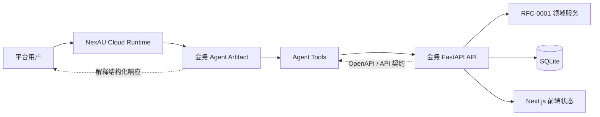
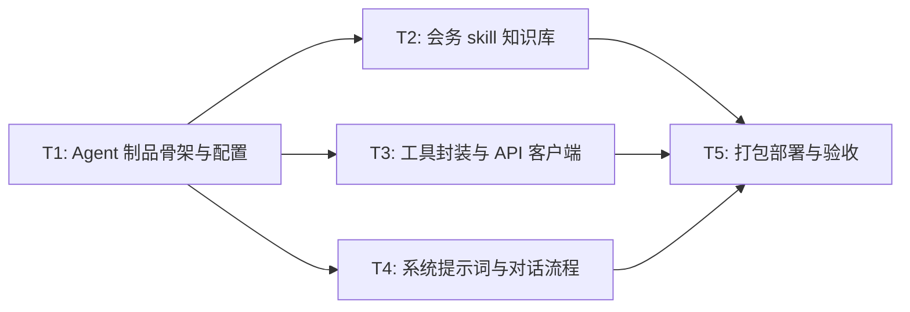

# RFC-0004: NAC 会务 Agent 制品与工具契约

- **状态**: implemented
- **优先级**: P1
- **标签**: `agent`, `nac`, `artifact`, `meeting-room`, `tool-contract`
- **影响服务**: NAC Agent 制品、FastAPI 后端、Next.js 前端、会务领域模型
- **创建日期**: 2026-07-31
- **更新日期**: 2026-07-31

## 摘要

本 RFC 定义运行在 NexAU Cloud（NAC）上的会务 Agent 制品设计，并已落地为 `agent/meeting-agent/` 制品。平台调用该 Agent 与用户对话，Agent 通过工具调用会务系统 FastAPI 接口，完成会议室查询、自然语言配置、预约候选、创建/取消/修改预约、日历与平面图状态解释等任务。Agent 不直接访问 SQLite，也不在前端或 prompt 中硬编码会务规则；规则、冲突校验、组合空间约束和状态版本仍由 RFC-0001 的领域模型与规则引擎维护，由 RFC-0002 的 FastAPI API 暴露。

本 RFC 是 NAC Agent 制品的入口、提示词边界、工具契约、运行策略和验收方式。实现时直接引用 RFC-0001、RFC-0002、RFC-0003 的模块定义。

## 动机

会务系统已经拆分为三个核心 RFC：

- RFC-0001 定义领域模型、固定空间关系、规则、预约和冲突校验；
- RFC-0002 定义 FastAPI 后端 API 与 Agent Tool 契约；
- RFC-0003 定义 Next.js 前端交互。

但赛题要求作品包含实际 Agent 层，平台会调用 Agent 对话，Agent 可以调用工具通过接口操作平台。仅有后端 API 和前端页面不足以说明 NAC 上的 Agent 如何被打包、如何理解会务领域、如何选择工具、如何避免越权或绕过冲突校验。

因此需要一个独立 RFC，明确 NAC Agent 制品的职责边界：

1. 平台如何注册和加载会务 Agent；
2. Agent 如何理解会务系统背景与固定约束；
3. Agent 如何把用户自然语言转换为 RFC-0002 的结构化 API 调用；
4. Agent 如何解释 FastAPI 返回的结构化状态；
5. Agent 如何保证不直接修改数据库、不绕过规则引擎、不承诺真实日历/支付/餐厅等外部系统。

## 设计

### 概述

NAC Agent 制品由 `nexau.json`、`agent.yaml`、`systemprompt.md`、工具定义和可选 skill 组成。实施期将在 NAC 中注册名为 `meeting_assistant` 的 Agent，平台根据会话上下文调用该 Agent；Agent 使用结构化模型调用工具，通过 FastAPI API 与本地会务系统交互。

NAC 平台集成契约如下：

- **注册/发现**：`nexau.json` 将 `meeting_assistant` 映射到 `agent.yaml`；`agent.yaml` 的 `description` 说明该 Agent 只处理会务系统 Topic A，不处理点餐、支付、真实日历、真实餐厅或真实地图服务。
- **调用输入**：平台必须把会话上下文注入为稳定变量，供系统提示词、工具 YAML 和 custom tool 函数读取：`user_message`、`session_id`、`workspace_id`、`actor_id`、`auth_token` 或 `demo_credentials`、`timezone=Asia/Shanghai`、`page_context` 或 `current_workspace`。本期不引入 RFC-0002 未定义的 `tenant_id`；如 NAC 平台内部存在租户概念，只能作为平台内部上下文，不得写入 FastAPI 请求体。实施期 `nac chat` 使用 `--var` 或 `--vars-file` 注入演示会话，`nac smoke`/`nac test` 使用 `--sbx-env` 或平台会话上下文注入 `MEETING_API_BASE_URL`、`auth_token`、`workspace_id` 与 `actor_id`。
- **认证映射**：工具层按优先级获取业务 API 认证上下文：优先使用平台注入的 `auth_token`（或平台会话变量/extra_kwargs 中同义字段）作为 `Authorization: Bearer <token>`；缺失时仅在显式 demo 模式调用 `auth_meeting_api` 的 login 操作，或读取部署脚本生成的 `MEETING_DEMO_TOKEN`；只读 demo 凭据只能用于查询。认证失败必须返回 `UNAUTHORIZED` 或 `DEMO_REQUIRED` 并标注 `demo_actor`，不得静默 fallback 到 demo 后执行写操作。
- **工具可见性**：Agent 可见会务业务工具、会务 skill references，以及仅用于制品自检/读取已打包 references 的标配文件工具。标配工具 binding 必须使用 NexAU 指南路径：`nexau.archs.tool.builtin.file_tools:read_file`、`nexau.archs.tool.builtin.file_tools:search_file_content`、`nexau.archs.tool.builtin.file_tools:glob`、`nexau.archs.tool.builtin.shell_tools:run_shell_command`。`run_shell_command` 不作为用户业务工具暴露；生产、临时 lane 或 staging-like 环境应禁用或限制为只读健康检查命令，禁止访问 SQLite、后端源码或绕过 FastAPI 的脚本。
- **结果回传**：工具返回统一 JSON 结构，保留 FastAPI 的 `request_id`、`data`、`error`、`warnings`、`meta.state_revision`、`meta.server_time`、`meta.timezone`，并在 FastAPI 响应缺省字段时标记 `missing_meta`，不得伪造 revision。
- **trace 验收**：NAC 层必须记录 `User -> NAC -> Agent -> Tool -> FastAPI` 的工具 span，包含工具名、FastAPI path、请求体摘要、响应 `ok/error`、`request_id`、`state_revision` 和 NAC Agent 当前模型卡；FastAPI 层对 `/api/nl/*` 还必须记录或返回后端自然语言接口的 `provider/model/request_id`。两者通过 FastAPI `request_id` 或会话上下文关联，不能以单一调用链替代双层 LLM 观测。

端到端请求上下文示例：

```json
{
  "user_message": "2026年8月5日 504 下午不能预约",
  "session_id": "nac-meeting-demo-session",
  "workspace_id": "default",
  "actor_id": "demo_actor",
  "auth_token": "${auth_token}",
  "timezone": "Asia/Shanghai",
  "current_workspace": {
    "name": "North Hackathon Demo",
    "page_context": "meeting-room-agent"
  },
  "demo_actor": true
}
```

实施期若使用真实平台登录态，`auth_token` 由平台会话变量或 `--vars-file` 注入并写入 `Authorization`；若使用演示账号，`demo_actor=true` 必须在回复和工具 metadata 中保留，且只读 demo 凭据不得提交写操作。

核心边界如下：

- Agent 负责对话、意图识别、澄清、工具选择和结果解释；
- FastAPI 负责认证、请求校验、幂等、状态版本、错误码和结构化响应；
- 领域服务负责规则、组合空间、冲突校验和状态写入；
- Next.js 前端负责真实 Web 操作闭环和可视化展示；
- Agent 不直接访问 SQLite，不直接调用数据库，不绕过 FastAPI；
- 标配文件检索和 shell 工具不得用于读写会务 SQLite、执行绕过 FastAPI 的脚本或修改后端领域服务代码；
- Agent 不硬编码领域规则，只把固定约束作为对话与工具选择的安全边界。



图读法：平台用户与 Agent 对话；Agent 通过工具调用 FastAPI；FastAPI 是操作会务系统的唯一后端边界；Next.js 前端继续作为本地 Web 应用入口，和 Agent 共享同一套 FastAPI 状态。

### 关键设计决策

1. **Agent 制品独立于本地 Web 应用，但共享同一套 API 契约**：NAC Agent 运行在平台 runtime 中，前端运行在本地或演示环境；二者都通过 RFC-0002 的 FastAPI API 操作会务系统，避免各自维护不同业务语义。
2. **Agent 不直接访问数据库或领域服务代码**：所有写操作必须通过 FastAPI，确保 `idempotency_key`、`expected_state_revision`、固定规则保护和结构化错误返回生效。
3. **固定空间关系写入 Agent 系统提示词，但规则引擎仍是唯一执行来源**：提示词用于帮助 Agent 正确澄清和解释，例如活动室午餐不可预约、505 周二不可用、会议室一/二可合并；最终是否可预约必须由 FastAPI 和领域服务判断。
4. **工具粒度围绕 RFC-0002 API 资源设计**：工具不直接暴露数据库 CRUD，而是暴露“查询空间”“查询可用时段”“自然语言候选”“配置规则”“创建/取消/修改预约”“读取日历/平面图”等面向任务的工具。
5. **自然语言写操作先确认再提交，但不改变后端直接生效语义**：对于创建预约、修改/删除规则、取消预约等写操作，Agent 应先展示结构化候选或影响摘要；用户明确确认后再生成稳定 `idempotency_key` 并调用写接口。自然语言配置后端仍按 RFC-0002 在 `dry_run=false` 时直接写入系统状态；Agent 的确认是用户交互层防误操作，不是新增管理员审批。
6. **LLM 固定使用 Nex-N2-Pro 且连接信息由平台模型卡注入**：`agent.yaml` 只声明模型卡全键 `nex-agi/Nex-N2-Pro`，不写 `base_url` 或 `api_key`；实施前必须确认该模型卡对该 NAC 项目已授权。验收必须读取 NAC trace 或 FastAPI 返回确认实际 provider/model 为 `nex-agi/Nex-N2-Pro`；NexAU 若因未授权而运行期优雅回落到项目默认模型，应判为验收失败并提示核对模型卡授权，而不是声称部署失败。`LLM_PROVIDER_ERROR` 仅用于 FastAPI 后端自然语言接口返回的后端 provider/model/API key 配置错误。
7. **工具调用结果必须结构化解释**：Agent 不得只复述 JSON；应把 `available_targets`、`excluded_targets`、`reason_code`、`state_revision`、冲突详情和建议转换为中文自然语言。
8. **不引入管理员/RBAC 或强制覆盖冲突能力**：本 RFC 与 RFC-0001/0002/0003 保持一致，本期所有登录用户业务权限相同，Agent 不承诺管理员调整或强制覆盖冲突。

### 制品结构

```text
agent/meeting-agent/
├── nexau.json
├── agent.yaml
├── systemprompt.md
├── NEXAU.md
├── tools/
│   ├── read_file.tool.yaml
│   ├── search_file_content.tool.yaml
│   ├── glob.tool.yaml
│   ├── run_shell_command.tool.yaml
│   ├── auth_meeting_api.tool.yaml
│   ├── get_meeting_state.tool.yaml
│   ├── query_availability.tool.yaml
│   ├── check_availability.tool.yaml
│   ├── nl_booking_candidates.tool.yaml
│   ├── configure_meeting_state.tool.yaml
│   ├── manage_rooms.tool.yaml
│   ├── manage_rules.tool.yaml
│   ├── manage_bookings.tool.yaml
│   ├── get_calendar.tool.yaml
│   └── get_floor_plan.tool.yaml
├── custom_tools/
│   ├── __init__.py
│   └── meeting_tools.py
└── skills/
    └── meeting-system/
        ├── SKILL.md
        └── references/
            ├── INDEX.md
            ├── domain.md
            ├── api-contract.md
            └── frontend-flow.md
```

#### `nexau.json`

`nexau.json` 只负责把 Agent 名称映射到 `agent.yaml`。

```json
{
  "agents": {
    "meeting_assistant": "agent.yaml"
  },
  "excluded": [
    ".git/",
    ".env",
    "node_modules/",
    "__pycache__/",
    "dist/",
    ".nac/"
  ]
}
```

#### `agent.yaml`

`agent.yaml` 声明 Agent 名称、系统提示词、模型、工具、上下文和执行上限。

```yaml
type: agent
name: meeting_assistant
description: 会务系统 Agent，负责通过 FastAPI 工具查询和操作本地会务系统；不处理点餐、支付、真实日历、真实餐厅或真实地图服务。
system_prompt: ./systemprompt.md
system_prompt_type: jinja
llm_config:
  model: nex-agi/Nex-N2-Pro
  max_tokens: 12000
  temperature: 0.2
tools:
  - name: read_file
    yaml_path: tools/read_file.tool.yaml
    binding: nexau.archs.tool.builtin.file_tools:read_file
  - name: search_file_content
    yaml_path: tools/search_file_content.tool.yaml
    binding: nexau.archs.tool.builtin.file_tools:search_file_content
  - name: glob
    yaml_path: tools/glob.tool.yaml
    binding: nexau.archs.tool.builtin.file_tools:glob
  - name: run_shell_command
    yaml_path: tools/run_shell_command.tool.yaml
    binding: nexau.archs.tool.builtin.shell_tools:run_shell_command
  - name: auth_meeting_api
    yaml_path: tools/auth_meeting_api.tool.yaml
    binding: custom_tools.meeting_tools:auth_meeting_api
  - name: get_meeting_state
    yaml_path: tools/get_meeting_state.tool.yaml
    binding: custom_tools.meeting_tools:get_meeting_state
  - name: query_availability
    yaml_path: tools/query_availability.tool.yaml
    binding: custom_tools.meeting_tools:query_availability
  - name: check_availability
    yaml_path: tools/check_availability.tool.yaml
    binding: custom_tools.meeting_tools:check_availability
  - name: nl_booking_candidates
    yaml_path: tools/nl_booking_candidates.tool.yaml
    binding: custom_tools.meeting_tools:nl_booking_candidates
  - name: configure_meeting_state
    yaml_path: tools/configure_meeting_state.tool.yaml
    binding: custom_tools.meeting_tools:configure_meeting_state
  - name: manage_rooms
    yaml_path: tools/manage_rooms.tool.yaml
    binding: custom_tools.meeting_tools:manage_rooms
  - name: manage_rules
    yaml_path: tools/manage_rules.tool.yaml
    binding: custom_tools.meeting_tools:manage_rules
  - name: manage_bookings
    yaml_path: tools/manage_bookings.tool.yaml
    binding: custom_tools.meeting_tools:manage_bookings
  - name: get_calendar
    yaml_path: tools/get_calendar.tool.yaml
    binding: custom_tools.meeting_tools:get_calendar
  - name: get_floor_plan
    yaml_path: tools/get_floor_plan.tool.yaml
    binding: custom_tools.meeting_tools:get_floor_plan
max_iterations: 18
max_context_tokens: 128000
tool_call_mode: structured
middlewares:
  - import: nexau.archs.main_sub.execution.middleware.context_compaction:ContextCompactionMiddleware
    params:
      threshold: 0.6
```

运行时配置由 NAC runtime variable、平台会话变量、`nac chat` 的 `--var`/`--vars-file` 或工具 `extra_kwargs` 注入，不写入制品：`MEETING_API_BASE_URL`（从 NAC 环境可访问的 FastAPI 地址）、`MEETING_API_TIMEOUT_SECONDS`（默认 30）、`WORKSPACE_ID`（默认 `default`）、`ACTOR_ID_FALLBACK` 与 `MEETING_DEMO_TOKEN`（仅显式 demo 模式）、`TIMEZONE`（默认 `Asia/Shanghai`）。`${env.*}` 仅表示制品解析或平台配置中的占位，不应假设 custom tool 进程能直接读取 OS 环境变量；工具函数必须通过 NAC 注入参数、session context 或部署脚本显式传入读取。`agent.yaml` 禁止包含 `base_url`、`api_key`、`sandbox_config`、`tracers` 或任何密钥；实施前必须确认 `nex-agi/Nex-N2-Pro` 对该 NAC 项目可见/已解锁。

制品根目录锁定为仓库根下的 `agent/meeting-agent/`；`nexau.json` 中 `meeting_assistant` 映射到该制品根目录内的 `agent.yaml`。实施期执行 `nac deploy --dry-run`、`nac dev`、`nac smoke`、`nac test` 或 `nac chat` 时，应在 `agent/meeting-agent/` 下运行，或从仓库根通过 NAC 项目配置显式选择该制品目录，避免把 `tools/`、`custom_tools/`、`skills/` 误建到仓库根。

#### `systemprompt.md`

系统提示词应包含以下内容：

1. 角色：会务系统 Agent，帮助用户查询、配置和预约会议室，只处理 Topic A 会务系统；
2. 固定领域约束：活动室午餐不可预约、会议室一/二可合并、503/505/506 是小会议室、505 周二全天不可用；504 是本期默认演示房间，可通过后端动态规则禁用，但不作为固定小会议室关系写入提示词；
3. 知识库使用：先通过 NAC 平台提供的 LoadSkill/LoadSkill-like 能力加载 `meeting-system`，再读取运行时返回的 `{path_to_skill_folder}/references/INDEX.md` 导航到领域、API 和前端契约摘要；需要核对接口或错误码时使用 `read_file`/`search_file_content`，不要凭记忆改写 RFC；若当前 NAC runtime 不支持该能力，实施期必须改为在制品 README 中说明替代加载方式，而不是硬编码 `skills/meeting-system/...` 路径；
4. 工作流：先识别意图，再查询必要状态，必要时澄清，写操作先确认，最后调用工具并解释结果；
5. 工具使用规则：只通过工具调用 FastAPI，不直接访问数据库，不导入仓储/领域服务代码，不绕过规则引擎；
6. 认证上下文：使用平台注入的 `workspace_id`、`actor_id`、token 或演示账号；若只能使用 demo actor，必须在回复和 trace 语义中标注演示身份；
7. 写操作规则：创建/修改/删除/取消必须准备 `idempotency_key` 和 `expected_state_revision`，并在用户确认后才提交 `dry_run=false`；
8. 状态版本：写操作前读取最新 `meta.state_revision`；遇到 `STATE_REVISION_CONFLICT` 时不得静默覆盖，应展示当前 revision 与影响摘要并请求再次确认；
9. LLM 错误分层：区分 NAC Agent 自身模型卡未命中、FastAPI/后端 LLM provider 错误、HTTP 5xx/超时；不得声称操作成功；
10. 安全边界：不承诺真实日历、支付、餐厅、外部会议室系统、管理员/RBAC、强制覆盖冲突；
11. 回复风格：中文、简洁、结构化，明确展示可用、不可用、冲突原因、`state_revision` 和下一步建议。

#### 工具契约

工具定义应暴露为 RFC-0002 API 的轻量封装。每个工具输入输出保持 JSON 友好，便于 NAC runtime 记录 trace。业务工具必须通过 FastAPI HTTP client 调用 RFC-0002 API，不得 import SQLite、仓储或领域服务代码。

| 工具 | 主要职责 | 对应 RFC-0002 API |
|---|---|---|
| `read_file` / `search_file_content` / `glob` / `run_shell_command` | 标配文件检索与制品自检工具；仅用于读取已打包 skill references、检查 YAML 和本地 smoke，不作为用户业务工具 | 不调用 FastAPI |
| `auth_meeting_api` | 显式 demo 模式登录、退出、读取当前用户；将 `token`、`workspace_id`、`actor_id`、`demo_actor` 写入工具上下文 | `POST /api/auth/login`、`POST /api/auth/logout`、`GET /api/auth/me` |
| `get_meeting_state` | 读取健康状态、会议室、组合空间、规则摘要；返回 `data.health`、`data.rooms`、`data.composites`、`data.rules`，任一子调用失败时工具返回结构化错误并保留已有子结果 warnings | `GET /api/health`、`GET /api/rooms`、`GET /api/rules` |
| `query_availability` | 按条件查询可用目标、候选和不可用原因 | `POST /api/availability:query` |
| `check_availability` | 对已选目标/时间窗做创建预约前冲突与可用性预检 | `POST /api/availability:check` |
| `nl_booking_candidates` | 解析自然语言预约意图并返回候选目标、排除目标和不可用原因；若 FastAPI 返回 `NATURAL_LANGUAGE_AMBIGUOUS` 则透传，若 Agent 自身调用前发现歧义则追问且不伪造 FastAPI 错误码 | `POST /api/nl/bookings:candidates` |
| `configure_meeting_state` | 自然语言配置房间、开放时段、规则；支持 `dry_run` 预览，只返回当前 revision 和影响摘要，不承诺预测 revision | `POST /api/nl/configure` |
| `manage_rooms` | 会议室、组合空间和开放时段结构化配置；优先用于 NL 配置无法稳定表达或需要结构化确认的变更 | `POST /api/rooms`、`GET /api/rooms/{room_id}`、`PATCH /api/rooms/{room_id}`、`POST /api/rooms/{room_id}/opening-schedules`、`PATCH /api/rooms/{room_id}/opening-schedules/{schedule_id}`、`DELETE /api/rooms/{room_id}/opening-schedules/{schedule_id}` |
| `manage_rules` | 规则定位、创建、更新、删除；固定规则受保护 | `GET /api/rules`、`GET /api/rules/{rule_id}`、`POST /api/rules`、`PATCH /api/rules/{rule_id}`、`DELETE /api/rules/{rule_id}` |
| `manage_bookings` | 预约定位、创建、取消、修改；创建前必须走候选或预检 | `GET /api/bookings`、`GET /api/bookings/{booking_id}`、`POST /api/bookings`、`POST /api/bookings/{booking_id}/cancel`、`PATCH /api/bookings/{booking_id}` |
| `get_calendar` | 查询指定房间/日期/时段状态 | `GET /api/calendar` |
| `get_floor_plan` | 查询平面图节点和状态 | `GET /api/floor-plan` |

工具输入 schema 必须区分用户/Agent 输入与工具自动生成字段：用户/Agent 只传业务意图、目标、时间窗、原因、候选选择等业务字段；工具层自动补齐 `workspace_id`、`actor_id`、`idempotency_key`、`expected_state_revision`、`dry_run` 和 `Authorization`。读接口认证上下文通过 `Authorization` 或工具 HTTP client 注入，不向 RFC-0002 未定义的 `GET /api/rooms` 查询参数写入 `workspace_id`、`actor_id` 或 `tenant_id`。`dry_run` 对 NL 配置、规则、房间和开放时段写操作是后端预览开关；对候选查询和可用性预检不是写操作语义。

工具层不新增业务规则，只做以下封装：

- 从 NAC 平台会话、runtime variable 或工具 `extra_kwargs` 读取 `workspace_id`、`actor_id`、认证 token 或演示凭据；
- 为写操作生成稳定 `idempotency_key`，并在用户确认摘要中固定该键；
- 写操作前按优先级读取 `meta.state_revision`：最近一次同会话 FastAPI 响应 > `GET /api/health` 全局 revision > 对象详情响应；最终以全局 revision 作为 `expected_state_revision`；
- 对 `STATE_REVISION_CONFLICT` 只返回结构化错误，不自动重写状态；由 Agent 读取当前摘要并再次征求确认。仅幂等同摘要请求和非破坏性 dry_run 可自动重试一次；
- 将 FastAPI 错误转换为 Agent 可读的 `reason_code`、`details`、`suggestions` 和 `next_action`。

`idempotency_key` 必须稳定且可测试。建议格式为：

```text
nac-meeting:{workspace_id}:{actor_id}:{operation_type}:{primary_resource_id}:{normalized_window_or_none}:{request_hash}
```

其中 `operation_type` 取 `configure_rule`、`create_booking`、`cancel_booking`、`update_booking`、`create_rule`、`update_rule`、`delete_rule`、`create_room`、`update_room`、`create_opening_schedule`、`update_opening_schedule`、`delete_opening_schedule` 等；`primary_resource_id` 对 `cancel_booking` 和 `update_booking` 必须包含 `booking_id`，对规则操作必须包含 `rule_id`，对房间/开放时段操作必须包含 `room_id` 或 `schedule_id`；`request_hash` 必须覆盖规范化后的完整确认请求体。规范化规则：固定字段顺序、时间统一为 RFC3339+时区、统一 `target_type/target_id` 与 `room_id/composite_id` 别名、剔除未确认原文和展示字段。用户重复确认同一摘要必须复用同一键；用户改口导致摘要变化时必须生成新键，FastAPI 若收到同键不同内容应返回 `IDEMPOTENCY_KEY_REUSED`。

统一返回结构如下，工具不得吞掉 FastAPI 的公共响应字段：

```json
{
  "ok": true,
  "request_id": "req_xxx",
  "data": {},
  "warnings": [],
  "meta": {
    "state_revision": 13,
    "server_time": "2026-07-31T10:00:00+08:00",
    "timezone": "Asia/Shanghai"
  }
}
```

失败时统一返回 `data: {}`，保留 FastAPI 的 `error.code`、`error.message`、`error.details`、`error.suggestions`，并补充 `http_status`、`tool_name`、`recoverable`、`next_action`。若 FastAPI 响应缺省 `request_id` 或 `meta.state_revision`，工具层必须生成 `tool_request_id` 并设置 `request_id=tool_request_id`、`meta.state_revision=null`、`meta.server_time=null`、`meta.timezone=null`，同时设置 `transport_error=missing_meta`；HTTP 连接失败、超时、非 JSON、工具异常分别映射为 `TRANSPORT_ERROR`、`TIMEOUT`、`INVALID_RESPONSE`、`TOOL_EXCEPTION`，不得伪造成功响应。

```json
{
  "ok": false,
  "request_id": "req_xxx",
  "error": {
    "code": "BOOKING_CONFLICT",
    "message": "该会议室在指定时段已有预约",
    "details": {
      "conflicts": [],
      "reason_code": "OVERLAPPING_BOOKING"
    },
    "suggestions": [],
    "http_status": 409,
    "tool_name": "manage_bookings",
    "recoverable": true,
    "next_action": "询问用户是否选择其它候选或调整时间"
  },
  "meta": {
    "state_revision": 13,
    "server_time": "2026-07-31T10:00:00+08:00",
    "timezone": "Asia/Shanghai"
  }
}
```

LLM 错误需要分层解释：NAC Agent 自身模型卡未命中或平台模型卡注入失败属于部署配置问题；FastAPI 返回 `LLM_PROVIDER_ERROR` 属于后端 provider/model/API key 配置问题；HTTP 5xx 或超时属于后端服务错误。Agent 必须说明失败来源、是否影响状态写入和建议检查项，不能声称操作成功。

### 对话与工具编排

#### 查询类意图

1. 识别用户要查询的是会议室列表、可用时段、日历还是平面图；
2. 若缺少日期、时间范围、房间类型或房间 ID，先澄清；
3. 自然语言可用查询调用 `query_availability` 或 `nl_booking_candidates`；指定目标/时间窗的创建前预检调用 `check_availability`；日历和平面图分别调用 `get_calendar` 或 `get_floor_plan`；
4. 按候选、排除原因、固定占用、动态规则和已有预约组织回答，并说明 `reason_code`。

#### 配置类意图

1. 识别用户要修改规则、开放时段或房间基础信息；
2. 调用 `configure_meeting_state` 的 `dry_run=true` 获取解析结果；结构化房间/开放时段变更可路由到 `manage_rooms`；
3. 向用户展示将创建/更新/删除的对象、`matched_rule_id`、影响时段、当前 `state_revision`、幂等键和提交前会重新读取最新 revision 的摘要；只展示当前 revision 和影响摘要，不承诺预测 revision；
4. 用户明确确认后再次调用 `dry_run=false` 写入；FastAPI 仍保持 RFC-0002 的直接写入语义，Agent 的确认只是用户交互层防误操作，不是新增管理员审批；
5. 若返回 `PROTECTED_RULE`、`STATE_REVISION_CONFLICT` 或 FastAPI 返回 `NATURAL_LANGUAGE_AMBIGUOUS`，解释原因并给出下一步；若 Agent 在调用前发现自然语言歧义，只追问并记录 Agent 决策，不伪造 FastAPI 错误码。

#### 预约类意图

1. 识别时间、时长、房间类型、人数、会议标题和参会人；
2. 自然语言预约优先调用 `nl_booking_candidates` 获取 `parsed_booking`、`candidates` 和 `excluded_targets`；指定目标/时间窗的预检调用 `check_availability`；
3. 展示候选与排除原因，要求用户明确选择候选；
4. 用户选择候选后，展示同一份影响摘要和 `idempotency_key`，读取最新 `state_revision`，调用 `POST /api/bookings` 创建预约；
5. 若冲突，解释 `reason_code`、冲突详情和可替代时段/房间。

#### 取消/修改类意图

1. 先通过 `GET /api/bookings` 或 `GET /api/bookings/{booking_id}` 定位预约；
2. 展示将释放或修改的时段、`booking_id`、影响摘要、当前 `state_revision` 和幂等键；
3. 用户明确确认后调用 `POST /api/bookings/{booking_id}/cancel` 或 `PATCH /api/bookings/{booking_id}`；否定词、反悔词或歧义词必须触发再澄清；
4. 返回新的 `state_revision`，并说明日历和平面图状态已更新。

### 接口契约

本 RFC 不重复定义 FastAPI API 细节，所有接口路径、请求/响应、错误码以 RFC-0002 为准。NAC Agent 工具层必须遵循以下契约：

- 工具调用 FastAPI 时必须携带认证上下文：优先使用平台注入的 `auth_token`；缺失时仅在显式 demo 模式调用 `auth_meeting_api` 或读取 `MEETING_DEMO_TOKEN`；只读 demo 凭据不得用于写操作。
- 读接口认证上下文通过 `Authorization` 或工具 HTTP client 注入，不向 RFC-0002 未定义的读接口参数写入 `workspace_id`、`actor_id` 或 `tenant_id`。
- 写操作必须由工具层在发往 FastAPI 前补齐 RFC-0002 公共字段：`idempotency_key`、`expected_state_revision`、`workspace_id`、`actor_id` 和 `dry_run`；若 RFC-0002 示例遗漏字段，实施期以公共请求格式为准。
- 写操作支持 `dry_run` 时，Agent 应先使用 `dry_run` 预览；后端不支持 `dry_run` 的端点，工具层必须用候选/详情/预检生成影响摘要并在用户确认后再提交。
- 工具不得吞掉 `error.code`、`error.details`、`error.suggestions`，也不得吞掉 `reason_code`、`conflicts`、`available_targets`、`excluded_targets`、`released_slots` 等可解释字段。
- 工具返回必须包含 `ok`、`request_id`、`data`、可选 `error`、`warnings`、`meta.state_revision`、`meta.server_time`、`meta.timezone`；FastAPI 缺省字段时按工具契约设置 fallback 并标记 `transport_error`。
- `LLM_PROVIDER_ERROR`、HTTP 5xx、认证失败、参数校验失败、状态版本冲突和 FastAPI 返回的自然语言歧义都必须映射为结构化错误；Agent 自身调用前的歧义只触发追问，不伪造 FastAPI 错误码。
- NAC trace 必须记录 `User -> NAC -> Agent -> Tool -> FastAPI` 的工具 span，并记录 FastAPI path、请求体摘要、响应 `ok/error`、`request_id`、`state_revision`、NAC Agent 当前模型卡；`/api/nl/*` 场景还必须关联 FastAPI 后端 NL runtime 的 `provider/model/request_id`。

API 覆盖矩阵如下：

| API | 覆盖方式 |
|---|---|
| `GET /api/health` | smoke、工具封装单测、state_revision 基线、trace 验收 |
| `POST /api/auth/login`、`POST /api/auth/logout`、`GET /api/auth/me` | 显式 demo 登录、token 映射、当前用户和 `demo_actor` 标注测试 |
| `GET /api/rooms` | 会议室列表集成测试、502 排除断言；读接口不携带 `workspace_id`/`actor_id` 查询参数 |
| `POST /api/rooms`、`PATCH /api/rooms/{room_id}` | 结构化房间配置、幂等和状态版本测试 |
| `POST/PATCH/DELETE /api/rooms/{room_id}/opening-schedules` | 开放时段配置、固定规则保护和状态版本测试 |
| `POST /api/availability:query` | 可用查询集成测试、手动验证 |
| `POST /api/availability:check` | 创建预约前预检、冲突解释测试 |
| `POST /api/nl/bookings:candidates` | 自然语言预约候选集成测试；断言 FastAPI 后端 NL runtime `provider/model` |
| `POST /api/nl/configure` | dry_run 与正式写入闭环测试；断言 FastAPI 后端 NL runtime `provider/model` |
| `GET /api/rules`、`GET /api/rules/{rule_id}`、`POST /api/rules`、`PATCH /api/rules/{rule_id}`、`DELETE /api/rules/{rule_id}` | 规则管理、固定规则保护、504 动态规则连续修改测试 |
| `POST /api/bookings` | 创建预约、组合空间互斥、幂等测试 |
| `GET /api/bookings`、`GET /api/bookings/{booking_id}` | 取消/修改前定位测试 |
| `POST /api/bookings/{booking_id}/cancel` | 取消释放与重订测试 |
| `PATCH /api/bookings/{booking_id}` | 修改预约成功/冲突测试 |
| `GET /api/calendar` | 日历状态闭环测试 |
| `GET /api/floor-plan` | 平面图状态闭环测试 |

### 与现有 RFC 的关系

| 关联 RFC | 关系 |
|---|---|
| RFC-0001 | 提供领域模型、固定空间关系、规则、组合空间和冲突校验语义 |
| RFC-0002 | 提供 FastAPI API、错误码、幂等、状态版本和 Agent Tool 契约 |
| RFC-0003 | 提供前端页面、自然语言交互和平面图展示契约 |

本 RFC 是 RFC-0002 中 Agent Tool 契约的制品化落地，同时依赖 RFC-0001 的领域语义和 RFC-0003 的前端闭环。

NAC Agent 与本地 Agent runtime 的职责边界：RFC-0002 要求 FastAPI 的自然语言接口内部由本地实际 Agent runtime 使用 `nex-agi/Nex-N2-Pro` 完成结构化解析；NAC Agent 是赛题要求的平台 Agent 层，负责通过 NAC 工具调用 RFC-0002 的 `/api/nl/configure` 与 `/api/nl/bookings:candidates`，不绕过这些接口，也不维护第二套领域解析规则。若两者并存，应共享 RFC-0001/0002/0003 作为单一事实来源，并在 trace 中区分 NAC Agent 自身 LLM 调用与 FastAPI 后端自然语言接口的 LLM provider/model。NAC Agent 自身模型失败时，工具层不得静默绕过 FastAPI；FastAPI 返回的 `data.llm.provider/model` 只代表后端 NL runtime。验收必须同时断言 NAC 当前模型卡和 FastAPI 后端 NL runtime 的 `provider/model/request_id`。

### 权衡取舍

#### 考虑过的替代方案

1. **让 Agent 直接访问 SQLite**
   - 优点：工具实现简单，少一层 API 调用。
   - 缺点：绕过认证、幂等、状态版本、固定规则保护和结构化错误；与 RFC-0002 冲突。
   - 结论：不采用。

2. **把会务规则写进系统提示词，由 Agent 自行判断冲突**
   - 优点：工具少，响应快。
   - 缺点：规则容易漂移，无法保证与日历、平面图、预约状态一致。
   - 结论：不采用。提示词只保留必要领域常识和安全边界。

3. **只提供 OpenAPI，不写独立 Agent 制品**
   - 优点：实现成本低。
   - 缺点：无法满足“平台调用 Agent 对话、Agent 调用工具操作平台”的赛题要求。
   - 结论：不采用。

4. **把 Agent 做成前端内置聊天框**
   - 优点：用户入口直观。
   - 缺点：NAC 制品、平台 trace、模型卡和环境变量无法复用；与 NAC 运行边界不一致。
   - 结论：不采用。前端仍按 RFC-0003 做本地 Web 闭环，NAC Agent 独立制品化。

#### 缺点

- Agent 需要额外维护工具封装和提示词，增加制品打包复杂度；
- 工具调用链路比直接 API 多一层，trace 排障时需要同时查看 Agent trace 和 FastAPI 请求；
- 写操作先确认后提交会增加一轮对话，但能降低误操作风险；
- 本 RFC 不解决管理员/RBAC、真实地图服务、真实日历接入等后续范围。

## 实现计划

> 实施状态：T1/T2/T3/T4 已完成，新增 `agent/meeting-agent/` 制品；T5 的本地静态验收已完成，NAC 临时 lane/staging 部署验收需在有 NAC 项目和 FastAPI 地址的环境中执行。

### 阶段划分

- [x] Phase 1: 创建 NAC Agent 制品骨架和会务 skill 知识库。
- [x] Phase 2: 实现工具封装，连接 RFC-0002 FastAPI API。
- [x] Phase 3: 编写系统提示词、对话流程和验收用例。
- [ ] Phase 4: 打包、部署到 NAC 临时 lane 或 staging-like 环境并验证 Agent 对话链路。

### 子任务分解

#### 依赖关系图



#### 子任务列表

| ID | 标题 | 依赖 | 状态 | Ref |
|----|------|------|------|-----|
| T1 | Agent 制品骨架与配置 | - | implemented | `agent/meeting-agent/nexau.json`, `agent/meeting-agent/agent.yaml` |
| T2 | 会务 skill 知识库 | T1 | implemented | `agent/meeting-agent/skills/meeting-system/` |
| T3 | 工具封装与 API 客户端 | T1 | implemented | `agent/meeting-agent/custom_tools/meeting_tools.py`, `agent/meeting-agent/tools/` |
| T4 | 系统提示词与对话流程 | T1 | implemented | `agent/meeting-agent/systemprompt.md` |
| T5 | 打包部署与验收 | T2, T3, T4 | pending | 本地静态验证已通过；NAC lane/staging 验证待环境执行 |

> **并行提示**: T1 是唯一硬前置；T2/T3/T4 在 T1 后可独立实现和验证；T5 依赖三者完成后再执行端到端验收。

#### 子任务定义

**T1: Agent 制品骨架与配置**
- **范围**: 实施期新增顶层 `agent/meeting-agent/`，包含 `nexau.json`、`agent.yaml`、`systemprompt.md`、`NEXAU.md`、`tools/`、`custom_tools/`、skill references 和打包排除配置；同步 `README.md`、`AGENTS.md` 或 `demo/README.md` 的索引说明。
- **验收标准**: `nac dev` 或 `nac deploy --dry-run` 能识别制品；`nexau.json`、`agent.yaml` 可解析；所有 `tools/*.tool.yaml` 的 `yaml_path` 与 binding 存在且可导入；`agent.yaml` 不包含 `base_url`、`api_key`、`sandbox_config`、`tracers` 或任何密钥；`llm_config.model` 固定为 `nex-agi/Nex-N2-Pro`；标配文件工具仅用于制品自检，`run_shell_command` 不作为用户业务工具；业务工具均可见。

**T2: 会务 skill 知识库**
- **范围**: 新增会务 skill，将 RFC-0001/0002/0003 的核心语义整理为 Agent 可检索的知识：固定空间关系、规则类型、API 契约、前端页面和验收场景。
- **验收标准**: 制品内 `agent/meeting-agent/skills/meeting-system/references/INDEX.md` 可在打包后的运行时 `{path_to_skill_folder}/references/INDEX.md` 中导航到领域、API 和前端契约摘要；知识库不复制整份 RFC；系统提示词要求 Agent 先加载 skill 再按需读取接口索引。

**T3: 工具封装与 API 客户端**
- **范围**: 实现 NAC 工具封装，连接 RFC-0002 的 FastAPI API；处理认证上下文、默认 workspace、`idempotency_key`、`expected_state_revision`、房间/开放时段/规则/预约写操作、LLM provider 错误和结构化错误。
- **验收标准**: 每个工具都有 YAML 定义；binding 函数签名与 YAML schema 一致；读接口认证通过 `Authorization` 注入且不向 RFC-0002 未定义参数写 `workspace_id`/`actor_id`；写操作由工具层自动补齐公共字段；写操作不会绕过 FastAPI；认证失败、状态版本冲突、固定规则保护、自然语言歧义、HTTP 5xx/超时和 LLM provider 错误均返回可解释结果；`custom_tools.meeting_tools` 可导入且不 import SQLite/仓储/领域服务代码。

**T4: 系统提示词与对话流程**
- **范围**: 编写 `systemprompt.md`，定义角色、固定约束、工具选择、澄清策略、写操作确认、错误解释和回复风格。
- **验收标准**: Agent 能处理查询、配置、自然语言预约候选、创建/取消/修改预约、日历和平面图解释；不会承诺管理员/RBAC、真实日历、支付、餐厅、外部地图服务或强制覆盖冲突。

**T5: 打包部署与验收**
- **范围**: 打包 Agent 制品，部署到 NAC 临时 lane 或 staging-like 环境，执行 `smoke`、`test`、`chat` 三层验收。
- **验收标准**: `nac smoke` 验证制品解析、模型卡、工具绑定和 FastAPI 健康；`nac test` 或等价脚本执行可重复场景；`nac chat` 覆盖至少 7 条关键对话；trace 中能观测到工具名、FastAPI path、请求体摘要、响应 `ok/error`、`request_id`、`state_revision` 和 LLM provider/model；README 或 acceptance 文档记录启动、部署、回滚和验证步骤。

### NAC 部署与回滚策略

- 本期只使用 NAC 临时 lane 或 staging-like 环境，不进入生产环境。
- 部署前置门禁：确认 `nex-agi/Nex-N2-Pro` 对该 NAC 项目可见/已解锁；确认 `MEETING_API_BASE_URL` 从 NAC 环境可访问并返回 `/api/health`；确认演示 token 或平台用户 token 可映射到 `workspace_id` 与 `actor_id`。NAC 到 FastAPI 的地址可为同集群服务名、Volc ingress 或受控本地隧道；不得使用未配置 TLS 或不可从 NAC 环境解析的地址。
- 推荐验证顺序：`nac deploy --dry-run` -> `nac deploy <temporary-lane-or-staging>` -> `nac smoke` -> `nac test` -> `nac chat` -> 检查 trace。
- 回滚只回滚 Agent 制品、工具封装和提示词，不回滚 FastAPI/SQLite 会务状态；回滚前记录当前 `state_revision`、FastAPI 版本、NAC agent version/tag 和测试 `workspace_id`，回滚后验证 `/api/health` 的 `state_revision` 与数据一致。
- 回滚兼容门禁：只用于临时 lane 或 staging-like；若工具 schema、认证上下文或 RFC-0002 写操作字段不兼容，禁止回滚，改为销毁 lane 并重建 seed。回滚后至少执行只读 API 验证，确认旧 Agent 能解释当前会议室、规则、日历和平面图状态。
- 若部署失败或 trace 不满足验收字段，优先销毁临时 lane 或回滚到上一版本 tag；工具 schema 变化必须兼容旧请求或提供迁移说明。

### 影响范围

- `agent/meeting-agent/` - 新增 NAC Agent 制品目录（实施期新增，本 RFC 不创建）。
- `agent/meeting-agent/tools/` - 新增 Agent 工具 YAML 定义。
- `agent/meeting-agent/custom_tools/` - 新增 FastAPI API 客户端工具封装。
- `agent/meeting-agent/skills/meeting-system/` - 新增会务系统 skill 知识库。
- `README.md`、`AGENTS.md` 或 `demo/README.md` - 增加 NAC Agent 部署、打包、回滚和验收说明。
- `agent/meeting-agent/acceptance/` - 增加 Agent 对话验收场景。
- `docs/rfcs/README.md`、`docs/rfcs/meta/` - 同步 RFC 索引和元数据（本轮只修改 RFC-0004 正文，不修改其它文件）。

## 测试方案

### 测试数据契约

- 自动 `test`、手动 `chat`、部署 `smoke` 使用不同 `workspace_id` 或可重置 seed；默认固定测试 workspace 为 `default`，人工 chat 不得污染自动化测试数据。
- 每个集成或手动场景前通过受控 seed 脚本、测试 API 或受控 demo 环境命令恢复固定状态；若 NAC 临时 lane 不能直接 reset SQLite，必须重建该 lane 或恢复到固定 seed 后再开始。
- 场景开始前记录 `GET /api/health` 的 `state_revision`；场景结束后断言 Agent 工具、FastAPI、前端/平面图查询读到同一 revision 或明确记录由测试写操作导致的单调递增。
- 断言初始空间包含活动室、会议室一、会议室二、503、504、505、506，不包含 502；504 初始状态由 seed 明确定义，若默认禁用则同时断言规则和可用性查询一致。
- 所有时间均以 `Asia/Shanghai` 为准；可重复场景固定为 2026-08-04、2026-08-05、2026-08-07。
- 手动验证不依赖“刚才”的不可控状态；每条用例明确取消或修改哪条预约/规则。

### smoke / test / chat 分层

| 层级 | 命令或方式 | 覆盖目标 |
|---|---|---|
| `smoke` | `nac deploy --dry-run`、`nac dev` 或等价健康检查 | 制品解析、`nexau.json`、`agent.yaml`、工具 YAML 路径、binding 可导入、实际模型为 `nex-agi/Nex-N2-Pro`、FastAPI `/api/health` 可达、NAC 到 FastAPI 网络可达、认证上下文注入 |
| `test` | `nac test` 或可重复脚本 | 固定数据、固定时间窗、API 覆盖矩阵、认证接口、幂等、状态版本、错误转换、502 排除、固定规则保护、504 动态规则 |
| `chat` | `nac chat` 或平台对话验收 | 至少 7 条关键对话；每条断言触发输入、预期工具调用、FastAPI path、响应字段、trace 字段和 LLM provider/model |

Chat 验收矩阵至少覆盖：小会议室候选（`nl_booking_candidates` -> `POST /api/nl/bookings:candidates`，断言 FastAPI NL runtime provider/model）、活动室午餐拒绝（`query_availability` 或 `check_availability`，断言 `FIXED_UNAVAILABLE`）、504 连续自然语言配置（`configure_meeting_state` dry_run/正式写入，断言 `matched_rule_id` 和 revision）、自然语言预约并创建（`nl_booking_candidates` + `manage_bookings`，断言幂等键和 revision）、组合预约互斥（`manage_bookings`，断言组合/成员冲突）、取消释放（`manage_bookings` cancel，断言 `released_slots` 和 revision）、修改冲突（`manage_bookings` patch，断言冲突且状态不变）、Topic A/B 边界或状态版本冲突（断言不越界或 `STATE_REVISION_CONFLICT` 再确认）。

### 单元测试

- 工具契约单测：解析所有 `.tool.yaml`，断言 schema 存在、参数 JSON 可序列化、输入输出示例覆盖查询/配置/预约/日历/平面图，binding 函数签名与 YAML schema 一致；缺参/错参返回结构化 `VALIDATION_ERROR`，不抛未捕获异常。
- 工具封装单测：有效 token 注入 `workspace_id`/`actor_id`；无 token/失效 token 返回 `UNAUTHORIZED`；显式 demo 登录返回 `demo_actor`；默认 `workspace_id=default`、`TIMEZONE=Asia/Shanghai`、`MEETING_API_BASE_URL` 从运行时变量或工具参数注入；注入失败返回可解释错误。
- 静态边界单测：AST/import 检查 `custom_tools/meeting_tools.py` 和每个业务 binding 不得 import SQLite、repositories、domain 或仓储代码；标配文件/Shell 工具不得用于读写 SQLite 或绕过 FastAPI。
- 响应透传单测：逐工具断言成功/失败响应保留 FastAPI 的 `request_id`、`data/error`、`warnings`、`meta.state_revision`、`meta.server_time`、`meta.timezone`；缺省字段时设置稳定 fallback 并标记 `transport_error`。
- 幂等与状态版本单测：同一摘要重复确认生成同一 `idempotency_key` 且不重复写入；摘要变化生成新键；同键不同内容触发 `IDEMPOTENCY_KEY_REUSED`；`expected_state_revision` 过期返回 `STATE_REVISION_CONFLICT`，不静默覆盖；状态冲突后不自动重写已确认写操作。
- 错误转换单测：覆盖 `UNAUTHORIZED`、`FORBIDDEN`、`VALIDATION_ERROR`、`NATURAL_LANGUAGE_AMBIGUOUS`、`ROOM_NOT_FOUND`、`BOOKING_NOT_FOUND`、`RULE_NOT_FOUND`、`STATE_REVISION_CONFLICT`、`IDEMPOTENCY_KEY_REUSED`、`BOOKING_CONFLICT`、`BOOKING_BLOCKED_BY_RULE`、`PROTECTED_RULE`、`LLM_PROVIDER_ERROR`、`TRANSPORT_ERROR`、`TIMEOUT`、`INVALID_RESPONSE`、`TOOL_EXCEPTION`；断言保留 `error.details`、`error.suggestions`、`reason_code`、`http_status`、`tool_name`、`recoverable`、`next_action`。
- 配置单测：`nexau.json` 可解析；`agent.yaml` 可解析；`llm_config.model=nex-agi/Nex-N2-Pro`；不包含 `base_url`、`api_key`、`sandbox_config`、`tracers`；所有业务工具和标配文件工具均存在；所有 binding 使用完整可导入路径；`custom_tools/meeting_tools.py` 可导入。
- 提示词安全边界单测：询问点餐、支付、真实餐厅、真实日历、真实地图、管理员强制覆盖、删除活动室午餐、把 502 加为可用房间、活动室午餐可预约、505 周二可用、会议室一/二不可合并、直接查 SQLite 或绕过工具写数据库时，Agent 应拒绝或澄清，不调用写接口或数据库访问。

### 集成测试

| 编号 | 场景 | 触发输入/工具 | 期望结果 |
|---|---|---|---|
| C1 | 会议室列表与 502 排除 | `get_meeting_state` / `GET /api/rooms` | 返回活动室、会议室一、会议室二、503、504、505、506；不包含 502 |
| C2 | 小会议室自然语言候选 | `nl_booking_candidates`：`2026-08-04T10:00:00+08:00` 到 `2026-08-04T11:00:00+08:00`，小会议室 | `candidates` 包含 503/506；`excluded_targets` 包含 505 且 `reason_code=WEEKLY_UNAVAILABLE`；不包含 502；trace 记录 FastAPI 使用 `nex-agi/Nex-N2-Pro` |
| C3 | 活动室午餐拒绝 | `query_availability` 或 `check_availability`：活动室，`2026-08-04T12:00:00+08:00` 到 `2026-08-04T13:00:00+08:00` | 返回 `FIXED_UNAVAILABLE`/午餐占用；Agent 中文解释包含拒绝原因和替代建议 |
| C4 | 504 自然语言配置闭环 | `configure_meeting_state` 先 `dry_run=true` 再 `dry_run=false`：`2026-08-05 504 临时维修，全天不能预约。刚才说错了，只停用下午` | `matched_rule_id` 两次相同；正式写入后 `state_revision` 单调递增；再调用 `GET /api/rules`、`GET /api/calendar`、`GET /api/floor-plan`、`POST /api/availability:query` 均显示 504 只下午禁用 |
| C5 | 自然语言预约候选与创建 | `nl_booking_candidates` 选择 503 后 `manage_bookings` 创建 `2026-08-04T10:00:00+08:00` 到 `2026-08-04T11:00:00+08:00` | 创建前/创建时调用 `check_availability` 或创建接口返回成功；`state_revision` 递增；日历和平面图可见 booked；同一 `idempotency_key` 重试返回上一次结果 |
| C6 | 组合预约与互斥 | `manage_bookings` 创建 `meeting-room-1-2`：`2026-08-07T14:00:00+08:00` 到 `2026-08-07T15:00:00+08:00` | 成功后分别预约 `meeting-room-1` 或 `meeting-room-2` 被拒绝；反向场景先占成员房间时组合预约返回 `OVERLAPPING_COMPOSITE_BOOKING` 或 `COMPOSITE_BOOKED` |
| C7 | 取消释放与重订 | 取消 C5 或 C6 创建的预约 | `released_slots` 正确；取消后日历/平面图释放；同一时段重订成功 |
| C8 | 修改预约冲突 | `manage_bookings` 修改已创建预约到冲突时段 | 返回可解释冲突 `reason_code` 和建议，不修改状态 |
| C9 | 固定规则保护 | 请求删除活动室午餐或 505 周二规则 | 返回 `PROTECTED_RULE`；`GET /api/rules` 状态不变；`state_revision` 不变 |
| C10 | 自然语言歧义澄清 | 输入“帮我约个小会议室”或“明天下午可以吗” | Agent 不调用写接口，追问日期/时间/人数/目标；返回或记录 `NATURAL_LANGUAGE_AMBIGUOUS` 等价语义 |
| C11 | 状态版本冲突 | 模拟 `expected_state_revision` 过期后写操作 | 返回 `STATE_REVISION_CONFLICT`、当前 revision 和建议；用户再次确认后重新读取状态再写 |
| C12 | 失败降级 | 模拟 FastAPI 502/503/超时或 FastAPI 返回 `LLM_PROVIDER_ERROR` | Agent 说明失败来源、是否影响状态写入和下一步检查项；不伪装成功；trace 记录 `request_id` 和错误码 |
| C13 | Topic A/B 边界 | 询问点餐、真实餐厅、真实支付、真实外部日历/地图 | Agent 明确本期不接入真实餐厅/支付/日历/地图，不创建相关工具调用 |
| C14 | 写操作确认门禁：未确认 | 用户提出创建/取消/修改/删除后回复“不取消”“先别改”或“算了” | Agent 展示候选/影响摘要并请求确认；trace 中不应出现写接口调用，`state_revision` 不变 |
| C15 | 写操作确认门禁：确认后提交 | 先展示影响摘要和 `idempotency_key`，用户再回复“确认”或明确说“取消” | Agent 才调用对应写接口；成功路径 `state_revision` 单调递增，冲突路径状态不变并解释原因 |

### 手动验证

1. 打包并部署：运行 `nac deploy --dry-run`，再部署到临时 lane 或 staging-like 环境；确认 `MEETING_API_BASE_URL` 从 NAC 环境可访问 `/api/health`。
2. 输入“2026年8月4日 10:00-11:00 有哪些小会议室可用？”；期望回答 503/506 可用、505 因每周二全天不可用排除，502 不作为可用结果。
3. 输入“2026年8月4日 12:00-13:00 预约活动室”；期望拒绝，解释活动室午餐固定占用 `FIXED_UNAVAILABLE`，并检查日历/平面图同时间段显示固定占用。
4. 输入“2026年8月5日 504 临时维修，全天不能预约。刚才说错了，只停用下午”；期望两次 NL 配置匹配同一条 504 规则，`matched_rule_id` 相同，规则、日历、平面图和可用性查询均只反映下午禁用。
5. 输入“2026年8月7日 14:00-15:00 预约会议室一+会议室二”；期望创建组合预约后，成员房间不可分别预约，并解释 `OVERLAPPING_COMPOSITE_BOOKING`/`COMPOSITE_BOOKED`。
6. 输入“取消步骤5创建的 2026年8月7日 14:00-15:00 组合预约”；期望释放该时段，日历/平面图不再显示 booked，同一时段可重订。
7. 修改预约成功路径：先重新创建步骤5同规格的 `2026年8月7日 14:00-15:00` 会议室一+会议室二组合预约，再输入“把步骤7新建的组合预约改到 2026年8月7日 16:00-17:00”；期望修改成功并返回新的 `state_revision`。
8. 修改预约冲突路径：先创建目标预约 A（`2026年8月7日 15:00-16:00` 会议室一）和冲突源预约 B（`2026年8月7日 16:00-17:00` 会议室一），再请求把 A 改到 B 的同一时段；期望返回 `BOOKING_CONFLICT`/`OVERLAPPING_BOOKING` 或等价结构化错误，`state_revision` 不变。
9. 输入“查看 5F 平面图”；期望平面图包含 504 且状态随 504 规则变化，会议室一/二可展示组合空间或成员占用关系。
10. 检查 NAC trace：必须看到 Agent 对话、工具名、FastAPI URL/path、请求体摘要、响应 `ok/error`、`request_id`、`state_revision`、`server_time`、`timezone`；自然语言候选和配置场景还需看到 FastAPI 或 NAC Agent 实际使用 `provider=nex-agi`、`model=Nex-N2-Pro`；若 trace 显示项目默认模型或其它模型回落，直接判 fail 并提示核对模型卡授权。

## 未解决的问题

- 无本期未解决问题。NAC 制品目录锁定为 `agent/meeting-agent/`；工具封装放在制品内 `custom_tools/`，暂不引入独立 Python package；`agent.yaml` 固定声明 `nex-agi/Nex-N2-Pro`，不写 `base_url` 或 `api_key`，连接信息由平台模型卡注入并纳入 trace 验收。

## 参考资料

- RFC-0001: 会务系统领域模型与规则引擎
- RFC-0002: FastAPI 后端 API 与 Agent Tool 契约
- RFC-0003: Next.js 前端交互设计
- NexAU Agent 制品开发指南：`nexau.json`、`agent.yaml`、`systemprompt.md`、工具 YAML、`nac dev/deploy/smoke/test/chat` 工作流

## Amendments

<!--
RFC 是 single source of truth。实施期发现需要调整时，在本段追加 amendment 而非
直接覆写原章节（保留设计演化轨迹）。
-->
