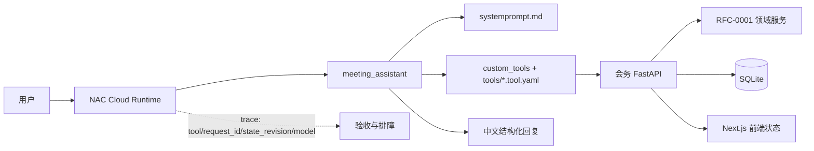
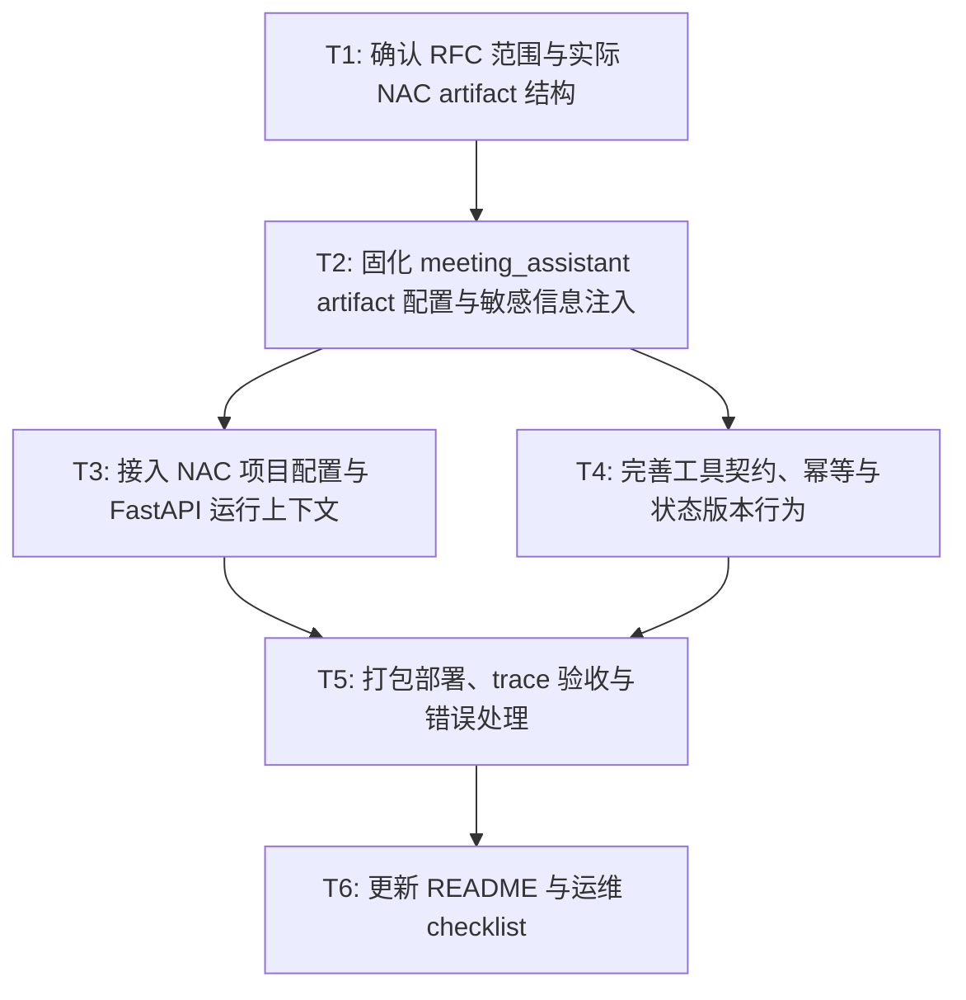

# RFC-0005: NAC 云端会务 Agent 接入会务系统对接模式

- **状态**: draft
- **优先级**: P1
- **标签**: `nac`, `agent`, `artifact`, `meeting-room`, `fastapi`, `deployment`
- **影响服务**: NAC Agent artifact、NAC 项目配置、FastAPI 后端、会务领域模型、文档
- **创建日期**: 2026-07-31
- **更新日期**: 2026-07-31

## 摘要

本 RFC 定义如何把用户提供并导出的 `meeting_assistant` NAC Agent artifact 接入 NAC 项目 `hack-8`，并通过工具调用会务系统 FastAPI 完成会议室查询、规则配置、预约创建/取消/修改、日历与平面图解释等任务。当前实际 artifact 位于 `/Users/tianruwang/Downloads/deploy-20260731-71ec3ihw/`，核心入口为 `nexau.json`，Agent 配置为 `agent.yaml`，工具实现为 `custom_tools/meeting_tools.py`，工具定义位于 `tools/*.tool.yaml`，会务知识库位于 `skills/meeting-system/`。

本 RFC 选择的对接主线是：**NAC 云端加载 `meeting_assistant` artifact，Agent 通过 HTTP 工具直接调用会务 FastAPI，FastAPI 继续作为会务领域规则、状态版本和结构化响应的唯一后端边界**。AK/SK、用户 token、demo 凭据等敏感信息必须放在 NAC 项目 secret 或本地运行环境中，不得写入 RFC、README、日志或仓库。

## 动机

当前项目已有 RFC-0004 定义会务 Agent artifact 与工具契约，但实际对接 NAC 时仍需要补齐一份面向部署和验收的设计说明：

1. 需要明确用户提供的 NAC 项目配置如何使用，以及哪些字段可以写入配置、哪些字段必须作为 secret；
2. 需要明确 `deploy-20260731-71ec3ihw/` 中导出的 `meeting_assistant` artifact 如何被 NAC 加载；
3. 需要明确 Agent 工具如何读取 FastAPI 地址、认证 token、workspace、actor、timezone 等运行上下文；
4. 需要明确写操作如何携带 `idempotency_key`、`expected_state_revision`、`dry_run`，并保留 `request_id`、`state_revision` 等 trace 字段；
5. 需要形成后续可复用的 NAC agent 接入 checklist，避免把本地 FastAPI 地址、长期密钥或绕过 FastAPI 的脚本带入云端 agent。

## 设计

### 用户看到的完整流程

1. 用户在 NAC 对话中提出会务请求，例如“查询下周二 10:00-11:00 的小会议室”或“明天中午预约活动室”。
2. NAC 云端 runtime 加载 `meeting_assistant` artifact，读取 `systemprompt.md` 中的角色、边界、工具说明和会务领域约束。
3. Agent 根据用户意图选择 `query_availability`、`nl_booking_candidates`、`configure_meeting_state`、`manage_bookings`、`get_calendar`、`get_floor_plan` 等工具。
4. 工具通过 `MEETING_API_BASE_URL` 调用会务 FastAPI，并携带 `workspace_id`、`actor_id`、认证 token、`idempotency_key`、`expected_state_revision`、`dry_run` 等上下文。
5. FastAPI 执行认证、请求校验、领域规则、冲突校验、幂等和状态版本管理，返回结构化 JSON。
6. Agent 将 FastAPI 返回的 `ok/error`、`request_id`、`state_revision`、候选、排除原因、冲突详情和下一步建议解释为中文回复。
7. 如果写操作失败，例如 `STATE_REVISION_CONFLICT`、`BOOKING_CONFLICT`、`PROTECTED_RULE`、`UNAUTHORIZED`，Agent 不伪造成功，而是说明失败来源并给出可执行下一步。

### 概述

本 RFC 以实际导出的 NAC artifact 为主，不把会务规则、数据库访问或状态版本逻辑搬进 Agent。Agent 只做对话、意图识别、工具选择、候选解释和错误解释；FastAPI 仍是会务系统的唯一后端边界；领域服务仍是规则、组合空间、冲突校验和状态版本的唯一执行来源。



图读法：NAC 负责加载和运行 Agent；Agent 通过工具调用 FastAPI；FastAPI 负责会务系统真实状态；NAC trace 用于确认工具调用、FastAPI 响应和状态版本是否可追溯。

### 实际 artifact 结构

用户提供并导出的 artifact 目录为：

```text
deploy-20260731-71ec3ihw/
├── nexau.json
├── agent.yaml
├── systemprompt.md
├── NEXAU.md
├── custom_tools/
│   ├── __init__.py
│   └── meeting_tools.py
├── tools/
│   ├── auth_meeting_api.tool.yaml
│   ├── check_availability.tool.yaml
│   ├── configure_meeting_state.tool.yaml
│   ├── get_calendar.tool.yaml
│   ├── get_floor_plan.tool.yaml
│   ├── get_meeting_state.tool.yaml
│   ├── Glob.tool.yaml
│   ├── manage_bookings.tool.yaml
│   ├── manage_rooms.tool.yaml
│   ├── manage_rules.tool.yaml
│   ├── nl_booking_candidates.tool.yaml
│   ├── query_availability.tool.yaml
│   ├── read_file.tool.yaml
│   ├── run_shell_command.tool.yaml
│   └── search_file_content.tool.yaml
└── skills/
    └── meeting-system/
        ├── SKILL.md
        └── references/
```

后续纳入仓库时，可把该目录作为 `deploy/nac/meeting-agent/`，或继续以现有 `agent/meeting-agent/` 为 canonical source；但无论目录名如何变化，都必须保留 `nexau.json -> agent.yaml -> systemprompt.md -> tools/ -> custom_tools/ -> skills/` 的相对路径关系。

### `nexau.json` 契约

`nexau.json` 只负责把 Agent 名称映射到 artifact 根目录下的 `agent.yaml`：

```json
{
  "agents": {
    "meeting_assistant": "agent.yaml"
  },
  "excluded": [
    ".git/",
    ".env",
    "node_modules/",
    "__pycache__/",
    "dist/",
    ".nac/"
  ]
}
```

约束：

- `meeting_assistant` 是 NAC 中注册的 Agent 名称；
- `agent.yaml` 必须位于 artifact 根目录；
- `excluded` 必须排除 `.env`、`node_modules/`、`dist/`、`.nac/` 等不应随 artifact 打包的内容；
- 不得把 AK/SK、token 或 demo 凭据写入 `nexau.json`。

### `agent.yaml` 契约

当前实际配置：

```yaml
type: agent
name: meeting_assistant
description: 会务系统 Agent，负责通过 FastAPI 工具查询和操作本地会务系统；不处理点餐、支付、真实日历、真实餐厅或真实地图服务。
system_prompt: ./systemprompt.md
system_prompt_type: jinja
llm_config:
  model: nex-agi/Nex-N2-Pro
  max_tokens: 12000
  temperature: 0.2
tools:
  - name: read_file
    yaml_path: tools/read_file.tool.yaml
    binding: nexau.archs.tool.builtin.file_tools:read_file
  - name: search_file_content
    yaml_path: tools/search_file_content.tool.yaml
    binding: nexau.archs.tool.builtin.file_tools:search_file_content
  - name: glob
    yaml_path: tools/Glob.tool.yaml
    binding: nexau.archs.tool.builtin.file_tools:glob
  - name: run_shell_command
    yaml_path: tools/run_shell_command.tool.yaml
    binding: nexau.archs.tool.builtin.shell_tools:run_shell_command
  - name: auth_meeting_api
    yaml_path: tools/auth_meeting_api.tool.yaml
    binding: custom_tools.meeting_tools:auth_meeting_api
  - name: get_meeting_state
    yaml_path: tools/get_meeting_state.tool.yaml
    binding: custom_tools.meeting_tools:get_meeting_state
  - name: query_availability
    yaml_path: tools/query_availability.tool.yaml
    binding: custom_tools.meeting_tools:query_availability
  - name: check_availability
    yaml_path: tools/check_availability.tool.yaml
    binding: custom_tools.meeting_tools:check_availability
  - name: nl_booking_candidates
    yaml_path: tools/nl_booking_candidates.tool.yaml
    binding: custom_tools.meeting_tools:nl_booking_candidates
  - name: configure_meeting_state
    yaml_path: tools/configure_meeting_state.tool.yaml
    binding: custom_tools.meeting_tools:configure_meeting_state
  - name: manage_rooms
    yaml_path: tools/manage_rooms.tool.yaml
    binding: custom_tools.meeting_tools:manage_rooms
  - name: manage_rules
    yaml_path: tools/manage_rules.tool.yaml
    binding: custom_tools.meeting_tools:manage_rules
  - name: manage_bookings
    yaml_path: tools/manage_bookings.tool.yaml
    binding: custom_tools.meeting_tools:manage_bookings
  - name: get_calendar
    yaml_path: tools/get_calendar.tool.yaml
    binding: custom_tools.meeting_tools:get_calendar
  - name: get_floor_plan
    yaml_path: tools/get_floor_plan.tool.yaml
    binding: custom_tools.meeting_tools:get_floor_plan
skills:
  - skills/meeting-system
max_iterations: 18
max_context_tokens: 128000
tool_call_mode: structured
middlewares:
  - import: nexau.archs.main_sub.execution.middleware.context_compaction:ContextCompactionMiddleware
    params:
      threshold: 0.6
```

约束：

- 模型固定为 `nex-agi/Nex-N2-Pro`，连接信息由 NAC 项目模型卡注入；
- `agent.yaml` 不写 `base_url`、`api_key`、`sandbox_config`、`tracers` 或任何密钥；
- `run_shell_command` 只允许用于轻量只读制品自检，禁止访问 SQLite、执行绕过 FastAPI 的脚本或修改后端代码；
- 业务工具必须通过 HTTP 调用 FastAPI，不 import SQLite、仓储或领域服务代码。

### `systemprompt.md` 契约

`systemprompt.md` 定义 Agent 的行为边界和对话流程，必须包含：

1. 角色：`meeting_assistant`，只处理 Topic A 会务系统；
2. 第一原则：FastAPI 是唯一后端边界，规则引擎是唯一执行来源，写操作先确认后提交；
3. 知识库使用：加载 `meeting-system` skill，并通过 `{path_to_skill_folder}/references/INDEX.md` 导航；
4. 固定领域约束：默认房间、小会议室、505 周二不可用、活动室午餐不可预约、会议室一/二可合并、504 是动态禁用演示房间、502 不作为默认房间；
5. 工具选择表：查询、配置、预约、取消/修改、日历、平面图、制品自检分别使用哪些工具；
6. 写操作字段：说明工具会自动补齐 `workspace_id`、`actor_id`、`idempotency_key`、`expected_state_revision`、`dry_run` 和认证头；
7. 错误解释：`STATE_REVISION_CONFLICT`、`PROTECTED_RULE`、`BOOKING_CONFLICT`、`IDEMPOTENCY_KEY_REUSED`、`UNAUTHORIZED`、`DEMO_REQUIRED`、`LLM_PROVIDER_ERROR`、`TRANSPORT_ERROR`、`TIMEOUT`、`INVALID_RESPONSE`；
8. 安全边界：不访问 SQLite、不绕过 FastAPI、不承诺真实外部日历/支付/餐厅/地图、不承诺管理员/RBAC 或强制覆盖冲突。

### 工具契约

| 工具 | 对应 FastAPI 能力 | 主要用途 |
|---|---|---|
| `auth_meeting_api` | `/api/auth/login`、`/api/auth/logout`、`/api/auth/me` | 显式 demo 登录、退出、查看当前用户 |
| `get_meeting_state` | `/api/health`、`/api/rooms`、`/api/rules` | 读取健康状态、房间、规则摘要；写操作前读取最新状态 |
| `query_availability` | `/api/availability:query` | 查询可用会议室/组合空间，返回候选、排除原因和状态元数据 |
| `check_availability` | `/api/availability:check` | 创建预约前预检指定目标 |
| `nl_booking_candidates` | `/api/nl/booking-candidates` | 自然语言预约候选，不直接创建预约 |
| `configure_meeting_state` | `/api/nl/configure` | 自然语言配置预览/写入 |
| `manage_rooms` | `/api/rooms/*` | 结构化房间和开放时段管理 |
| `manage_rules` | `/api/rules/*` | 结构化规则管理 |
| `manage_bookings` | `/api/bookings/*` | 结构化预约管理 |
| `get_calendar` | `/api/calendar` | 查看日历 |
| `get_floor_plan` | `/api/floor-plan` | 查看平面图 |
| `read_file` / `search_file_content` / `Glob` | 不调用 FastAPI | 读取已打包 skill references、检查 YAML |
| `run_shell_command` | 不调用 FastAPI | 轻量只读制品自检 |

### `custom_tools/meeting_tools.py` 契约

`custom_tools/meeting_tools.py` 是薄 HTTP client，必须保持以下行为：

- 默认读取 `MEETING_API_BASE_URL`，当前代码默认值为 `https://hackathon-8.qichangzheng.net`；NAC 部署时必须确认该地址从 NAC runtime 可达，必要时改为公网可访问的 FastAPI 地址；
- 默认读取 `MEETING_WORKSPACE_ID` 或 `WORKSPACE_ID`，默认 `default`；
- 默认读取 `MEETING_ACTOR_ID` 或 `ACTOR_ID_FALLBACK`，默认 `demo-user`；
- 默认读取 `MEETING_AUTH_TOKEN` 或 `AUTH_TOKEN` 作为 `Authorization: Bearer <token>`；
- 默认读取 `MEETING_API_TIMEOUT_SECONDS`，默认 `30` 秒；
- 默认读取 `TIMEZONE`，默认 `Asia/Shanghai`；
- demo 凭据只能通过 `MEETING_DEMO_CREDENTIALS`、`MEETING_DEMO_USERNAME`、`MEETING_DEMO_PASSWORD` 注入，且只读 demo 凭据不能用于写操作；
- 写操作通过 `_with_common_write_fields` 补齐 `workspace_id`、`actor_id`、`expected_state_revision`、`idempotency_key`、`dry_run`；
- 工具返回统一 envelope：`ok`、`request_id`、`data`、`error`、`warnings`、`meta.state_revision`、`meta.server_time`、`meta.timezone`；
- 错误返回统一 envelope：`ok=false`、`error.code`、`error.message`、`error.details`、`error.suggestions`、`error.http_status`、`error.tool_name`、`error.recoverable`、`error.next_action`。

### NAC 项目配置

用户提供的 NAC 项目配置如下，其中 AK/SK 必须作为 secret 管理：

| 配置项 | 值 | 是否可提交仓库 | 说明 |
|---|---|---|---|
| `NAC_BASE_URL` | `https://nac-beta.xiaobei.top/` | 可以 | NAC Agent API base URL |
| `NAC_ENVIRONMENT` | `hack-8` | 可以 | NAC 部署环境 |
| `NAC_PROJECT_ID` | `e4ebe630-1c26-48d0-8d29-4563375ee959` | 可以，但需确认项目公开性 | NAC 项目 ID |
| `NAC_AK` | `<secret>` | 否 | BFF 或 NAC 项目访问所需 AK，按用户给定值放入 secret |
| `NAC_SK` | `<secret>` | 否 | BFF 或 NAC 项目访问所需 SK，按用户给定值放入 secret |

> 注意：本 RFC 不记录用户提供的真实 AK/SK。实施时把 AK/SK 写入 NAC secret 或本地安全环境，不写入仓库、RFC、README、日志或 trace。

### Agent 运行上下文配置

NAC 部署或本地调试时，需要为 `meeting_assistant` 注入以下运行上下文：

| 配置项 | 示例 | 默认值 | 说明 |
|---|---|---|---|
| `MEETING_API_BASE_URL` | `https://hackathon-8.qichangzheng.net` | `https://hackathon-8.qichangzheng.net` | NAC runtime 可达的会务 FastAPI 地址 |
| `MEETING_API_TIMEOUT_SECONDS` | `30` | `30` | HTTP 超时 |
| `MEETING_WORKSPACE_ID` / `WORKSPACE_ID` | `default` | `default` | 会务工作空间 |
| `MEETING_ACTOR_ID` / `ACTOR_ID_FALLBACK` | `demo-user` 或真实 actor | `demo-user` | 写操作 actor |
| `MEETING_AUTH_TOKEN` / `AUTH_TOKEN` | `<secret>` | 无 | 用户认证 token；缺失时只能走显式 demo 模式 |
| `MEETING_DEMO_CREDENTIALS` | `<secret-json>` | 无 | 显式 demo 登录凭据 |
| `TIMEZONE` | `Asia/Shanghai` | `Asia/Shanghai` | 时间解释时区 |

### 部署模式

完整对接流程：

1. 确认 artifact 目录结构完整，`nexau.json` 能映射到 `agent.yaml`；
2. 在 NAC 项目配置中设置 `baseurl`、`environment`、`projectId`；
3. 将 AK/SK、`MEETING_AUTH_TOKEN`、demo 凭据等敏感信息写入 NAC secret 或本地安全环境；
4. 在 artifact 根目录执行静态检查；
5. 执行 `nac deploy` 部署到 `hack-8`；
6. 执行 `nac chat` 或 `nac smoke` 验证查询、配置、预约、取消、日历、平面图；
7. 读取 NAC trace，确认工具调用、FastAPI 响应、`request_id`、`state_revision` 和模型信息。

建议命令：

```bash
cd /Users/tianruwang/Downloads/deploy-20260731-71ec3ihw
python3 -m json.tool nexau.json
python3 -m py_compile custom_tools/meeting_tools.py
# 用实际 secret 变量名或项目 secret 名称替换占位符，不要把真实 AK/SK 写入命令历史。
grep -R "<NAC_AK_SECRET_VALUE>\|<NAC_SK_SECRET_VALUE>\|<MEETING_AUTH_TOKEN_VALUE>" . || true
nac deploy hack-8 --yes --json
nac chat hack-8 -m '2026年8月5日 10:00-11:00 有哪些小会议室可用？'
nac smoke hack-8
nac test hack-8
```

> 注意：上述 `grep` 命令用于防止真实 AK/SK 被带入 artifact；实际 AK/SK 不应出现在命令历史、日志或仓库中。

### 与 RFC-0004 的关系

RFC-0004 定义了会务 Agent artifact 的通用设计，包括 `nexau.json`、`agent.yaml`、`systemprompt.md`、工具定义、custom tools 和 skill references。

本 RFC 是 RFC-0004 在用户提供的 `deploy-20260731-71ec3ihw/` artifact 上的具体落地设计：

- 使用 `meeting_assistant` 作为 NAC Agent 名称；
- 使用 `nex-agi/Nex-N2-Pro` 作为模型；
- 使用 `MEETING_API_BASE_URL`、`MEETING_AUTH_TOKEN`、`MEETING_WORKSPACE_ID`、`MEETING_ACTOR_ID` 注入运行上下文；
- 使用 `custom_tools/meeting_tools.py` 作为 FastAPI 薄客户端；
- 使用 NAC 项目 `hack-8` 作为部署环境；
- 使用 NAC trace 作为工具调用和状态版本验收依据。

## 权衡取舍

### 方案 A：使用实际导出的 `meeting_assistant` artifact，通过 HTTP 工具调用 FastAPI

选择该方案。

优点：

- 与用户提供的 artifact 代码一致；
- 复用 RFC-0004 的工具契约和系统提示词；
- FastAPI 仍是规则、冲突校验、幂等和状态版本的唯一执行来源；
- 部署路径清晰：NAC 项目配置 + artifact 打包部署 + trace 验收。

缺点：

- Agent 需要能访问公网或 NAC runtime 可达的 FastAPI 地址；
- 工具层需要正确注入认证、workspace、actor、幂等键和状态版本；
- 如果 FastAPI 地址不可达，NAC 侧会表现为工具调用失败，需要在部署前验证网络。

### 方案 B：让 Agent 直接访问 SQLite 或领域服务代码

拒绝该方案。

原因：

- 绕过 FastAPI 的认证、请求校验、幂等、状态版本和错误码；
- 云端 NAC runtime 无法可靠访问本地 SQLite；
- 容易破坏前端、后端、Agent 共享的单一状态源。

### 方案 C：把 AK/SK 或用户 token 写入 `agent.yaml`、`systemprompt.md` 或仓库文件

拒绝该方案。

原因：

- 存在密钥泄露风险；
- 不同环境、不同用户、不同 workspace 不应共享长期凭据；
- 与本项目安全边界不一致。

### 方案 D：沿用 Context Platform 的 `sandbox_env + nctx + BFF + Gateway` 云端托管模式

本 RFC 不作为本次 `meeting_assistant` artifact 的主路径。

原因：

- 用户提供的实际 artifact 已经采用 `custom_tools/meeting_tools.py` 直接调用 FastAPI；
- 该模式需要额外的 BFF broker、Gateway AKSK 翻译和 `nctx` bootstrap；
- 如果后续要接入 Context Platform 原生云端 agent，应另开 RFC 或在本 RFC 中追加子任务。

## 实现计划

### 阶段划分

- [ ] Phase 1: 确认 `deploy-20260731-71ec3ihw/` artifact 结构、NAC 项目配置和敏感信息注入方式；
- [ ] Phase 2: 固化 `meeting_assistant` artifact 配置、FastAPI 运行上下文和工具契约；
- [ ] Phase 3: 部署到 NAC `hack-8`，通过 chat/smoke/test/trace 完成验收；
- [ ] Phase 4: 更新 README 与运维 checklist，形成后续复用模板。

### 子任务分解



### 子任务列表

| ID | 标题 | 依赖 | Ref |
|----|------|------|-----|
| T1 | 确认 RFC 范围与实际 NAC artifact 结构 | - | `docs/rfcs/0005-nac-context-platform-agent-integration.md`, `deploy-20260731-71ec3ihw/`, `agent/meeting-agent/` |
| T2 | 固化 `meeting_assistant` artifact 配置与敏感信息注入 | T1 | `deploy-20260731-71ec3ihw/nexau.json`, `deploy-20260731-71ec3ihw/agent.yaml`, `deploy-20260731-71ec3ihw/custom_tools/meeting_tools.py` |
| T3 | 接入 NAC 项目配置与 FastAPI 运行上下文 | T2 | NAC project config, `MEETING_API_BASE_URL`, `MEETING_AUTH_TOKEN`, `MEETING_WORKSPACE_ID`, `MEETING_ACTOR_ID` |
| T4 | 完善工具契约、幂等与状态版本行为 | T2 | `deploy-20260731-71ec3ihw/tools/`, `deploy-20260731-71ec3ihw/custom_tools/meeting_tools.py` |
| T5 | 打包部署、trace 验收与错误处理 | T3, T4 | `deploy-20260731-71ec3ihw/`, NAC trace, FastAPI OpenAPI |
| T6 | 更新 README 与运维 checklist | T5 | `agent/README.md`, `docs/rfcs/README.md` |

### 子任务定义

**T1: 确认 RFC 范围与实际 NAC artifact 结构**

- **范围**: 阅读 `deploy-20260731-71ec3ihw/`、现有 `agent/meeting-agent/`、RFC-0004 和 NAC 项目配置，确认本次 RFC 以实际导出的 `meeting_assistant` artifact 为主。
- **验收标准**:
  - 确认 `nexau.json` 映射 `meeting_assistant -> agent.yaml`；
  - 确认 `agent.yaml` 中工具、skills、模型和中间件配置完整；
  - 确认 AK/SK 不写入仓库，只记录配置项和 secret 注入方式。

**T2: 固化 `meeting_assistant` artifact 配置与敏感信息注入**

- **范围**: 固化 `nexau.json`、`agent.yaml`、`systemprompt.md`、`custom_tools/meeting_tools.py` 的运行上下文读取规则，确保敏感信息来自 secret 或环境变量。
- **验收标准**:
  - `python3 -m json.tool nexau.json` 通过；
  - `python3 -m py_compile custom_tools/meeting_tools.py` 通过；
  - artifact 中不包含真实 AK/SK、用户 token 或 demo 凭据；
  - `agent.yaml` 不包含 `base_url`、`api_key`、`sandbox_config`、`tracers`。

**T3: 接入 NAC 项目配置与 FastAPI 运行上下文**

- **范围**: 在 NAC 项目 `hack-8` 中配置 base URL、environment、projectId、AK/SK secret，以及 Agent 运行所需的 `MEETING_API_BASE_URL`、`MEETING_AUTH_TOKEN`、workspace、actor、timezone。
- **验收标准**:
  - NAC 项目配置指向 `https://nac-beta.xiaobei.top/`；
  - environment 为 `hack-8`；
  - projectId 为 `e4ebe630-1c26-48d0-8d29-4563375ee959`；
  - AK/SK 来自 secret；
  - `MEETING_API_BASE_URL` 指向 NAC runtime 可达的 FastAPI 地址。

**T4: 完善工具契约、幂等与状态版本行为**

- **范围**: 检查 `tools/*.tool.yaml` 与 `custom_tools/meeting_tools.py` 是否完整覆盖查询、配置、预约、取消/修改、日历、平面图和错误解释。
- **验收标准**:
  - 写操作自动补齐 `workspace_id`、`actor_id`、`idempotency_key`、`expected_state_revision`、`dry_run`；
  - 工具返回 `request_id`、`state_revision`、`server_time`、`timezone`；
  - 错误返回包含 `code`、`message`、`details`、`suggestions`、`http_status`、`tool_name`、`recoverable`、`next_action`；
  - `STATE_REVISION_CONFLICT` 不静默覆盖。

**T5: 打包部署、trace 验收与错误处理**

- **范围**: 部署到 NAC `hack-8`，执行 chat/smoke/test，并读取 trace 验证工具调用和 FastAPI 响应。
- **验收标准**:
  - `nac deploy hack-8 --yes --json` 成功；
  - `nac chat hack-8 -m '<验收问题>'` 能返回结构化中文结果；
  - trace 中包含工具名、FastAPI path 或请求摘要、响应 `ok/error`、`request_id`、`state_revision` 和模型信息；
  - 查询、规则配置、预约、取消、日历、平面图验收场景通过；
  - 失败场景返回可解释错误，不伪造成功。

**T6: 更新 README 与运维 checklist**

- **范围**: 更新 `agent/README.md` 或新增 NAC 部署说明，记录配置项、命令、验收 checklist、故障排查和安全注意事项。
- **验收标准**:
  - README 明确 NAC base URL、environment、projectId、AK/SK secret 注入方式；
  - README 明确 `MEETING_API_BASE_URL`、`MEETING_AUTH_TOKEN`、workspace、actor、timezone 注入方式；
  - README 明确 AK/SK、token、demo 凭据不得写入仓库；
  - README 提供 `nac deploy`、`nac chat`、`nac smoke`、`nac test` 示例命令。

## 影响范围

- `deploy-20260731-71ec3ihw/` - 本次 RFC 的实际 artifact 事实来源；
- `agent/meeting-agent/` - 仓库内现有会务 Agent artifact，可作为 canonical source 或对比基准；
- `custom_tools/meeting_tools.py` - FastAPI 薄客户端、运行上下文读取、幂等和错误 envelope；
- `tools/*.tool.yaml` - Agent 工具输入输出契约；
- `systemprompt.md` - Agent 角色、边界、工具选择、写操作和错误解释；
- `agent/README.md` - 部署、运行、验收和运维说明；
- `docs/rfcs/` - 本 RFC 与索引；
- NAC 项目 secret - AK/SK、token、demo 凭据等敏感配置。

## 测试方案

### 单元与静态验证

1. `python3 -m json.tool nexau.json`；
2. `python3 -m py_compile custom_tools/meeting_tools.py`；
3. 检查 `agent.yaml` 中所有 `yaml_path` 指向的文件存在；
4. 检查 `skills/meeting-system/references/INDEX.md` 存在；
5. 扫描 artifact 和 RFC，确认不包含真实 AK/SK、用户 token 或 demo 凭据；
6. 检查 `agent.yaml` 不包含 `base_url`、`api_key`、`sandbox_config`、`tracers`。

### 集成测试

1. 配置 `MEETING_API_BASE_URL` 为 NAC runtime 可达的 FastAPI 地址；
2. 使用有效 `MEETING_AUTH_TOKEN` 查询会议室列表；
3. 使用 `query_availability` 查询下周二 10:00-11:00 小会议室；
4. 使用 `configure_meeting_state` 的 `dry_run=true` 预览规则配置；
5. 使用 `manage_bookings` 创建预约并检查 `state_revision` 更新；
6. 使用 `manage_bookings` 取消预约并确认可重新预约；
7. 使用 `get_calendar` 和 `get_floor_plan` 验证状态一致。

### 手动验收

1. `nac chat hack-8 -m '登录后查询会议室列表'`；
2. `nac chat hack-8 -m '下周二 10:00-11:00 有哪些小会议室可用？'`；
3. `nac chat hack-8 -m '明天中午预约活动室'`，确认午餐规则拒绝；
4. `nac chat hack-8 -m '创建会议室一和会议室二组合预约'`，确认组合空间约束；
5. `nac chat hack-8 -m '504 全天临时维修，然后改成只停用下午'`，确认更新同一条规则；
6. `nac chat hack-8 -m '取消刚才的预约'`，确认释放时段；
7. `nac chat hack-8 -m '查看今天的日历和平面图'`，确认状态一致。

### Trace 验收

NAC trace 至少应保留：

- Agent 名称：`meeting_assistant`；
- 模型：`nex-agi/Nex-N2-Pro`；
- 工具名：如 `query_availability`、`manage_bookings`、`get_floor_plan`；
- FastAPI path 或请求摘要；
- 响应 `ok/error`；
- `request_id`；
- `state_revision`；
- 错误码和 `next_action`；
- 不包含 AK/SK、用户 token、demo 凭据明文。

## 未解决的问题

无。当前 RFC 以用户提供的 `deploy-20260731-71ec3ihw/` artifact 和 NAC 项目配置为主；如果后续要把该 Agent 改为由 Context Platform BFF 通过 `sandbox_env + nctx + Gateway` 托管触发，需要追加新的设计或 RFC 修订。

## 部署与回滚

### 部署

```bash
cd /Users/tianruwang/Downloads/deploy-20260731-71ec3ihw
nac deploy hack-8 --yes --json
```

如果后续把 artifact 纳入仓库，建议使用相对路径：

```bash
cd agent/meeting-agent
nac deploy hack-8 --yes --json
```

### 回滚

- 在 NAC 项目中回滚到上一版 `meeting_assistant` artifact；
- 保留 NAC 项目配置、AK/SK secret 和 FastAPI 运行上下文不变；
- 如果新版本修改了工具契约，回滚后需要同步回滚 `systemprompt.md` 和 README 中的工具说明。

## 监控与告警

建议至少监控：

- NAC agent 加载失败率；
- NAC chat 调用失败率；
- 工具 HTTP 超时和 5xx 比例；
- `UNAUTHORIZED`、`DEMO_REQUIRED`、`STATE_REVISION_CONFLICT`、`BOOKING_CONFLICT` 的错误分布；
- trace 中缺少 `request_id` 或 `state_revision` 的比例；
- artifact 中误提交 secret 的扫描告警。

## 安全注意事项

1. AK/SK、用户 token、demo 凭据、session id 不得写入 RFC、README、日志、trace 明文或仓库；
2. `MEETING_API_BASE_URL` 必须是 NAC runtime 可达且受控的 FastAPI 地址，不应使用调用者本地 `127.0.0.1`；
3. 写操作必须携带 `idempotency_key` 和 `expected_state_revision`；
4. 只读 demo 凭据不得用于写操作；
5. `run_shell_command` 不得用于访问 SQLite、执行绕过 FastAPI 的脚本或修改后端代码；
6. Agent 回复必须如实解释 FastAPI 错误，不伪造成功或状态版本；
7. trace 中应保留工具调用和状态版本，但不能泄露 AK/SK 或用户 token。

## 参考资料

- `deploy-20260731-71ec3ihw/nexau.json`
- `deploy-20260731-71ec3ihw/agent.yaml`
- `deploy-20260731-71ec3ihw/systemprompt.md`
- `deploy-20260731-71ec3ihw/custom_tools/meeting_tools.py`
- `deploy-20260731-71ec3ihw/tools/`
- `deploy-20260731-71ec3ihw/skills/meeting-system/`
- `agent/meeting-agent/`
- `docs/rfcs/0002-fastapi-api-agent-contract.md`
- `docs/rfcs/0003-nextjs-frontend-interaction.md`
- `docs/rfcs/0004-nac-meeting-agent-artifact.md`
